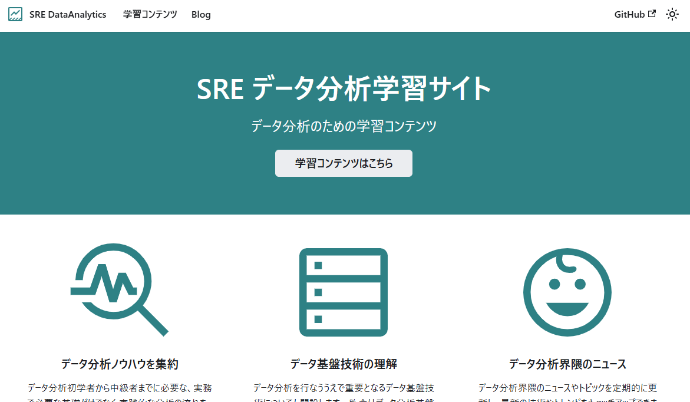

# データ分析学習サイトプロジェクト

[](https://github.com/lcp-business-SRE/data-analytics-knowledge-base/actions/workflows/deploy.yml)
[](https://opensource.org/licenses/MIT)
[](https://github.com/your-username/your-repo/stargazers)

## 概要

本プロジェクトは、データ分析に関する学習コンテンツを提供するウェブサイトです。基礎から応用まで幅広いトピックを体系的にカバーしています。

## 特徴

- **学習コンテンツ**: データ分析の基礎から応用までの教材を体系的に提供します。
- **インタラクティブなデモ**: 実際のデータ分析ツールを用いたデモで学習効果を高めます。
- **コミュニティサポート**: フォーラムやチャットを通じて、他の学習者と交流・情報交換が可能です。
- **オープンソース**: 誰でも貢献できるオープンソースプロジェクトです。

## デモ

サイトトップ画面例：



## インストール手順

### 前提条件

- [Git](https://git-scm.com/book/ja/v2/はじめに-Gitをインストールする)
- [Node.js](https://nodejs.org/ja/download/)（18.0以上推奨）

> [!NOTE]
> Node.jsは18.0以上を推奨します。バージョン確認は `node -v` で行えます。複数バージョン管理にはnvmが便利です。

### セットアップ手順

1. リポジトリのクローン
    ```bash
    git clone git@github.com:lcp-business-SRE/data-analytics-knowledge-base.git
    cd data-analytics-guides
    ```
2. 依存関係のインストール
    ```bash
    npm install
    ```
3. ローカル開発サーバーの起動
    ```bash
    npm start
    ```
    ブラウザで [http://localhost:3000](http://localhost:3000) を開くと、ローカルサーバーでサイトを確認できます。

#### トラブルシューティング

- **キャッシュクリア**
    ```bash
    npm run clear
    npm start
    ```
- **依存関係の再インストール**
    ```bash
    rm -rf node_modules
    npm install
    ```

## GitHub Pagesによる公開

本プロジェクトはGitHub Pagesでホスティングされています。GitHub Actionsにより、masterブランチへのプッシュ後、約2分で自動的にサイトが更新されます。

- ビルドエラー発生時は修正後に再度プッシュしてください。
- エラー詳細は [GitHub Actions](https://github.com/lcp-business-SRE/data-analytics-knowledge-base/actions) のログで確認できます。
- ワークフローの詳細は [deploy.yml](https://github.com/lcp-business-SRE/data-analytics-knowledge-base/blob/master/.github/workflows/deploy.yml) を参照してください。

## Docusaurusセットアップ・構築方法

この環境の詳細な構築方法は [Docusaurusセットアップ](docusaurus.md) を参照してください。

## アクセス解析（Google Analytics）

Google Analyticsを利用してサイトのアクセス解析を行っています。
- [Google Analytics管理画面](https://analytics.google.com/analytics/web/?hl=ja#/p492893539/reports/intelligenthome?params=_u..nav%3Dmaui)

## コメント管理（Disqus）

Disqusを利用してコメント機能を提供しています。
- [Disqus管理画面](https://data-analytics-guides.disqus.com/admin/)

## コントリビュート

本プロジェクトはオープンソースです。貢献希望の方は管理者までご連絡ください。
