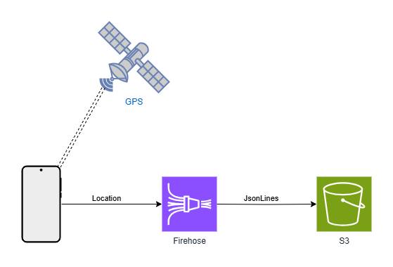
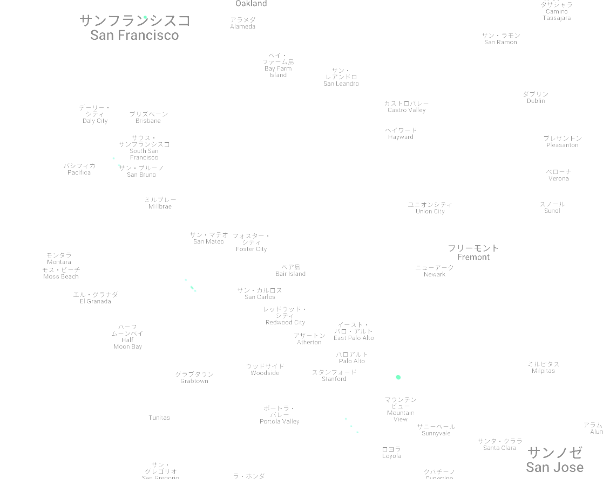
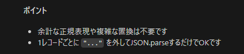

## 初めに

QUICKRIDEではユーザーが特定の操作を行った時に位置情報データを取得しています。
やり方もアプリからFirehoseを経由してS3にデータを流し込むだけのシンプルな物で、取ったデータを使っていないこと以外は何ら問題がないと思われていました。


大雑把な構成図

## 問題発覚

そんな中、そろそろ社内でもデータ分析をしようという機運が高まる中、技術検証としてApache Supersetを試すことになりました。
Jsonlinesが入っているだけだし、とりあえずGlue+Athenaの簡易的な構成でクエリを試みよう。甘く考えてやってみると、なぜか古いデータしか返ってこない現象に見舞われます。
「なんで？」と言いつつS3の元データを見に行くと、ある時期を境に記録されているデータが変わっていること発見します。

昔のデータのイメージ

```Json
{"Name":Data,"Time":"2000-03-12"},
{"Name":Data2,"Time":"2000-03-12"},
```

最近のデータ

```Json
"{\"Name\":\"Data\",\"Time\":\"2025-01-09\"},\n""{\"Name\":\"Data2\",\"Time\":\"2025-01-09\"},\n"
```

Glueがこの差を吸収できず、適切なテーブルにできなかったのが原因でした。
ちょうどこの時期くらいから試用できるようになったGeminiに質問を投げながらコードを書いたり、正規表現を考えたりとしばらく変換を試みて格闘するも上手くはいかず。
結局Supersetを試しに使うことを目的としていたからという理由で、古いデータだけ見れたらOKとして変換問題は封印することになりました……

### データが変化した原因

変換はあきらめたものの並行してアプリ側のコードを調べることでなぜ形式が変わったのかを調査。
S3にあるログとGitのログをさかのぼったり、上手く動いているバックエンド側のコードと比較したり、して原因が判明。
Firehoseに入力するデータ形式が問題でした。
というのもFirehoseに入力するデータ自体はbinaryでもStringijyしたJsonでもよく、どちらも保存してくれるのですが保存結果に違いがあるようで、

```JavaScript
//アプリ側のデータ送信部
data: `${JSON.stringify(joinedData)},\n`
//バックエンドのデータ送信部
Data: Buffer.from(JSON.stringify(itemToPut) + ',\n') 

```

この書き方の違いが致命的な違いを生み出していたのです。

## Geminiとの再会と別れ

Geminiとともに討ち死にしてから数か月後、お客様の位置情報データの分析ができないか？との要望が出てきたという話が聞こえてきました。
せっかくだから技術検証がてら改めて使えるようになったGeminiの新モデルに変換ロジックを書かせてみよう。そう考えGeminiに解凍したデータを渡し変換させようとしました。
しかし数か月放置されたGeminiの機嫌は悪かったのです。
返ってきたコードは動かない。サンプルのテキストデータは変換できるのに、実際のテキストファイルを読み込むと変換ができない。
そして色々修正案を返してきたGemini君もついには二つのバージョンの間を行ったり来たりするのみとなり、埒が明かない状態に……
「Geminiには無理だったか。」そう思い、ついにGeminiを見捨て、GithubCopilotへの乗り換えを決意しました。

## GitHub Copilotに頼る

まずGitHub Copilot 君にGemini君との話し合いの成果と変換したいテキストを渡し、

```
このテキストをパースしたい
今のコードではうまくいかない
```

と要求。お手並み拝見などと見ていると、4分の1にスリム化されたコードが返ってきました。
これで行けるのでは？そう思いエラーが出るたびに修正を要求すること5往復。どんどん雲行きが怪しくなってくる。
私はついにGeminiとの思い出をあきらめ最初からやり直すことに。

```
一度やり直します
このテキストを正規のJSONとしてパースしたいです
```

何度かエラーが出るも今度は進捗が目に見える。今度こそと出してきたコードを修正し、ついにデータが解析可能な状態に🎉
さらに新旧データごちゃまぜでも変換して形式を整えられるように修正し、分析可能な状態にまでたどり着きました。

最終的なコードは以下のようになります。

```JavaScript

/**
 * 1ファイル分のカスタムログテキストをパースしてJSON配列に変換
 * @param {string} fileContent - ファイルのテキスト内容
 * @returns {Array<Object>} - パースしたJSONオブジェクト配列
 */
function parseCustomLogContent(fileContent) {
    // すべての { ... } を正規表現で抽出
    // 改行やカンマ、ダブルクォートの有無に関係なく抽出
    const matches = fileContent.match(/({[^}]+})/g);
    if (!matches) return [];

    const jsonArray = [];
    for (let rec of matches) {
        rec = rec.trim();
        // 先頭・末尾の " を除去（もしあれば）
        if (rec.startsWith('"')) rec = rec.slice(1);
        if (rec.endsWith('"')) rec = rec.slice(0, -1);
        // エスケープされたダブルクォートを戻す
        rec = rec.replace(/\\"/g, '"');
        if (!rec) continue;
        try {
            jsonArray.push(JSON.parse(rec));
        } catch (e) {
            console.error("JSON parse error:", e.message, rec.substring(0, 100));
            console.error("Full record:", rec);
        }
    }
    return jsonArray;
}
```

## その後

調子に乗った私は複数ファイルの一括変換・Apache Parquetへの変換などGitHub Copilotに投げつけ、そしてCopilotはそれを次々と成功させていきました。
そしてセットアップがいらないLooker Studioで地図上に表示するも……

そうですこのデータは開発環境のデータ。そして、エミュレータのデフォルト位置情報はアメリカ西海岸。当然ながらシリコンバレーに集中したログに、これ以上は本番環境データを使わなければと悟りました。
ようやくそれっぽい絵が出ると期待した私でしたが、それを実現するのはまだ先になりそうです。

## まとめ

1. データを取得するときは定期的にメンテナンスしましょう
さもなくば後で大変なことになっているかもしれません
2. garbage in garbage out
結局いいデータをとらないと何にもならない。その現実を突きつけられました。
3. AIとはさみは使いよう
最後はデータの問題で思った絵は得られませんでしたが、GitHub Copilotの力は本物だと確信。きっとこっぴどく振ったGeminiももっとうまく使う方法はあったのかもしれません。

## おまけ

Geminiのコードを見たGitHub Copilotの返答

ここまでぶった切られると気持ちよさすら感じる
