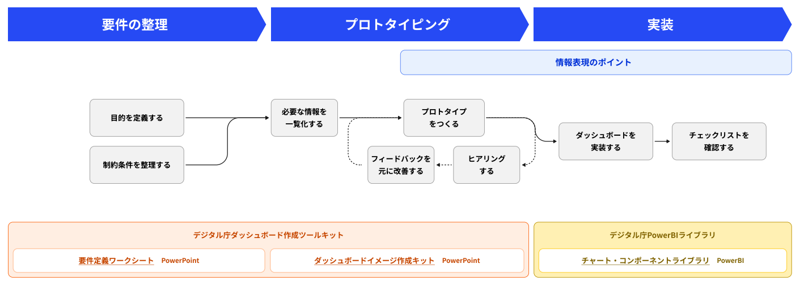

## デジタル庁でダッシュボードの実践ガイドブックが公開されている

ベータ版ですが、かなりの内容が詰まった**ダッシュボードを作成する際のガイドブック**が公開されています。

[ダッシュボードデザインの実践ガイドブックとチャート・コンポーネントライブラリ（ベータ版）](https://www.digital.go.jp/resources/dashboard-guidebook)

公開の目的は以下のように書かれています。

<!-- truncate -->

>データをわかりやすく可視化できるようにすることで、**多くの関係者間で正しい共通認識を持ち、意思決定の質を向上させ、より良い行動に繋げられるよう**になることを目的
>
> 出典：デジタル庁([URL](https://www.digital.go.jp/resources/dashboard-guidebook))

非常に細かく整理されていて、可視化のヒントも多く含まれています。
一読の価値あります。

さまざまなツールも紹介されており、ダッシュボードを作成する際に使ってみてはいかがでしょうか。

### ダッシュボード作成のながれ

ダッシュボードを作成する際の作業の流れが整理されています。**可視化のシナリオ作成のときとほぼ同じ流れ**ですね。

それぞれのツールのリンクも以下に貼っておきます。

[ダッシュボードデザインの実践ガイドブックとチャート・コンポーネントライブラリ（ベータ版）](https://www.digital.go.jp/resources/dashboard-guidebook#download)
