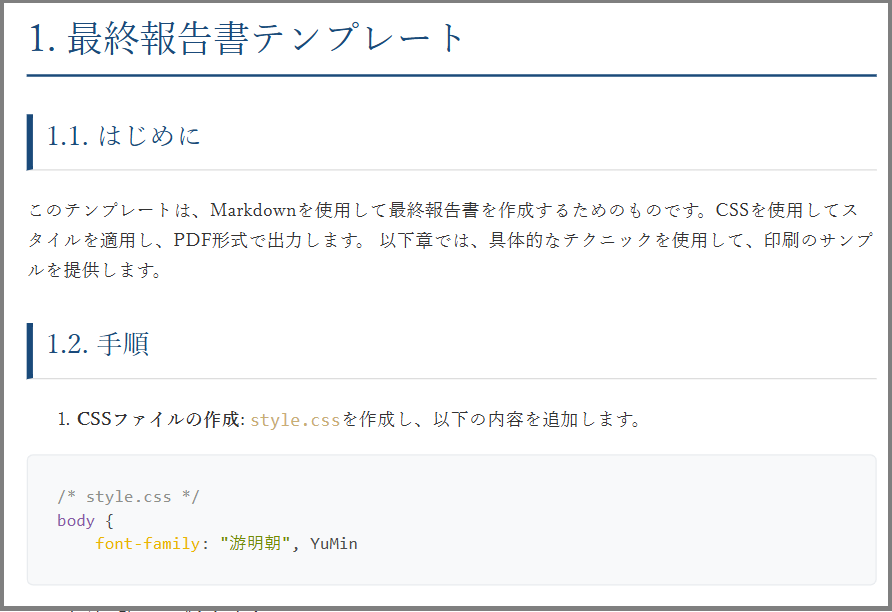

## VSCodeをつかっているなら、そのまま報告書をつくりたいですよね

エンジニアならマークダウンでドキュメントを作成し、そのままPDFに変換できるのが理想です。
VSCodeを使っているなら、Markdownで書いたドキュメントをPDFに変換するのは簡単です。

でも、そのまま報告書として使うとなると、**PDFの体裁が整っていないので、見栄えが悪い**ですよね。

そこで、CSSを使ってPDFの体裁を整える方法を紹介します。

用意するのは簡単！！

<!-- truncate -->

## Markdown PDFレポートの作成方法

VSCodeの拡張機能「Markdown PDF」を使うと、Markdownファイ
ルをPDFに変換できます。

この拡張機能は、MarkdownファイルをHTMLに変換し、そのHTMLをPDFに変換する仕組みです。
そのため、CSSを使ってPDFの体裁を整えることができます。

## 表紙や本文もいろいろとかえることができます

### 普通にPDFとして出力したら

読めますが、このままでは、見栄えが悪いですよね。

[PDF](before.pdf)

### CSSで見栄えを変更したら

このまま会社の資料として提出することができます。

[PDF](after.pdf)

## CSSを使ってPDFの体裁を整える具体的な方法

サンプルは[こちら](https://github.com/lcp-business-SRE/markdown-to-pdf-report-sample)にあります。
※サンプル１のREADMEに従ってやってみてください。
