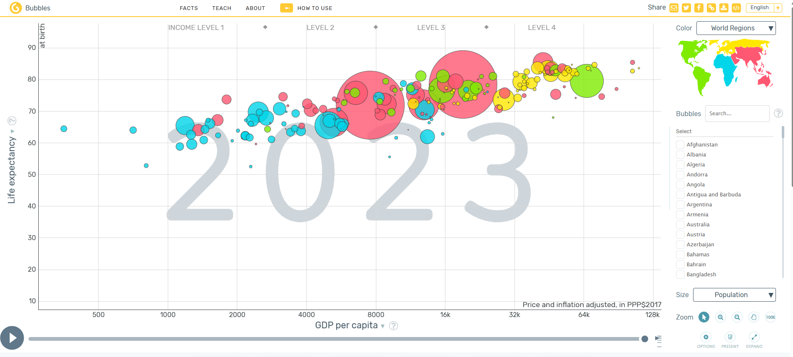

# FUCTFULNESS でストレスレス

[Amazon factfulness](https://www.amazon.co.jp/s?k=factfulness&adgrpid=55806287680&hvadid=658689682702&hvdev=c&hvexpln=0&hvlocphy=9053343&hvnetw=g&hvocijid=11718895491066100865--&hvqmt=e&hvrand=11718895491066100865&hvtargid=kwd-345049939819&hydadcr=24973_13674439&jp-ad-ap=0&mcid=203121b3e3ee39938044025a8488fcb1&tag=googhydr-22&ref=pd_sl_58zhn3cw49_e)

スウェーデンの医師ハンス・ロスリングが提唱した概念で、彼の著書『ファクトフルネス』が有名です。

こちらは、2025年7月30日のビジ開で開催された朝会の資料でも一部紹介しました。（[資料](./朝会ネタ_07230.marp.pdf)）

## そもそも「ファクトフルネス」って？

「ファクトフルネス」とは、事実に基づいて世界を理解し、誤解や偏見を排除するための考え方です。

本書の中の「10の思い込み」に書かれているように、人間には瞬時に何かを判断する本能と、ドラマチックな物語を求める本能があり、どうしても「**ドラマチックすぎる世界の見方**」をしてしまうのです。

具体的には、10個の本能に沿って解説しています。

<!-- truncate -->

## 情報があふれるストレスフルな社会に生きるうえで

「ファクトフルネス」を実践することは、情報があふれる現代社会において、ストレスを軽減し、冷静な判断を下すために非常に重要です。

この本の著者ハンス氏は、感染症の専門家でもあり、アフリカやアジアの途上国を中心としたさまざまな地域で感染症研究をする中で、**自分が見ている本当の世界の姿と、多くの人たち、特に先進国の人たちが見ている世界の姿は違う**のではないかと気づきます。

つまり、私たち先進国の人間は、事実に基づく世界の見方ができていないのではないかと。

そこでロスリング氏は、事実に基づいて世界を見ることができているか否かをはかる「チンパンジークイズ」をつくり（本書参照）、14ヵ国・1万2000人に質問をしました。
その結果、チンパンジーに勝った、つまり三つの選択肢をランダムに選んだ場合に出るはずの正答率30％以上の人はわずか10％。80％の人は世界の姿を実際よりも悲観的に見ており、しかも**専門家や学歴が高い人、社会的な地位がある人ほど正答率が低い**ことが分かったのです。

## 詳細は本で読めばいいのだが

このロスリング氏は、すでに亡くなってしまいましたが、彼の考え方は今でも多くの人に影響を与えています。

私が好きなTEDトークでも、面白おかしくこの「ファクトフルネス」の考え方を紹介しています。

<iframe width="560" height="315" src="https://www.youtube.com/embed/RUwS1uAdUcI?si=39GyAdhZTs3nc7wn" title="YouTube video player" frameborder="0" allow="accelerometer; autoplay; clipboard-write; encrypted-media; gyroscope; picture-in-picture; web-share" referrerpolicy="strict-origin-when-cross-origin" allowfullscreen></iframe>

出典：[TED 最高の統計を披露（2008）](https://www.ted.com/talks/hans_rosling_the_best_stats_you_ve_ever_seen?utm_campaign=tedspread&utm_medium=referral&utm_source=tedcomshare)

動画の中でも、データをシミュレーションしながら **ファクトフルネス**の重要性が強調されています。しかも素晴らしいプレゼンです。

ぜひご覧になってください。

## 著者が見せていたようなシミュレーション（Gapminder）

この[サイト](https://www.gapminder.org/)もリアルを知る手助けになります。

質問形式で学習できるサイトとグラフデモで理解するサイトとなっています。

[Animating Data](https://www.gapminder.org/tools/#$chart-type=bubbles&url=v2)

[出典：GAPMINDER](https://www.gapminder.org/)

## 最後に

著者のハンス・ロスリング氏は、ファクトフルネスの重要性を説きながら、私たちが直面する情報の洪水に対処するための方法を提供しています。
彼の考え方は、私たちが情報を正しく理解し、冷静な判断を下すための指針となります。

ほかのTEDトークでも、ファクトフルネスの考え方を取り入れたプレゼンテーションが多くあります。

### 地球規模の人口増加について（2010）

[TED](https://www.ted.com/talks/hans_rosling_global_population_growth_box_by_box?utm_campaign=tedspread&utm_medium=referral&utm_source=tedcomshare)
<iframe width="560" height="315" src="https://www.youtube.com/embed/fTznEIZRkLg?si=s41UW44uhJ2paijV" title="YouTube video player" frameborder="0" allow="accelerometer; autoplay; clipboard-write; encrypted-media; gyroscope; picture-in-picture; web-share" referrerpolicy="strict-origin-when-cross-origin" allowfullscreen></iframe>

### 世界について無知にならないために（2014）

[TED](https://www.ted.com/talks/hans_and_ola_rosling_how_not_to_be_ignorant_about_the_world?utm_campaign=tedspread&utm_medium=referral&utm_source=tedcomshare)
<iframe width="560" height="315" src="https://www.youtube.com/embed/Sm5xF-UYgdg?si=36VawSJM5kDGpirv" title="YouTube video player" frameborder="0" allow="accelerometer; autoplay; clipboard-write; encrypted-media; gyroscope; picture-in-picture; web-share" referrerpolicy="strict-origin-when-cross-origin" allowfullscreen></iframe>

思考のゆがみは、教育・環境・経験によって影響を受けますが、そして先入観な思考を持つことは、社会的な問題を引き起こす可能性があります。

ファクトフルネスは、私たちが情報を正しく理解し、冷静な判断を下すための指針として重要です。
