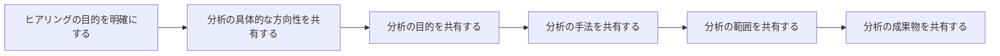

# なぜ、データ分析をするのにヒアリングなのか？

データ分析という華やかな世界に飛び込んだあなた。
データを集めて、グラフを作って、分析結果を出すのが仕事だと思っていませんか？

実は、データ分析の成功の鍵は「ヒアリング」にあります。

思い出してください。なんで分析をするのでしょうか？

お客様の「課題を解決するため」ですよね。
そのためには、まずお客様の課題を正確に理解する必要があります。

ヒアリングは、データ分析の“設計図”を描くための第一歩です。

このページでは、データ分析を始めるにあたり、**なぜヒアリングが必要なのか**、その重要性と具体的なステップを解説します。

## 実は、お客様も課題を理解していない場合が多い？

お客様は、日々の業務に追われていることが多く、課題を明確に言語化できないこともあります。
そのため、ヒアリングを通じてお客様の潜在的なニーズや課題を引き出すことが重要です。

そのため、ヒアリングを通じて、以下のような情報を引き出すことが求められます。

- **課題の背景**：なぜその課題が発生しているのか？
- **目指すゴール**：どのような状態を実現したいのか？
- **成功の指標**：どのような結果が出れば成功といえるのか？
- **制約条件**：予算や時間、リソースの制約は何か？
- **過去の取り組み**：過去にどのような取り組みを行ったのか？その結果はどうだったのか？
- **競合や市場の状況**：競合他社の動向や市場のトレンドはどうなっているのか？
- **関係者の意見**：他の関係者（営業、マーケティング、経営層など）の意見や要望は何か？

事前にこれらの情報を整理しておくことで、ヒアリングがスムーズに進みます。

### ヒアリングのポイント

ヒアリングを行う際のポイントは以下の通りです。

- **オープンエンドな質問をする**：お客様が自由に意見を述べられるような質問を心がけましょう。例えば、「現在の業務で困っていることは何ですか？」といった質問です。
- **傾聴する**：お客様の話をしっかりと聞き、理解することが大切です。相手の意見に対して共感を示しながら、深掘りしていきましょう。
- **具体的な事例を引き出す**：抽象的な話ではなく、具体的な事例を引き出すことで、課題の本質を理解しやすくなります。例えば、「最近のプロジェクトで具体的にどのような問題が発生しましたか？」といった質問です。
- **仮説を持って臨む**：ヒアリングの前に、ある程度の仮説を持っておくと良いでしょう。仮説をもとに質問を深掘りすることで、より具体的な情報を引き出すことができます。
- **フィードバックを求める**：ヒアリングの最後に、お客様に対して「今日のヒアリングで得られた情報をもとに、どのような方向性で進めていくべきか、フィードバックをいただけますか？」といった形で、次のステップへの意見を求めることも重要です。
- **次のアクションを明確にする**：ヒアリングの結果をもとに、次に何をすべきかを明確にしましょう。例えば、「次回は具体的なデータを持参して、さらに深掘りしたい」といったアクションプランを立てることが大切です。

また、ヒアリングは１回で終わるものではありません。
お客様とのコミュニケーションを通じて、徐々に課題を深掘りしていくことが重要です。そのため継続的なやり取りをしつつ
お客様と一緒に課題を解決していくことが求められます。

実は最終報告までヒアリングは続きます。そのため、その旨をお客様に伝えておくことも大切です。

:::tip ヒアリングする前にできることは山のようにある

お客様との時間も限られています。そのため、事前に情報を整理し、ヒアリングをスムーズにするために準備を行いましょう。

- お客様の市場の競合やトレンド、関連団体の情報を調査する
- お客様との日々のコミュニケーションを通じて、潜在的なニーズや課題を想像する
- 過去のプロジェクトや事例を参考に、どのような課題があったかを振り返る
- 政府や団体のガイドラインやベストプラクティス、データを調べる
- 同様の業界や分野の専門家の意見を参考にする

:::

### ヒアリングと最終報告の関係

ヒアリングは、データ分析のシナリオ作成の基礎となります。
ヒアリングを通じて得られた情報をもとに、以下のような流れで最終報告を作成します。

|ステップ| タスク | 内容 |
|:---|:---|:---|
|事前/実施中| 1. 課題の整理 | ヒアリングで得られた情報をもとに、課題を明確にする |
|| 2. 仮説の立案 | 課題に対する仮説を立てる |
|| 3. データの収集 | 仮説を検証するために必要なデータを収集する |
|| 4. 分析の実施 | 収集したデータをもとに、分析を行う |
|| 5. 結果のまとめ | 分析結果を整理し、課題解決のための提案をまとめる |
|クロージング| 6. 最終報告の作成 | 提案内容をもとに、最終報告を作成する |
|| 7. フィードバックの取得 | 最終報告をお客様に提出し、フィードバックを受け取る |
|| 8. 改善点の反映 | フィードバックをもとに、必要な改善点を反映する |
|| 9. 最終報告の提出 | 改善点を反映した最終報告をお客様に提出する |
|クロージング/提案| 10. 次のステップの提案 | 最終報告をもとに、次のステップを提案する |
|| 11. 継続的なコミュニケーション | お客様とのコミュニケーションを継続し、課題解決に向けた取り組みを進める |
|| 12. 成果の評価 | 最終報告の成果を評価し、次のプロジェクトに活かす |
|| 13. 学びの共有 | プロジェクトの成果や学びをチーム内で共有し、次のプロジェクトに活かす |

プロジェクトによっては、データが限られたり、時間が足りなかったりすることもあります。
QCD（Quality, Cost, Delivery）を意識しながら、最適なアプローチを選択することが重要です。

いずれにしても、データサイエンティストは、**プロとしてお客様を先導し、課題解決に向けた最適な提案を行う**ことが求められます。
そのため、事前準備８割と言われるように、ヒアリングを通じて得られた情報をもとに、しっかりとしたシナリオを作成することが重要です。

## 具体的に初回ヒアリングに向けて準備すること

ここでは、初回のヒアリングに向けて具体的に準備することを紹介します。

### 1. ヒアリングの目的を明確にする

ヒアリングの目的を明確にすることで、必要な情報を効率的に引き出すことができます。

:::warning ヒアリングの目的がないと意見も引き出せない

プロジェクトによっては、具体的な目的を設定することが難しい場合もありますが、先ほどのヒアリングのポイントを参考に、仮説の目的でも構いません。
間違っていれば、ヒアリングを重ねつつ修正していけば良いのです。

:::

- **目的の例**：
  - オーバーツーリズムの現状を把握する
  - 売上減少の要因を特定する
  - 新規顧客獲得のための施策を検討する
  - 業務効率化のための改善点を見つける

#### 【ヒアリングシートベースでの解説】

ヒアリングをする際は、必ず事前に資料をお送付し、その資料をもとに打ち合わせに臨みます。
ここでは、ある架空の観光課のお客様へのヒアリングシートを元に説明します。

``` markdown

# 〇〇登山におけるデータ活用に関するヒアリングシート

## ヒアリング基本情報

|項目|内容|備考|
|:---|:---|:---|
|作成日|〇年〇月〇日| |
|作成者|[自分の名前]| |
|ヒアリング日時|〇年〇月〇日〇時～〇時| |
|ヒアリング方法|対面/リモート| |
|出席者（お客様）|〇〇|※敬称略、順不同 |
|出席者（弊社側）|〇〇|※敬称略、順不同 |

|改版履歴| 日時 | 改版内容|
|:---|:---|:---|
|初版 0.9|〇年〇月〇日|初版作成|
|1.0|〇月〇日|1回目ヒアリング内容反映|

## はじめに

> **１．自己紹介**
〇〇観光課の皆様、本日は貴重なお時間をいただき、誠にありがとうございます。
データサイエンティストの[自分の名前]です。この度は、〇〇登山におけるデータ活用という、大変意義深いプロジェクトにお声がけいただき、身の引き締まる思いです。

> **２．ヒアリングの意図**
本日は、皆様が課題と感じていらっしゃる点を、私たちがデータ分析というアプローチでどのように解決できるか、その全体像と具体的な分析案をご提案させていただきたく、お伺いしました。
私たちの提案をたたき台として、皆様が現場で感じていらっしゃるリアルな課題感や、まだ言葉になっていない想いなどもお聞かせいただき、最終的なアウトプットの精度を共に高めていきたいと考えております。
具体的なヒアリング事項は後程お伝えいたします。

> **３．プロジェクトの確認**
なお、本プロジェクトの目的、スケジュールや進め方、最終的なアウトプットについて、改めて確認させていただきたいと思います。

```

システム開発でも同様ですが、まずは**1回目のヒアリングをキックオフととらえ、自己紹介とヒアリングの意図、プロジェクトの確認を行います**。

#### ２．ヒアリングの意図

ヒアリングの意図を明確にすることで、「 **お客様も何を考えておけばいいのか** 」や、**この打ち合わせの目的**　も分かり、スムーズに進行できます。

事前に考えておいていただきたいことも、可能な範囲でお伝えするのが良いでしょう。

#### ３．プロジェクトの確認

プロジェクトの目的やスケジュール、進め方を確認することで、プロジェクトの基本内容を合意します。
ここが揺らぐと、ヒアリングの方向性が不明確になり、最終的なアウトプットの精度にも影響を与えます。

確認事項としては、以下が考えられます。

- **プロジェクトの目的**：何を達成目標とするのか
- **スケジュール**：いつまでに何をするのか？
- **進め方**：どのように進めるのか？
- **最終的なアウトプット**：どのような成果物を作成するのか？
- **関係者の役割**：誰がどのような役割を担うのか？
- **コミュニケーションの方法**：どのように情報共有を行うのか？

#### 【サンプル】

``` markdown

>**プロジェクトの目的**

## 1. 本プロジェクトのゴール設定

まず、入山〇〇システムで収集できるデータを活用し、基本統計として「今シーズンにおける登山者の実態把握」を第１のゴールとさせていただきます。

また、以下の3つのお困りごとを解決するための「示唆」を導き出すことも本プロジェクトのゴールとさせていただければと存じます。

- インバウンド登山者の課題解決と満足度向上

- 登山客の県内周遊促進（富士山以外の観光地への誘導）

- 富士山の登山混雑の緩和（安全性と快適性の向上）

:::warning 注意点
基本的には、今回取得できるデータは、入山〇〇システムで収集できるデータに限られます。
プロジェクトのゴールは「基本統計の把握」と「示唆の導出」となります。
そのため、具体的な施策の立案や実行は、別途検討が必要となります。
:::

## 2. 本プロジェクトのスケジュール

本プロジェクトは、以下のスケジュールで進める予定です。
|ステップ|内容|期間|
|:---|:---|:---|:---|
|1. ヒアリング|お客様の課題やニーズをヒアリングし、プロジェクトの方向性を確認|〇年〇月〇日|
|2. データ収集|入山〇〇システムから必要なデータを継続的に収集|〇年〇月〇日|
|3. データ分析|収集したデータをもとに、基本統計の把握と示唆の導出を行う|〇年〇月〇日|
|4. 中間報告|分析結果を中間報告としてお客様に提出し、フィードバックを受ける|〇年〇月〇日|
|5. 最終報告|最終的な分析結果と提案をまとめ、最終報告をお客様に提出|〇年〇月〇日|
|6. フィードバック|最終報告に対するフィードバックを受け取り、必要な改善点を反映|〇年〇月〇日|

>```mermaid
>gantt
>  title プロジェクトスケジュール
>  dateFormat  YYYY-MM-DD
>  section ステップ
>  ヒアリング           :a1, 2024-07-01, 1d
>  データ収集           :a2, after a1, 2d
>  データ分析           :a3, after a2, 3d
>  中間報告             :a4, after a3, 1d
>  最終報告             :a5, after a4, 1d
>  フィードバック        :a6, after a5, 1d
>```

※日付は現時点の例です。実際のスケジュールに合わせて調整いたします。

## 3. 本プロジェクトの進め方

本プロジェクトは、今回のヒアリングを元に先ほどのステップで進める予定です。
中間報告を挟む予定ですが、示唆を得るための重要な機会と考えています。
適宜、お客様からのフィードバックを受けながら、進めていきたいと考えています。
また、最終報告の際には、以下のような成果物を作成します。

- 基本統計のレポート(PDF形式のレポート)
- 示唆のレポート（PDF形式のレポート）
- データの可視化ダッシュボード（可能であれば）
- 今後の施策提案

## 4. プロジェクトにおける担当役割

|役割|担当者|備考|
|:---|:---|:---|
|プロジェクトマネージャー|[自分の名前]|プロジェクト全体の進行管理と調整を担当します。|
|データサイエンティスト|[自分の名前]|データ分析と可視化を担当します。|
|データエンジニア|[自分の名前]|データ収集と前処理を担当します。|
|お客様担当者|〇〇|分析の結果を確認し、フィードバックを行います。|

## 5. コミュニケーションの方法

本プロジェクトでは、以下の方法でコミュニケーションを行います。

- **中間報告**：月１回リモートミーティングを実施し、進捗状況や課題を共有します。
- **定期的な連絡**：必要に応じて、メールやチャットツールを活用し、情報共有を行います。
- **ドキュメント共有**：プロジェクトの進捗や成果物は、共有ドキュメント（Google Driveや簡易分析サイトなど）で管理し、関係者全員がアクセスできるようにします。

```

このように、プロジェクトの基本内容を合意することで、プロジェクトの方向性が明確になり、スムーズに進行できます。

### 2. 分析の具体的な方向性の認識を共有する

ヒアリングの目的を明確にしたら、次は具体的な分析の方向性を共有します。
ここでは、以下のような情報を共有します。

- **分析の目的**：何を明らかにするための分析なのか
- **分析の手法**：どのような手法を用いて分析を行うのか
- **分析の範囲**：どのデータを対象に分析を行うのか
- **分析の成果物**：どのような成果物を作成するのか

#### 【ヒアリングシートベースでの解説】

``` markdown

## 1. 分析の目的
本プロジェクトでは、入山〇〇システムで収集できるデータを活用し、以下の目的で分析を行います。
- **基本統計の把握**：今シーズンにおける登山者の実態を把握する
- **示唆の導出**：
  - インバウンド登山者の課題解決と満足度向上
  - 登山客の県内周遊促進（富士山以外の観光地への誘導）
  - 富士山の登山混雑の緩和（安全性と快適性の向上）
## 2. 分析の手法

### 2. 基本統計の把握：データから現状を正しく理解する（Fact Finding）

何よりもまず、議論の土台となる「客観的な事実」を固めることが重要です。入山〇〇システムのデータから、まずは以下のような現状把握（可視化）を行います。

- 登山者全体のプロファイリング
  - 登山者はどのような人々か？（国籍、年代、性別、居住地の構成比）
  - 「宿泊」と「日帰り（弾丸登山）」の割合は？それは国籍や年代によって違いがあるか？
- 登山行動の可視化
  - どの登山口が、どの層（国籍・年代）に人気があるのか？
  - GPSデータから、実際の登山ルート、人気の休憩ポイント、山頂での平均滞在時間などを地図上にプロットします。

- 混雑状況の可視化
- 月別・曜日別・時間帯別に、どの登山口・どのルートがどれくらい混雑しているのかをヒートマップなどで可視化します。

それぞれ可視化した結果をもとに、以下のような分析を行います。

- 登山者の属性分析
- 登山行動の傾向分析
- 混雑状況の分析

具体的には、可視化することにより洞察を得ることを目指します。

- **洞察の例**：
  - 特定の国籍の登山者が特定の登山口を好む傾向がある
  - 平日と週末で登山者の行動パターンが異なる
  - 混雑時間帯が特定の時間に集中している

### 3. 示唆の導出：課題解決のための提案（Insight Generation）

次に、基本統計の把握と可視化および関連データを活用した分析をもとに、以下のような示唆を導出します。

:::warning 注意点
示唆の導出は、あくまで「課題解決のための提案」です。
そのため、具体的な施策の立案や実行は、別途検討が必要となります。
また、今シーズンにおける得られるデータの範囲内での示唆となります。
:::

#### 課題①：インバウンド問題へのアプローチ

インバウンド登山者の動向を深く理解し、マナー改善や満足度向上に繋げます。

|分析提案 |分析内容 |この分析で得られる示唆の例|
|:---|:---|:---|
|国籍別・登山行動パターンの比較分析 |国籍ごとに、GPSデータから登山ペース、休憩の取り方、山小屋の利用傾向などを比較分析します。|「A国からの登山客は比較的早いペースで登るが、下山時の速度低下が著しい。下山時の膝への負担を軽減するような情報提供が有効かもしれない」
「B国からの若年層は、特定の絶景ポイントでの滞在時間が長い。SNS映えを意識した情報発信が満足度向上に繋がりそうだ」|
|【外部データ活用】SNS感情分析|X (Twitter)やInstagram等から「#fujimountain」等のキーワードで投稿を収集。内容を分析し、ポジティブ/ネガティブな声を抽出します。|「『景色は最高だったがトイレが少ない・汚い』という声が多数見られる。特に〇合目のトイレに関する不満が多い」
「『〇〇（地名）から見る逆さ富士が美しかった』など、まだあまり知られていない魅力的なスポットを発見できる」|

#### 課題②：富士山以外の観光地への誘導（周遊促進）

「富士山だけ」で終わらせない、効果的な周遊ルートの設計と情報提供を目指します。

|分析提案 |分析内容 |この分析で得られる示唆の例|
|:---|:---|:---|
|【外部データ活用】登山前後の広域人流分析|携帯電話の位置情報データ（キャリア等が提供）とチケットデータを組み合わせ、登山客が登山前後に県内のどこを訪れているかを分析します。|「富士宮ルートを利用した登山客は、白糸の滝や朝霧高原への立ち寄り率が高い。この層に、さらに西伊豆の夕日や温泉を組み合わせたプランを提案できないか？」
「海外からの登山客は、御殿場プレミアム・アウトレットを経由する割合が非常に高い。アウトレットと連携し、周辺の宿泊施設や飲食店のクーポンを配布してはどうか」|
|周遊促進レコメンド分析 |登山者の属性（国籍、年代、家族構成）と登山スタイル（宿泊/日帰り）を元に、興味を持ちそうな観光地の組み合わせを分析します。|「アクティブな20代グループには、登山後に富士急ハイランドを推薦」
「宿泊するファミリー層には、翌日に楽しめる『まかいの牧場』や『ぐりんぱ』といった体験施設をセットで提案する」|

#### 課題③：富士山混雑問題

科学的根拠に基づいた混雑緩和策を立案し、登山者の安全と満足度を向上させます。

|分析提案 |分析内容 |この分析で得られる示唆の例|
|:---|:---|:---|
|混雑予測モデルの構築 |過去の登山者数、曜日、祝日、**天気予報（外部データ）**などを組み合わせ、未来の混雑状況を予測するモデルを構築します。|「来週末の土曜日は晴天予報のため、吉田ルートは午前8時頃に8合目付近で渋滞発生確率90%」といった予測が可能に。ウェブサイト等で事前に告知し、入山時間の分散を促すことができる。|
|GPSデータによるボトルネック特定 |全登山者のGPS軌跡データから、登山者の速度が著しく低下する地点（渋滞のボトルネック）を正確に特定し、ヒートマップで可視化します。|「特定の岩場や山小屋の前で、常時速度低下が見られる。物理的な対策（足場の改善、ロープの増設）や、誘導員の配置、SNSでの注意喚起が有効である」|

```

このように、具体的な分析の内容から示唆のイメージを共有することで、お客様との認識のズレを防ぎます。



## まとめ

ヒアリングは、データ分析の成功に不可欠なステップです。
お客様の課題を正確に理解し、分析の方向性を共有することで、最終的なアウトプットの精度を高めることができます。
ヒアリングを通じて得られた情報をもとに、しっかりとしたシナリオを作成し、データ分析を進めていきましょう。

## 次のステップ

次のステップとして、ヒアリングをもとに具体的な分析シナリオを作成し、データ収集と分析を進めていきます。

- シナリオ作成の方法については、[こちらのページ](./columns-dataanalysis-and-scenario-creation.md)を参照してください。
- 最終報告の作成方法については、またの機会に解説します。
