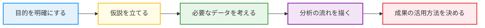
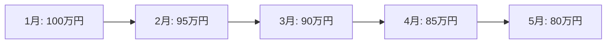
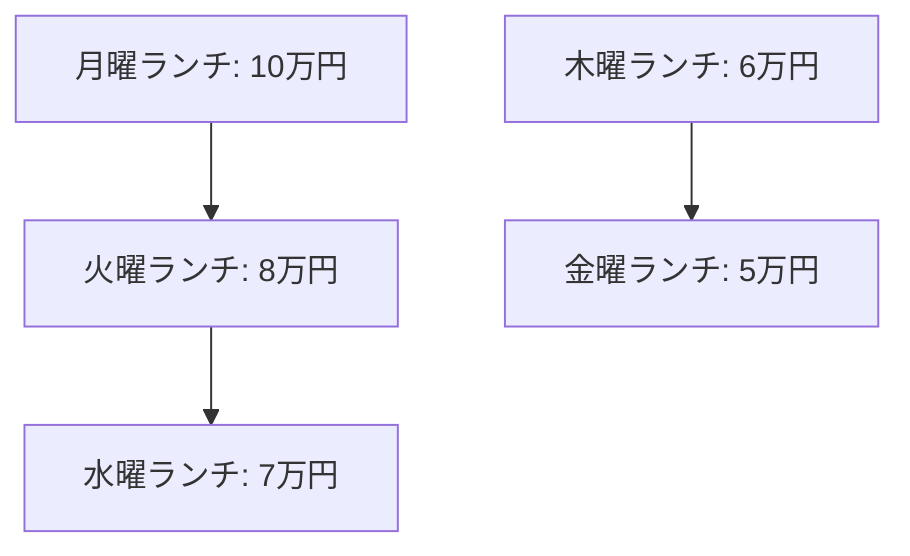

# データ分析の“設計図”を描こう！

データ分析の世界で「シナリオ作成」は、まさに“設計図”です。  

分析の目的を明確にし、仮説を立て、必要なデータを集め、分析の流れを考え、結果をどう活用するかまでを描く  

この一連の流れが、あなたの分析を成功に導きます。

このページでは、データ分析を始めるにあたり、**なぜシナリオ作成が必要なのか**、その重要性と具体的なステップを解説します。


---

## 1. はじめに：なぜ「シナリオ作成」が必要なのか？

データ分析は「データを集めてグラフを作る」だけではありません。

目的やゴールが曖昧なまま進めると、膨大なデータの海で迷子になってしまいます。  

**シナリオがあれば、分析の“道しるべ”となり、最短距離で成果にたどり着けます**。

---

## 2. シナリオ作成とは何か？

シナリオとは「分析の設計図」です。具体的には、

- 何のために分析するのか（目的）
- どんな仮説を検証したいのか
- どんなデータが必要か
- どんな手順・流れで進めるか
- 分析結果をどう活用するか

を事前に整理することです。

---

## 3. シナリオがないとどうなる？（失敗例）

例えば
「とりあえずデータを集めてみたけど、何を見ればいいか分からない」
「分析したけど、結局何が言いたいのか分からない」

これはシナリオがない典型例です。

**目的やゴールが曖昧だと、時間も労力も無駄になりがち**です。

---

## 4. シナリオ作成のステップ：誰でもできる5つの手順



1. **目的を明確にする**（例：売上が下がった理由を知りたい）
2. **仮説を立てる**（例：特定の商品が売れていないのでは？）
3. **必要なデータを考える**（例：商品別売上データ、期間、店舗情報など）
4. **分析の流れを描く**（例：売上推移→商品別比較→要因分析）
5. **成果の活用方法を決める**（例：販促施策の立案、経営会議での報告）

---

## 5. 実践例：シナリオ作成で分析が変わる！


ここでは「カフェの売上が減少している」という課題を例に、シナリオ作成の具体的な流れと分析へのつなげ方を体験してみましょう。

---

### 1. 顧客の課題ヒアリング

あるカフェの店長さんから「最近、売上が下がってきて困っている。何が原因か分からず、対策も立てられない」という相談がありました。

- **顧客の悩み**：
    - 売上が昨年より10%以上減少
    - どの時間帯・曜日・商品が影響しているか分からない
    - 何を改善すればよいか分からない

---

### 2. 問題の整理とシナリオ案の作成

ヒアリング内容をもとに、以下のようにシナリオを整理します。

- **目的**：売上減少の要因を特定し、具体的な改善策を提案する
- **仮説**：
    1. 平日ランチタイムの集客が減っているのでは？
    2. 人気メニューの販売数が落ちているのでは？
- **必要なデータ**：
    - 日別・時間帯別の売上・客数
    - 商品別売上データ
    - 天候、キャンペーン実施履歴
- **分析の流れ**：
    1. 月別・曜日別・時間帯別の売上推移を可視化
    2. 人気メニューの販売数推移を確認
    3. 天候やキャンペーンとの関係を分析
- **成果の活用方法**：
    - 平日ランチ限定の新メニューや割引施策を検討
    - 人気メニューの再プロモーション

---

### 3. 分析の実施

#### (1) 月別売上推移の可視化



- **結果**：売上が月を追うごとに減少していることが分かる

#### (2) 曜日・時間帯別売上の可視化



- **結果**：特に平日ランチタイムの売上が大きく落ちていることが判明

#### (3) 人気メニューの販売数推移

- 例：カレーランチの販売数が昨年比で30%減少
- 天候やキャンペーンの有無と重ねて分析したところ、雨天時やキャンペーン未実施時に顕著な減少が見られた

---

### 4. 分析結果からの提案

- 平日ランチタイムに新メニューや割引クーポンを導入
- 人気メニューの再プロモーションを実施
- 雨天時限定の集客施策を検討

---

### Before/Afterまとめ

|  | Before（シナリオなし） | After（シナリオあり） |
|---|---|---|
| 進め方 | なんとなくグラフ化 | 顧客課題を整理し、目的・仮説・手順を明確化 |
| 分析内容 | 月別売上推移のみ | 曜日・時間帯・商品・要因分析まで |
| 得られる成果 | 売上減少しか分からない | 原因特定・具体的な施策提案 |

**このように、顧客の課題を丁寧に整理し、シナリオを作成することで、分析が“問題解決の武器”になります！**

---

## 6. まとめ：シナリオ作成から始めよう！

データ分析の第一歩は「設計図＝シナリオ」を描くこと。

初心者こそ、まずは紙とペンで“自分なりのシナリオ”を書いてみましょう。
シナリオがあれば、分析のゴールが明確になり、成果につながる分析ができるようになります。

---

## シナリオ作成の雛形（テンプレート）

```
【分析の目的】
（例：売上減少の要因を特定したい）

【仮説】
（例：特定商品・特定期間の売上が落ちているのでは？）

【必要なデータ】
（例：商品別売上データ、期間、店舗情報など）

【分析の流れ】
（例：売上推移→商品別比較→要因分析）

【成果の活用方法】
（例：販促施策の立案、経営会議での報告）
```

これらを一覧で分類ごとに一覧で整理することをおすすめします。
ほかにも、マーケティング分野(MA)でのシナリオ分析も参考になるので、ぜひ調べてみてください。

---

## 参考資料・おすすめリンク

- [データ分析のシナリオ設計入門（外部記事）](https://www.ryuzee.com/contents/blog/10141)
- [データ分析の基本プロセス（Qiita）](https://qiita.com/ynakayama/items/1e7e2e2e2e2e2e2e2e2e)
- [ビジネスデータ分析の教科書（書籍）](https://www.amazon.co.jp/%E3%83%87%E3%83%BC%E3%82%BF%E5%88%86%E6%9E%90%E3%81%AE%E6%95%99%E7%A7%91%E6%9B%B8-%E7%8F%BE%E5%A0%B4%E3%81%A7%E5%8D%B3%E6%88%A6%E5%8A%9B%E3%81%AB%E3%81%AA%E3%82%8B%E3%83%87%E3%83%BC%E3%82%BF%E3%82%B5%E3%82%A4%E3%82%A8%E3%83%B3%E3%82%B9%E3%81%AE%E5%8B%98%E6%89%80-%E6%A0%AA%E5%BC%8F%E4%BC%9A%E7%A4%BE%E6%97%A5%E7%AB%8B%E8%A3%BD%E4%BD%9C%E6%89%80-Lumada-Science/dp/4865943005/ref=sr_1_1?adgrpid=173037347218&dib=eyJ2IjoiMSJ9.6PXm33a-BvPeEThYpam3StxF5WsT6afTD7rf5KHWMRRO_6zujbbZSny2b1OeWxh3E3gIXoQOcY6ddqaBeHza5x3_Eqsh5F9u8DVeB1NMbgsL2HGPh1ivZfyg_WvhBoumhHof473GVZC388GXoOFEhx5c5H-0tREJ0uT_z-R-prnQAJq3I-nCHuSOws9j8TEsmlZ7xg7cJcKTlp8_oLPTXufiaOCKcF0waSZRh-wN32WOWoX-ITTaEqzs4pFCO5nFTYd3AlyLusjZAlR4UV81xtyaV8FsS_-Cx8wpMF0r4Ps.IWCTc-1GO12qdbZmZe1vxPPpDvkyftY1K7wz9_PMf7E&dib_tag=se&hvadid=725288564540&hvdev=c&hvexpln=0&hvlocphy=9053343&hvnetw=g&hvocijid=17899690334837536894--&hvqmt=e&hvrand=17899690334837536894&hvtargid=kwd-2382711310747&hydadcr=2755_13722196&jp-ad-ap=0&keywords=%E3%83%93%E3%82%B8%E3%83%8D%E3%82%B9%E3%83%87%E3%83%BC%E3%82%BF%E5%88%86%E6%9E%90%E3%81%AE%E6%95%99%E7%A7%91%E6%9B%B8&mcid=1210a3eba33f3eda806a762d6bc0c22f&qid=1750754649&sr=8-1)
- [データ分析シナリオの策定](https://www.hp.sankei-bc.co.jp/caats-20210125)
- [シナリオ設計とは？基本から応用、マーケティングでの成功の秘訣を解説](https://kyozon.net/list/what-is-scenario-planning/)
- [MAのシナリオとは？設計方法と具体例【テンプレート付き】](https://satori.marketing/marketing-blog/scenario/)

---

## コメント
