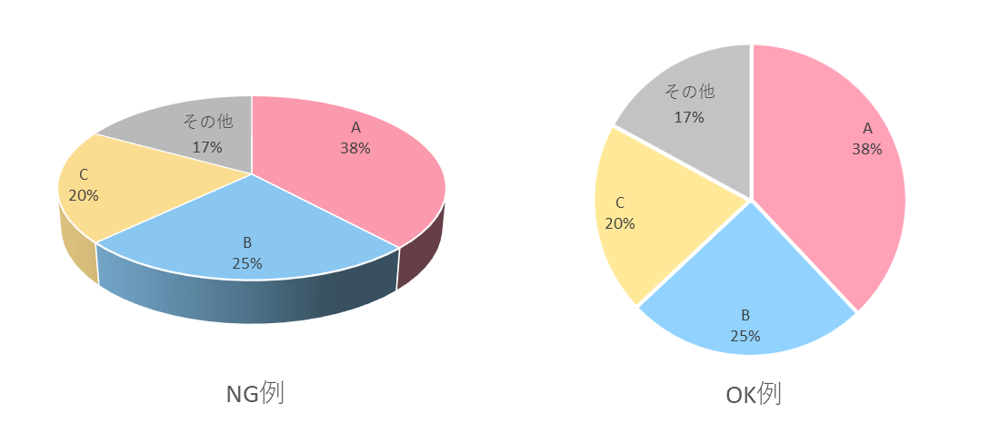

# 1-6. 誠実な可視化をするには

## グラフはよくも悪くも強力な情報伝達手段

前回データ前処理を学んだことで、ついに可視化の準備が整いました。  
ですが、グラフを作成するといっても、闇雲に作ればいいわけではありません。  
ここでは、見た人に情報を正しく伝えるために避けるべきアンチパターンを紹介します。  

早速ですが、以下の2つのグラフを見比べてどう思いますか？  
どちらも使用しているデータは同じですが、読みやすさや印象が大きく異なります。

<SreGenericChart
    chartType="bar"
    chartData={{
        labels: ['自社', '競合A', '競合B'],
        datasets: [
            {
                label: '売上',
                data: [289, 267, 250],
                backgroundColor: ['rgba(75, 192, 192, 1)', 'rgb(180, 180, 180)', 'rgba(180, 180, 180, 1)'],
            },
        ],
    }}
    chartOptions={{
        plugins: {
            legend: {
                display: false,
            },
            title: {
                display: true,
                text: '売上比較',
            },
            datalabels: {
                display: true,
                formatter: function(value, context) {
                    return value + '千円';
                },
            },
        },
        scales: {
            x: {
                grid: {
                    display: false,
                }
            },
            y: {
                beginAtZero: true,
                grid: {
                    display: true,
                },
                ticks: {
                    stepSize: 50,
                    // 縦軸 単位表示
                    callback: function(value, index, ticks) {
                    return index < ticks.length - 1 ?
                    this.getLabelForValue(value) :
                    ['千円', this.getLabelForValue(value)];
                }
                }
            },
        },
    }}
/>

<SreGenericChart
    chartType="bar"
    chartData={{
        labels: ['自社', '競合A', '競合B'],
        datasets: [
            {
                label: '売上',
                data: [289, 267, 250],
                backgroundColor: ['rgba(255, 28, 28, 1)', 'rgba(255, 217, 0, 1)', 'rgba(8, 24, 255, 1)'],
                borderColor: '#000000',
                borderWidth: 4,
                barPercentage: 0.9,
            },
        ],
    }}
    chartOptions={{
        backgroundColor: 'rgba(30, 30, 30, 1)',
        plugins: {
            legend: {
                display: false,
            },
            title: {
                display: true,
                text: '売上比較',
            },
        },
        scales: {
            x: {
                grid: {
                    display: true,
                    color: 'rgba(50, 50, 50, 1)',
                },
                ticks: {
                    font: {
                        size: 18,
                        color: 'rgba(0, 0, 0, 1)',
                        weight: 'bold',
                    },
                }
            },
            y: {
                min: 240,
                grid: {
                    display: true,
                    color: 'rgba(0, 0, 0, 1)',
                },
                ticks: {
                    stepSize: 10,
                    maxTicksLimit: 100,
                    font: {
                        size: 18,
                        color: 'rgba(0, 0, 0, 1)',
                        weight: 'bold',
                    },
                }
            },
        },
    }}
/>

上のグラフは自社と競合他社で棒を色分けしており、競合他社は薄いグレーにすることで水色の自社の棒が際立っています。  
縦軸も0から始まっているため、**棒の長さで正確に値を比較**できます。  
背景やグリッド線、軸の文字も控えめで、最も注目してほしい棒が見やすくなっています。  

一方、下のグラフは棒の色分けに意味がなく、注目すべきポイントが分かりにくくなっています。  
さらに、**縦軸が0始点ではないため、3社の売上の差が実際よりも大きく見えてしまいます**。  
競合Aは自社の10％程度売り上げが低いだけなのに、棒の長さは半分くらいになっているため、**実態と異なる印象**を植え付けてしまいます。  
また、全体的に棒の色やグリッド線、棒の枠線、軸の文字など、棒の長さ以外の要素の主張が強く、見るのに疲れます。  

このように、全く同じデータを使用しても、**グラフのデザイン次第で情報の伝わり方が大きく変わる**ことが分かります。  
グラフは良くも悪くも強力な情報伝達手段であるため、良くないデザインをしてしまうと誤解を招いたり、認知的負荷を高めてしまいます。  
そのため、グラフを作成するときは、伝えたいことを的確に伝えるためにデザインを工夫する必要があります。  
必要なことを伝え、余計な情報や誤解を招く表現を避けられる、**誠実な可視化**の方法を身につけましょう。

### この記事で得られること

- 誤解を招く表現や過度な装飾など、よくあるアンチパターンを「見分けて」「直せる」ようになる
- 迷ったときに立ち返れる判断基準として、データインクレシオ（Data-Ink Ratio）の考え方を押さえる

## これだけはやめよう！データ可視化のアンチパターン

### 1. 棒グラフの軸が0から始まっていない

冒頭の下のグラフがまさにこのアンチパターンの例です。  

棒グラフは、**棒の長さで値の大きさを比較するためのグラフ**です。  
もし軸の始点が0から始まっていないと、棒の長さが実際の値の差を正確に反映しなくなります。  
そのため、実際にはそこまで差がないのに、**あたかも大きな差があるかのように見せるグラフ**が現実でも横行しています。  

また、グラフの途中で波線を挟んで省略する表現もしばしばみられますが、これも棒の長さが正確でなくなるので出来るだけ避けるべきです。  
リテラシーのある人にはすぐに見抜かれてしまうので、こういった表現は避けましょう。  

### 2. 3Dグラフの使用

Excelなどでも簡単に作成できる3Dグラフですが、奥行き情報が加わることで核となる視覚属性を阻害することがあるため避けるべきです。  

例えば左の3D円グラフでは、25%のBの方が38%のAと同じかそれ以上に大きく見えます。  
一方、右の2D円グラフではAの方が大きいことが一目瞭然です。  

このように、3Dにすると**面積や長さで正確に値を比較することが難しく**なってしまいます。  
本来は面積や長さで大小を簡単に比較するために作るはずなのに、これでは意味がありません。  

実際、テレビや広告などの一部の3Dグラフが印象操作であるとネット上で指摘されることがあります。  
昨今はこういった事例がSNSで拡散されることもあり、人々の見る目も以前より厳しくなっているでしょう。  
そのため、3Dグラフを使うとそれだけで**不誠実な印象を与える**可能性があります。  

3Dグラフを使って不誠実だと思われて損するのはもったいないので、使用は控えましょう。  

### 3. 過剰な装飾（チャートジャンク）

グラフを装飾しすぎると、**チャートジャンク（chart junk）** と呼ばれる状態になります。  
冒頭の下の棒グラフが、まさにチャートジャンクの典型例です。  
チャートジャンクとは、情報伝達に不要な**過度な装飾を加える**ことで、本来伝えたい**情報の意味を歪めたり、理解を妨げる現象**を指します。  

グラフ作成の原則は、**伝えたいことに合わせて過不足なく可視化する**ことです。  
そのため、伝えたいことに必要な装飾だけに留めるようにしましょう。  

:::tip[データインクレシオ（Data-Ink Ratio）を意識しよう]

過剰な装飾を避けるときに役立つのが、**データインクレシオ**という考え方です。  
ざっくり言うと、**図の中のインク（視覚要素）のうち、どれくらいがデータを伝えるために使われているか**という比率のことです。  
ここでいうインクとは、線、色、形、テキストなどのグラフを形作る視覚的なパーツのことです。  

データインクレシオは以下の式で表されます。  

$$
    \text{データインクレシオ} = \frac{\text{データを表すためのインク}}{\text{図全体に使われているインク}}
$$

つまり、**データインクレシオが高ければ、無駄な装飾が少なく、データを伝えるために上手にインクを使えている**ということになります。  

冒頭の2つの棒グラフで言うと、上のグラフは余計な線や色、形を使わず、強調したい自社の棒だけに色を使っているので、データインクレシオが高いです。  
一方、下のグラフはグリッド線や文字サイズ、枠線、棒の色など、データの本質ではないところにインクが多く使われており、データインクレシオが低いです。  

もちろん、**要素を減らしすぎてデータが伝わらなくなる**のも本末転倒です。  
例えば、注記・強調・ガイド線などが**理解を助ける**なら、それは**必要なインク**です。  
そのため、**必要最低限を常に意識して、適切に伝わるけど無駄もない**というバランスを目指しましょう。  

:::

#### データインクレシオを上げるコツ

- **背景・枠・影を弱める/消す**：背景色、太い枠線、シャドウ、過度なグラデーションを控える
- **グリッド線は最小限**：薄くする／間引く／必要な補助線だけにする
- **色は意味に割り当てる**：カテゴリや強調したいものに色を使い、その他はグレーなどで抑える
- **色のトーンも考慮する**：鮮やかすぎたり強すぎる色は避け、少しくすんだ色や薄い色を使う
- **ユニバーサルデザインを意識する**：色覚多様性に配慮したカラーパレットを使う
- **ラベルは厳選する**：散布図などでは全点ではなく、要点（最大・最小・注目点）だけ注記する

## まとめ：誠実な可視化のための最終チェック

今回はグラフ作成で避けるべきアンチパターンを3つ紹介しました。  
まとめると以下のとおりです。  

- 棒グラフの軸は**0起点**
- 3Dは避け、**面積・長さ**など読み取りやすい表現を優先
- 装飾は「データ」か「理解の補助」のために行い、**データインクレシオ**が高くなるよう見直す

他にも注意点はたくさんありますが、まずはこれらを守るだけでも、誠実な可視化に大きく近づけます。  
過不足なく、誤解を与えないグラフを目指して、ぜひ実践してみてください。  

## 参考資料

- [『データビジュアライゼーションの教科書』](https://www.shuwasystem.co.jp/book/9784798053486.html)
- [『データ視覚化のデザイン』](https://amzn.asia/d/eZEJuGJ)