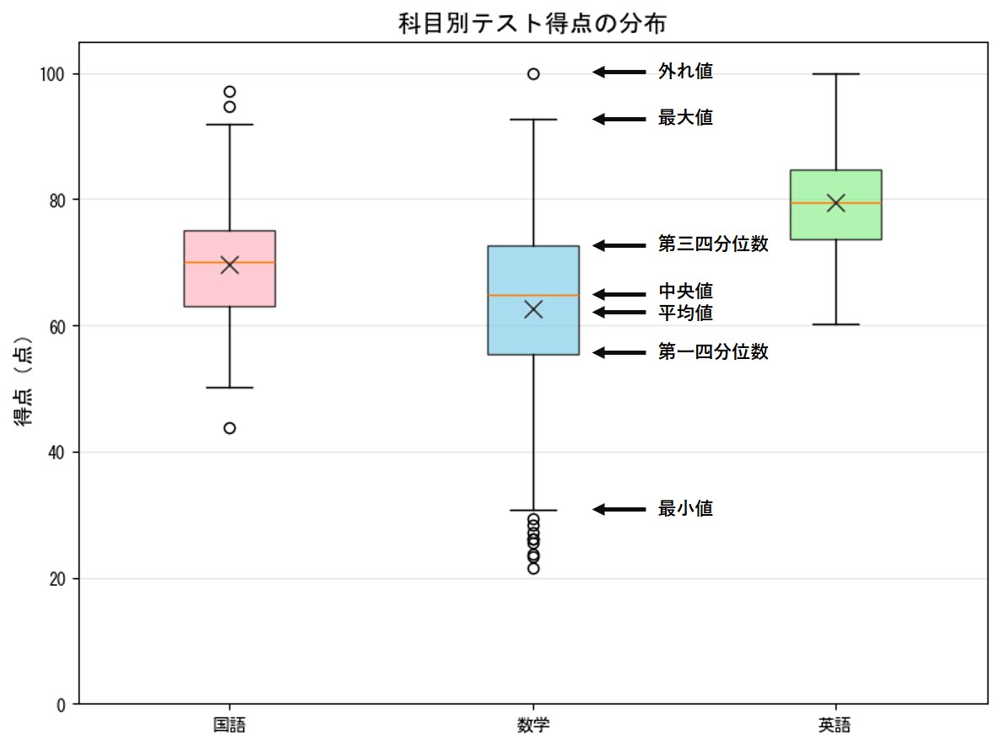
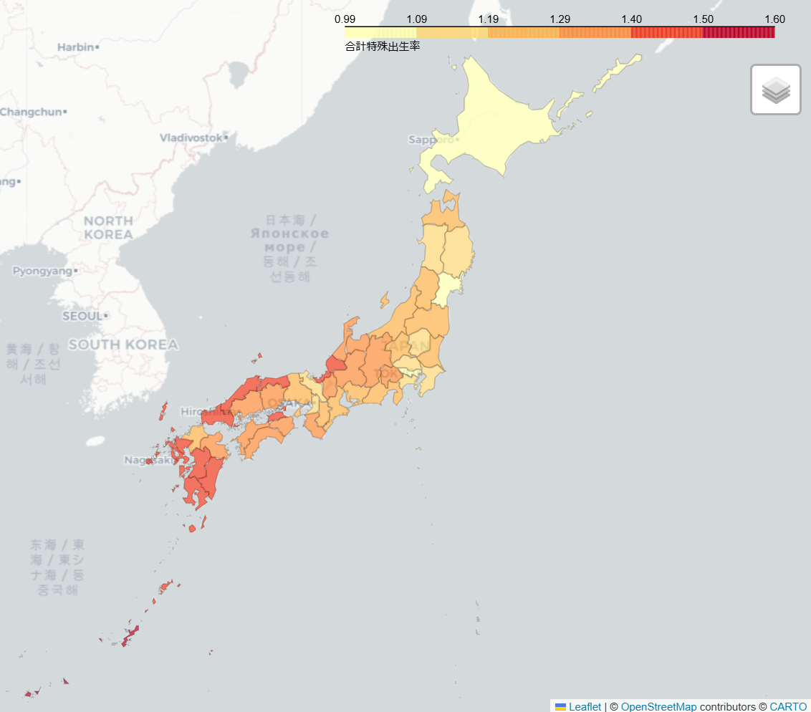
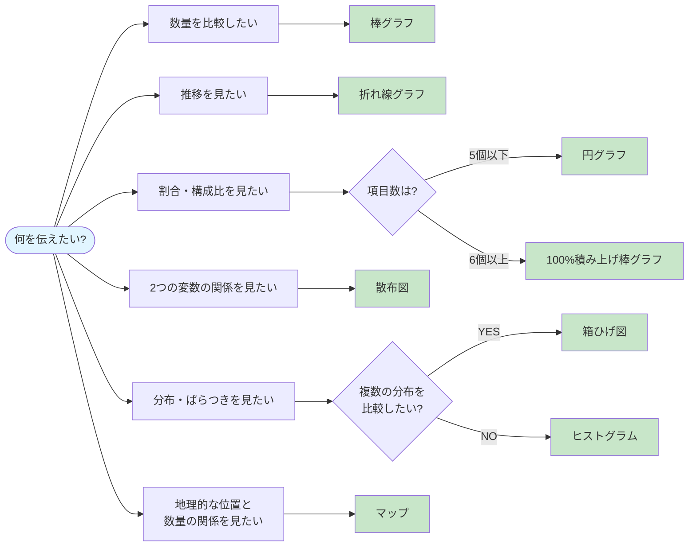

# 1-4. 目的に応じたグラフの選び方

**投稿者：Yukina Matsumoto**

## 目的が決まればグラフも決まる

前回はデータの種類と視覚属性の相性について学びました。  
データの種類によって、視覚属性がある程度決まるということが分かりましたね。  
しかし、**グラフを選ぶにはもっと大事なポイント**があります。  

それは、**「見る人」に何を伝えたいのか**という**目的**です。

**同じデータでも、何を伝えたいかによって選ぶべきグラフは変わります。**  
それは、グラフによって異なる視覚属性を持っており、そこから読み取れるメッセージも変わるからです。  
ここでは、目的に応じたグラフの選び方を具体的に解説します。

## 目的別：適切なグラフの選び方

ここでいう「目的」とは具体的に何なのか、もう少し詳しく見ていきましょう。  
今回は1つのグラフを作成するときの目的として、以下の6つを挙げます。  
いずれもビジネスシーンで可視化したいときによくある目的です。

- **比較**したい
- **推移・変化**を見たい
- **割合・構成比**を示したい
- **分布・ばらつき**を把握したい
- **複数の要素の関係性**を探りたい
- **地理的な位置との関係性**を示したい

ここからは、それぞれの目的に応じた代表的なグラフの種類と使い方を紹介します。

 

### 1. 比較

**「どちらが大きい？」「どれが一番？」を見せる**  
データの可視化において最も基本的な目的です。  
他の目的も、比較がベースになっています。

**こんなときに使う:**

- 商品別の売上を比較したい
- 地域ごとの顧客数を比較したい
- 今月と先月の実績を比較したい

 

#### 棒グラフ（Bar Chart）

**最も基本的な比較のグラフ**

<SreGenericChart
  chartType="bar"
  chartData={{
    labels: ['商品A', '商品B', '商品C', '商品D', '商品E'],
    datasets: [
      {
        label: '売上',
        data: [120, 190, 150, 220, 180],
        backgroundColor: 'rgba(101, 159, 253, 1)',
      },
    ],
  }}
  chartOptions={{
    responsive: true,
    plugins: {
      legend: {
        display: false
      },
      title: {
        display: true,
        text: '商品別売上比較（万円）',
      },
    },
    scales: {
      x: {
        grid: {
          display: false,
        },
      },
      y: {
        title: {
          display: true,
          text: '売上（万円）',
        },
        min: 0,
        max: 250,
        ticks: { stepSize: 50 },
      },
    },
  }}
/>

**特徴:**

- 視覚属性の「長さ」で比較するため、わずかな差も認識しやすい
- 項目数が多くても対応可能
- 誰でも理解しやすい

**適したデータ:**

- X軸: 名義尺度、順序尺度（商品名、地域名など）
- Y軸: 比例尺度、間隔尺度（売上、個数など）

**ポイント:**

- 比較したい項目を横軸に並べる
- 複数期間を比較する場合はグループ化棒グラフを使う
- 長さが数量そのものにあたるので、必ず軸はゼロから始める

---

### 2. 推移・変化

**「どう変化している？」「傾向は？」を見せる**  
推移という名のとおり、**時間の経過に伴う変化**を見ることが目的です。

**こんなときに使う:**

- 月次売上の変化を見せたい
- アクセス数の推移を追いたい
- 株価の変動を示したい

 

#### 折れ線グラフ（Line Chart）

**時系列データの定番**

<SreGenericChart
  chartType="line"
  chartData={{
    labels: ['1月', '2月', '3月', '4月', '5月', '6月', '7月', '8月', '9月', '10月', '11月', '12月'],
    datasets: [
      {
        label: '売上',
        data: [320, 280, 350, 380, 420, 450, 480, 460, 500, 520, 490, 550],
        borderColor: 'rgba(101, 159, 253, 1)',
        backgroundColor: 'rgba(101, 159, 253, 1)',
        fill: true,
        pointRadius: 2,
      },
    ],
  }}
  chartOptions={{
    responsive: true,
    plugins: {
      legend: {
        display: false
      },
      title: {
        display: true,
        text: '月次売上推移（万円）',
      },
    },
    scales: {
      x: {
        grid: {
          display: false,
        },
      },
      y: {
        title: {
          display: true,
          text: '売上（万円）',
        },
        min: 200,
        max: 600,
        ticks: { stepSize: 100 },
      },
    },
  }}
/>

**特徴:**

- 視覚属性の「（点の）位置」と「（線の）向き」で傾向を把握しやすい
- 連続的な変化・傾向を視覚化できる

**適したデータ:**

- X軸: 時間（日付、月、年など）
- Y軸: 比例尺度、間隔尺度（売上、気温など）

**ポイント:**

- X軸は必ず時間
- 複数の系列を重ねて比較できる
- 相対的な傾向を見たい場合は、必ずしも軸はゼロから始めなくてもよい

**棒グラフとの使い分け:**

- 折れ線: 連続的な変化・傾向を見せたい
- 棒グラフ: 期間ごとの値を比較したい

---

### 3. 割合・構成比

**「全体のうちどれくらい？」「内訳は？」を見せる**  
数量や大きさそのものではなく、**割合や内訳といった比率**が重要な場合に使います。

**こんなときに使う:**

- 市場シェアを示したい
- 予算の配分を見せたい
- 年代別の購入比率を比較したい

 

#### 円グラフ（Pie Chart）

**全体に対する大まかな割合を直感的に示す**

<SreGenericChart
  chartType="pie"
  maxWidth={400}
  chartData={{
    labels: ['当社', '競合A', '競合B', '競合C'],
    datasets: [
      {
        data: [35, 25, 20, 12],
        backgroundColor: [
          'rgba(101, 159, 253, 1)',
          'rgba(123, 135, 150, 0.8)',
          'rgba(156, 163, 175, 0.8)',
          'rgba(209, 213, 219, 0.8)',
        ],
      },
    ],
  }}
  chartOptions={{
    responsive: true,
    plugins: {
      legend: {
        position: 'right',
      },
      title: {
        display: true,
        text: '市場シェア（%）',
      },
    },
  }}
/>

**特徴:**

- 視覚属性の「向き（角度）」と「大きさ（面積）」で割合を表現
- 大まかな構成比を一目で把握できる

**適したデータ:**

- すべての尺度（合計が100%になるデータ）
- 項目数: 4個以下

**ポイント:**

- 合計が100%になるデータのみに使用
- 項目が多い場合や、構成比を比較したい場合は100%積み上げ棒グラフを使う
- 項目が多い場合は上位N項目+その他に集約するとよい
- 正確な値の比較には向かない（角度や面積は正確に比較しづらい）

 

#### 100%積み上げ棒グラフ（100% Stacked Bar Chart）

**複数グループの構成比を比較する**

<SreGenericChart
  chartType="bar"
  chartData={{
    labels: ['10代', '20代', '30代', '40代', '50代以上'],
    datasets: [
      {
        label: '商品A',
        data: [15, 25, 30, 20, 10],
        backgroundColor: 'rgba(101, 159, 253, 1)',
      },
      {
        label: '商品B',
        data: [30, 35, 25, 15, 10],
        backgroundColor: 'rgba(123, 172, 252, 1)',
      },
      {
        label: '商品C',
        data: [25, 20, 25, 30, 35],
        backgroundColor: 'rgba(157, 194, 255, 1)',
      },
      {
        label: 'その他',
        data: [30, 20, 20, 35, 45],
        backgroundColor: 'rgba(235, 235, 235, 1)',
      },
    ],
  }}
  chartOptions={{
    responsive: true,
    plugins: {
      legend: {
        position: 'top',
      },
      title: {
        display: true,
        text: '年代別商品購入比率（%）',
      },
    },
    scales: {
      x: {
        stacked: true,
        grid: {
          display: false,
        },
      },
      y: {
        stacked: true,
        max: 100,
        title: {
          display: false,
          text: '構成比（%）',
        },
        ticks: {
          stepSize: 20,
        },
      },
    },
  }}
/>

**特徴:**

- 視覚属性の「長さ」で割合を比較できる
- 複数のグループ間で構成比の違いを見せられる
- 円グラフより多くの項目やグループを扱える
- 円グラフに比べて割合を正確に比較しやすい

**適したデータ:**

- X軸: 名義尺度、順序尺度（年代、地域など）
- Y軸の内訳: すべての尺度（合計が100%になるように変換）

**ポイント:**

- 各グループの合計が100%になる
- 絶対値ではなく割合の比較に特化
- 5項目以上、または複数グループを比較する場合に有効

---

### 4. 分布・ばらつき

**「どこに集まっている？」「ばらつきは？」を見せる**  
この目的の場合、集計する前の生データをもとに可視化します。  
そのため、他の分析をする前に得られたデータそのものの特徴を把握したいときに使います。

**こんなときに使う:**

- テストの点数分布を見せたい
- 年齢層の偏りを示したい
- データの外れ値を見つけたい

 

#### ヒストグラム（Histogram）

**データの分布形状を把握**

<SreGenericChart
  chartType="bar"
  chartData={{
    labels: ['0-10', '11-20', '21-30', '31-40', '41-50', '51-60', '61-70', '71-80', '81-90', '91-100'],
    datasets: [
      {
        label: '人数',
        data: [2, 3, 5, 8, 12, 18, 22, 15, 10, 5],
        backgroundColor: 'rgba(101, 159, 253, 1)',
        barPercentage: 1.0,
        categoryPercentage: 1.0,
      },
    ],
  }}
  chartOptions={{
    responsive: true,
    plugins: {
      legend: {
        display: false
      },
      title: {
        display: true,
        text: 'テスト点数の分布',
      },
    },
    scales: {
      x: {
        title: {
          display: true,
          text: '点数',
        },
        grid: {
          display: false,
        },
      },
      y: {
        beginAtZero: true,
        title: {
          display: true,
          text: '人数',
        },
      },
    },
  }}
/>

**特徴:**

- 視覚属性の「長さ」で度数、「幅」で階級の区間（ビン幅）を表現
- どの区間に値が集中しているかが一目でわかる
- 正規分布、偏り、外れ値などのパターンを発見できる

**適したデータ:**

- X軸: 比例尺度、間隔尺度（連続的な数値データ）
- Y軸: 度数（個数）

**ポイント:**

- X軸は数値の範囲（階級）、Y軸は度数
- 1つのグループの分布を見る場合に最適
- 階級の幅（ビン幅）で見え方が変わるので、適切なビン幅の設定が重要

:::tip **ヒストグラムと棒グラフの違い**

ずばり、**棒の横幅に意味があるかどうか**です。

**ヒストグラム**: 連続的な数値データを区切って分布をみる
- 棒の幅は連続した値を階級という区分で別の棒に区切っているだけ = 棒同士をくっつける必要がある
  - 例）10～20, 20～30, 30～40という区間は連続している
- 高さ（度数）と幅（階級の区間）からなる面積でデータの分布を表現
  - 棒の幅が見え方に影響する

**棒グラフ**: カテゴリごとの度数や値の比較
- 長さだけに意味があり、棒の幅は意味がない = 棒同士を離して表示する
  - 例）商品A、商品Bは別々のカテゴリであり、間に連続性はない
  - 棒の幅は見え方に影響しない
:::

 

#### 箱ひげ図（Box Plot）

**中央値、四分位数、外れ値を一度に把握**

**特徴:**

- データの分布を複数の統計値で要約
- 複数グループの分布を並べて比較しやすい
- 読み解くのに一定の知識が必要

**読み方:**

- 箱: 第一四分位数〜第三四分位数（箱の中に中央50%のデータが含まれる）
  - 第一四分位数: データの小さい方から25％の位置の値
  - 第三四分位数: データの小さい方から75％の位置の値
- 線（箱の中の線）: 中央値
- 線（ひげ）: 最小値〜最大値の範囲
- ○印: 外れ値
- ×印: 平均値

**適したデータ:**

- 値: 比例尺度、間隔尺度（連続的な数値データ）
- グループ: 名義尺度、順序尺度

**ポイント:**

- 複数グループの分布比較に最適
- 基本的な統計量が一度に把握できるので、一定知識がある人には便利

---

### 5. 複数の要素の関係性

**「関連性はある？」「相関している？」を見せる**  
この目的の場合も、集計する前の生データをもとに可視化します。  
2つ以上の量的データが互いにどのような関係にあるかを把握したいときに使います。

**こんなときに使う:**

- 広告費と売上の関係を調べたい
- 気温とアイスの売上の相関を見たい
- 勉強時間と成績の関係を示したい

 

#### 散布図（Scatter Plot）

**2つの変数の相関関係を可視化**

<SreGenericChart
  chartType="scatter"
  chartData={{
    datasets: [
      {
        label: '各月のデータ',
        data: [
          {x: 50, y: 180},
          {x: 80, y: 250},
          {x: 120, y: 320},
          {x: 150, y: 380},
          {x: 200, y: 480},
          {x: 250, y: 580},
          {x: 300, y: 650},
          {x: 350, y: 720},
          {x: 400, y: 800},
          {x: 450, y: 880},
          {x: 500, y: 950},
          {x: 550, y: 1020},
        ],
        backgroundColor: 'rgba(101, 159, 253, 1)',
        pointRadius: 3,
      },
    ],
  }}
  chartOptions={{
    responsive: true,
    plugins: {
      legend: {
        display: false
      },
      title: {
        display: true,
        text: '広告費と売上の関係',
      },
    },
    scales: {
      x: {
        title: {
          display: true,
          text: '広告費（万円）',
        },
        beginAtZero: true,
      },
      y: {
        title: {
          display: true,
          text: '売上（万円）',
        },
        beginAtZero: true,
      },
    },
  }}
/>

**特徴:**

- 視覚属性の「位置」で関係性を直感的に理解
- 正の相関、負の相関、無相関を視覚的に判断できる

**適したデータ:**

- X軸: 比例尺度、間隔尺度
- Y軸: 比例尺度、間隔尺度

**ポイント:**

- 外れ値やクラスターの発見にも有効
- 因果関係ではなく相関関係を示す
- 相関がなくても「関係がない」という重要な情報が得られる

---

### 6. 地理的な位置との関係性

**「地域による違いは？」「どこに集中している？」を見せる**  
地理的な位置と、地域ごとの数量などの関係を把握したいときに使います。  

**こんなときに使う:**

- 都道府県別の売上を見せたい
- 店舗の売上分布を示したい
- 地域的なパターンを発見したい

 

#### マップ（Map Chart）

**地域ごとの違いを視覚化**

2023年度　都道府県別合計特殊出生率（e-Statのデータをもとに作成）

**特徴:**

- 地理的なパターンを発見しやすい
- 地域的な偏りや集中を直感的に把握できる

**適したデータ:**

- 地域: 都道府県、市区町村などの地理データ
- 値: すべての尺度

**ポイント:**

- 塗りつぶす場合、色の濃淡で値の大小を表現
- 具体的な数値の比較には棒グラフを併用すると効果的

---

## グラフ選択のフローチャート

 

## 実際にグラフを選んでみよう

以下のシナリオに最適なグラフを考えてみましょう。

### 問題1

**状況**: 過去1年間の月別売上データがある  
**伝えたいこと**: 売上が季節によって変動していることを示したい  
**最適なグラフは？**

答えを見る

**折れ線グラフ**

理由: 

- 目的は「推移」を見せること
- 時系列データ
- 季節変動というパターン（傾向）を視覚的に捉えやすい

### 問題2

**状況**: 5つの商品の今月の売上データがある  
**伝えたいこと**: どの商品が最も売れているかを示したい  
**最適なグラフは？**

答えを見る

**棒グラフ**

理由:

- 目的は「大きさの比較」
- カテゴリデータ（商品名）
- 長さの視覚属性で直感的に大小を把握できる

### 問題3

**状況**: 100人の顧客の年齢データがある  
**伝えたいこと**: 顧客の年齢層の偏りを示したい  
**最適なグラフは？**

答えを見る

**ヒストグラム**

理由:

- 目的は「分布・ばらつき」を見せること
- 連続的な数値データ（年齢）
- どの年齢層に集中しているかが一目でわかる

### 問題4

**状況**: 全社の予算配分データがある（開発40%、営業30%、管理20%、その他10%）  
**伝えたいこと**: 各部門の予算の割合を示したい  
**最適なグラフは？**

答えを見る

**円グラフ**

理由:

- 目的は「割合・構成比」
- 項目数が4個と少ない
- 合計が100%で、全体に対する割合を直感的に示せる

### 問題5

**状況**: 都道府県別の人口データがある  
**伝えたいこと**: どの地域に人口が集中しているかを示したい  
**最適なグラフは？**

答えを見る

**マップ**

理由:

- 目的は「地域による違い」
- 地理的なパターンを一目で把握できる
- 首都圏や大都市圏への集中が視覚的にわかる

### 問題6

**状況**: 毎月の広告費と売上のデータがある  
**伝えたいこと**: 広告費を増やすと売上が増えるかを確認したい  
**最適なグラフは？**

答えを見る

**散布図**

理由:

- 目的は「2つの変数の関係性」
- 両方とも量的データ
- 相関関係を視覚的に確認できる

 

## まとめ：目的が決まればグラフも決まる

今回は、目的に応じたグラフの選び方を学びました。  
**「見る人」に何を伝えたいのか**という目的さえ明確なら、自然と適切なグラフがわかるようになります。  
逆に言えば、目的が曖昧だとグラフ選びに失敗してしまうかもしれません。  
まずは、**目的に応じてグラフを選ぶという考え方**をしっかり身につけましょう。

また、紹介したグラフは基本的なものであり、実際にはもっと多くの種類があります。  
しかし、それらもこの6つのグラフから派生していることがほとんどですので、最初は基本をしっかり押さえましょう。

 

# 参考資料

- [データビジュアライゼーションの教科書](https://www.shuwasystem.co.jp/book/9784798053486.html)