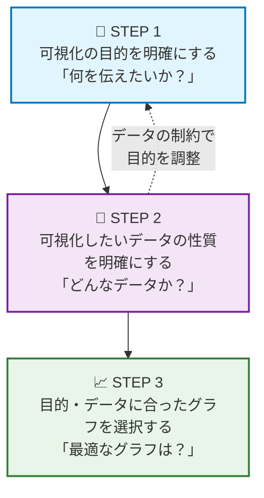
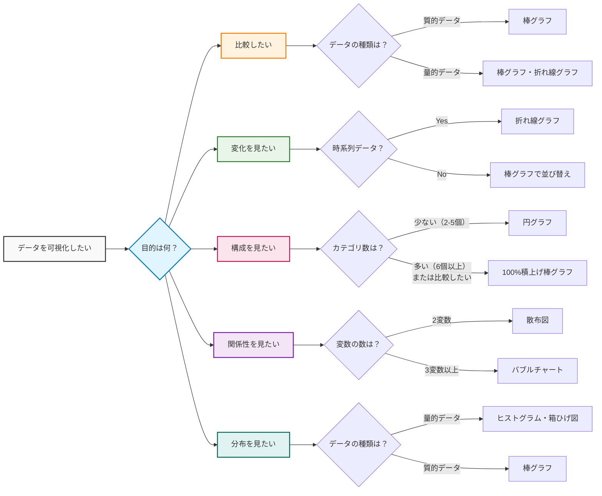

# 1-3. 迷わずグラフを選べる！3ステップ思考法

## いざグラフを作成するときに結局迷いませんか？
一通りグラフの種類やデータの尺度を学んだけど、いざ実践する際にどうやってグラフを選ぼう・・・と悩むことはありませんか？  
可視化で迷ったら、次の3ステップを思い出してください。  
この考え方を身につければ、どんなデータでも自信をもってグラフにできるはずです！

## グラフ選びの3ステップ

**📝 ステップの順番について**

実際の現場では「データを見てから目的を決める」ことがほとんどです：

### 🔄 実践的なアプローチ
1. **データを確認する** - どんなデータがあるか把握
2. **目的を明確にする** - データで何を伝えられるかを考える
3. **データの性質を詳しく分析** - 目的に合うデータかチェック
4. **適切なグラフを選択** - 目的とデータの両方に最適なグラフを選ぶ

**このアプローチなら、手持ちのデータを最大限活用して意味のある可視化ができます。**

### ステップ1: 分析対象のデータを踏まえて目的を明確にする
グラフはメッセージを伝えるための道具です。  
**まずは手持ちのデータを確認し、そのデータで「何が分かるか」「何を伝えられるか」を考えましょう。**

**🔍 データを見てから目的を決める実践的アプローチ**

1. **手持ちのデータを眺める**
   - どんな項目（変数）があるか？
   - データの期間や範囲は？
   - 何か面白そうな傾向はありそうか？

2. **データの特徴から可能な分析を考える**
   - 時系列データなら「変化」が見える
   - カテゴリ別データなら「比較」ができる
   - 変数が複数あるなら「関係性」が調べられる

3. **伝えたいメッセージを決める**
   - このデータから何を伝えたいか？
   - 読み手にとって価値のある気づきは何か？

**💡 データから目的を見つける質問例**
- 「このデータを見て、一番驚くことは何？」
- 「このデータで業務改善につながる発見はある？」
- 「時間の経過で何か変化している？」
- 「グループ間で違いはある？」

目的は以下の5つに分類できます：

1. **比較** - どちらが大きい？どれが一番？
2. **変化** - 時間とともにどう変わった？
3. **構成** - 全体の中での割合は？
4. **関係性** - 2つのデータに関連はある？
5. **分布** - データはどのようにばらついている？

それぞれの目的を詳しく見ていきましょう。

#### 比較
カテゴリ間で量や大きさを比較したいときの目的です。
**データを見てこんなことが気になったら「比較」の目的：**
- 「AとBはどちらが多い？」
- 「地域別でばらつきがありそう」
- 「ランキングにしたらどうなる？」

具体例：
- 商品AとBの売上比較
- 部署別の残業時間
- 都道府県別の人口

#### 変化
時間の経過とともにどのように変化したかを見る目的です。
**データを見てこんなことが気になったら「変化」の目的：**
- 「最近増えている／減っているような気がする」
- 「季節による変動がありそう」
- 「昨年と比べてどうだろう？」

具体例：
- 月別売上の推移
- 株価の変動
- コロナ感染者数の推移

#### 構成
全体の中での割合や構成比を見る目的です。
**データを見てこんなことが気になったら「構成」の目的：**
- 「全体の中で何が一番多い？」
- 「シェアはどうなっている？」
- 「構成比が変わっているかも」

具体例：
- 売上の商品別構成比
- 年代別のアンケート回答割合
- 予算の費目別配分

#### 関係性
2つ以上のデータに関連があるかを調べる目的です。
**データを見てこんなことが気になったら「関係性」の目的：**
- 「Aが増えるとBも増える？」
- 「この2つは関係ありそう」
- 「相関があるかもしれない」

具体例：
- 気温とアイスクリーム売上の関係
- 広告費と売上の関係
- 年収と満足度の関係

#### 分布
データのばらつきや傾向を見る目的です。
**データを見てこんなことが気になったら「分布」の目的：**
- 「みんな同じような値？それともばらつきがある？」
- 「平均的なのはどのあたり？」
- 「極端に高い／低いものはある？」

具体例：
- テストの得点分布
- 従業員の年齢分布
- 商品価格の分布

### ステップ2: データの性質を明確にする
目的が決まったら、次は手持ちのデータの性質を確認します。  
**ここで重要なのは、データの制約によって目的の調整が必要になる場合があることです。**

#### 🔄 目的とデータの整合性をチェック
データを確認した結果、以下のような場合は目的の見直しが必要です：

**例：目的の調整が必要なケース**
- **関係性を見たかったが** → データが1変数しかない → **分布や変化**に目的変更
- **変化を見たかったが** → 時系列データがない → **比較**に目的変更  
- **構成比を見たかったが** → 全体の合計が意味をなさない → **比較**に目的変更

**💡 柔軟な思考が大切**  
「このデータで何が分かるか？」「何を伝えられるか？」を常に意識しましょう。

#### データの種類を確認する質問
前回学んだ「データの種類」を思い出してください。
1. **量的データ vs 質的データ**
   - 「平均を計算して意味があるか？」→ Yes：量的データ、No：質的データ

2. **質的データの場合：順序があるか？**
   - 順序がある → 順序尺度（満足度、成績など）
   - 順序がない → 名義尺度（血液型、色など）

3. **量的データの場合：真のゼロがあるか？**
   - 真のゼロがある → 比例尺度（身長、年収など）
   - 真のゼロがない → 間隔尺度（気温、IQなど）

#### データの構造を確認する質問
- **変数の数**：1つ？2つ？それ以上？
- **時系列性**：時間の経過とともに変化するデータか？
- **カテゴリ数**：質的データの場合、いくつのカテゴリがあるか？

### ステップ3: 具体的なグラフ選択の思考回路

ここまでで「目的」と「データの性質」が明確になりました。  
最後に、この2つの情報を組み合わせて最適なグラフを選択します。

#### 🧠 グラフ選択の思考フローチャート

#### 💡 実践的な選択のコツ

**迷ったときの判断基準：**

1. **シンプルなものを選ぶ**
   - 複雑なグラフより、理解しやすいグラフを優先
   - 読み手のことを最優先に考える

2. **データの特性を活かす**
   - 時系列データなら折れ線グラフ
   - カテゴリ比較なら棒グラフ
   - 全体に対する割合なら円グラフ

3. **目的に忠実になる**
   - 「何を伝えたいか」を常に意識
   - グラフの見た目より、メッセージの伝わりやすさを重視

4. **試行錯誤する**
   - 複数のグラフを作って比較
   - 第三者に見せて意見をもらう

### 実践例：思考回路を体験してみよう

#### 例1：月別の売上データ
**データ**: 1月〜12月の各月の売上金額

**STEP 1: 目的は？**
→ 「月ごとの売上の変化を見たい」= **変化**

**STEP 2: データの性質は？**
→ 売上金額（量的データ・比例尺度）+ 時系列データ

**STEP 3: グラフ選択**
→ **折れ線グラフ** が最適（時系列の変化を表現）

#### 例2：アンケートの満足度結果
**データ**: 満足度5段階評価の回答分布

**STEP 1: 目的は？**
→ 「回答の分布を見たい」= **分布**

**STEP 2: データの性質は？**
→ 満足度（質的データ・順序尺度）

**STEP 3: グラフ選択**
→ **棒グラフ** が最適（カテゴリごとの度数を表現）

#### 例3：部署別の予算配分
**データ**: 各部署に割り当てられた予算額

**STEP 1: 目的は？**
→ 「全体予算に対する各部署の割合を見たい」= **構成**

**STEP 2: データの性質は？**
→ 部署名（質的データ・名義尺度）+ 予算額（量的データ・比例尺度）

**STEP 3: グラフ選択**
→ 部署数が少なければ**円グラフ**、多ければ**積み上げ棒グラフ**

## まとめ：グラフ選択は「目的×データ」の掛け算

グラフ選択で迷わないためのポイント：

1. **目的を明確にする**（比較・変化・構成・関係性・分布）
2. **データの性質を把握する**（量的/質的、時系列性、変数の数）
3. **目的とデータの組み合わせでグラフを決める**
4. **シンプルで伝わりやすいものを選ぶ**

この3ステップを習慣化すれば、どんなデータでも適切なグラフを選択できるようになります。  
最初は時間がかかっても、繰り返し実践することで自然と身につきます。

**次回データを可視化するときは、ぜひこの思考回路を試してみてください！**

