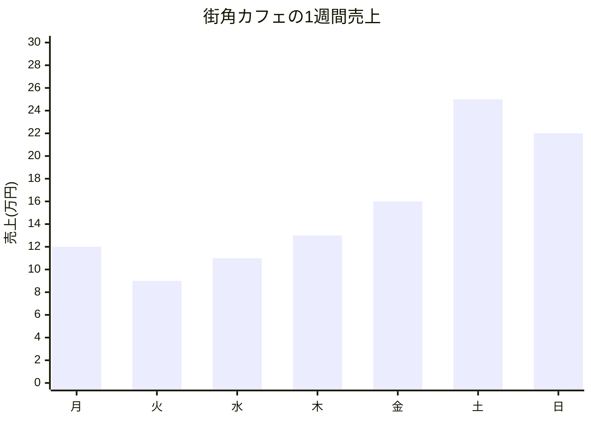

# 1-1. データを可視化する目的

## なぜデータを「見える化」するの？
皆さんも「データ可視化」という言葉を聞いたことがあるかもしれませんね。実は、数字の表を見ているだけでは気づけないことが、グラフにするだけで一瞬で分かるようになるんです！

## データの可視化って何？
まず、データとは**私たちの身の回りで起こっていることを記録した情報**のことです。数字だけでなく、文字や画像、音声なども含まれます。例えば、お店の売上（数字）、お客さんのアンケート回答（文字）、商品の写真（画像）、気温の変化（数字）、顧客の性別（カテゴリー）などですね。

データの可視化とは、**これらの様々な情報から傾向やパターンを見つけ出し、グラフや図にして一目で分かるようにすること**です。

## 実際に体験してみよう
例えば、あるカフェの1週間の売上データを見てみましょう。

### 数字だけで見るとこんな感じ…
|  | 月曜 | 火曜 | 水曜 | 木曜 | 金曜 | 土曜 | 日曜 |
|:---|:---|:---|:---|:---|:---|:---|:---|
| 売上(万円) | 12 | 9 | 11 | 13 | 16 | 25 | 22 |

この表を見て、何か気づくことはありますか？パッと見ただけだと「なんとなく土曜日が一番高いかな？」程度にしか分からないですよね。

### でも、グラフにするとこんなに分かりやすく！

どうでしょう？グラフにすると一瞬で分かりますよね！
- **平日は10～16万円**で推移
- **週末（土日）は20万円以上**で平日の約2倍
- **火曜日が最も低く**、土曜日がピーク

これが可視化の力です。同じデータでも、**見せ方を変えるだけで「気づき」が生まれる**んです。

## 可視化する3つのメリット

### 1. 瞬時に理解できる
数字の表を見るのに5分かかることも、グラフなら3秒で理解できます。

### 2. 問題や改善点が見つかる
上のカフェの例では「火曜日の売上が低い理由は何だろう？」という疑問が生まれますよね。

### 3. 他の人にも伝わりやすい
会議で数字をずらずら読み上げるより、グラフを1枚見せる方が説得力があります。

## まとめ
データの可視化は、**データに隠れている「物語」を見つけ出す魔法のツール**です。同じ情報でも、見せ方次第で全く違った発見や気づきが生まれます。

これからデータ分析を学んでいく中で、「数字を眺める」のではなく「数字の向こう側にある意味を見つける」ことを意識してみてくださいね！

## 参考
- [データビジュアライゼーションの教科書](https://www.shuwasystem.co.jp/book/9784798053486.html)