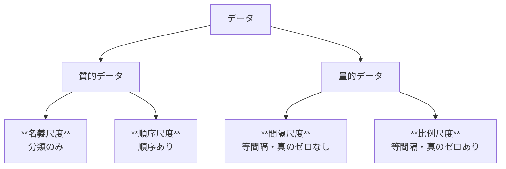
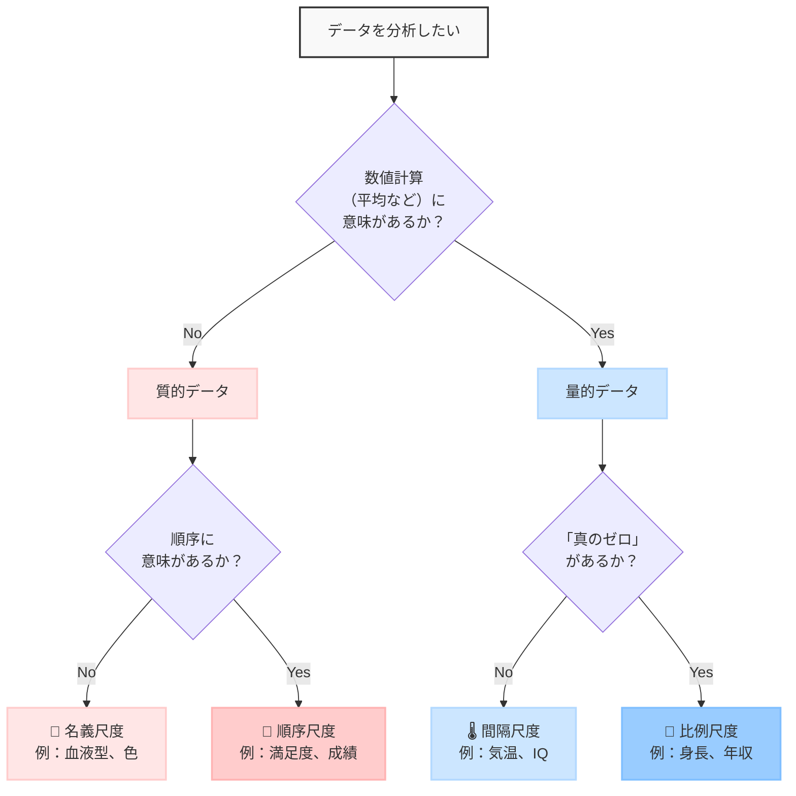

# 1-2. グラフを構成するデータの種類

## なぜデータの種類を理解する必要があるの？

データ分析を行う際、まず理解しておくべきなのが**データの種類**です。  
データの種類によって、適用できる統計手法や適切なグラフの選択が大きく変わるためです。

例えば、身長のデータと好きな色のデータでは、計算できる統計量も表現方法も全く異なります。  
この違いを理解することで、データを正確に分析し、適切に可視化できるようになります。

## データの2つの大きな分類

データは大きく「量的データ」と「質的データ」に分けることができます。  

さらに詳しく見ると、それぞれの中にも細かい分類があります。  
量的データには「間隔尺度」と「比例尺度」が、質的データには「名義尺度」と「順序尺度」があります。

### 📋 質的データ（カテゴリーデータ）
**「何の種類？」「どのグループ？」と聞けるデータ**

質的データは性質や分類を表すデータで、数字があっても計算に意味がないデータです。  
質的データはさらに2つに分けられます。

#### 📛 名義尺度（Nominal Scale）
**ただの分類・ラベルのデータ**

- 分類・区別のみ可能
- 順序や大小関係に意味がない
- 数字があっても計算は無意味

**例：**
- 血液型：A型、B型、O型、AB型
- 色：赤、青、緑、黄色
- 都道府県：東京都、大阪府、北海道...
- 背番号：1番、10番、23番...（1番が10番より優秀という意味ではない）

#### 🥇 順序尺度（Ordinal Scale）
**順番に意味があるデータ**

- 分類・順序付けが可能
- 大小関係に意味がある
- 間隔（差）に意味がない
- 足し算・引き算は意味がない

**例：**
- 満足度：★1（不満）、★2（やや不満）、★3（普通）、★4（満足）、★5（大満足）
- 成績：A、B、C、D、F
- 企業規模：大企業、中企業、小企業
- 年代：10代、20代、30代、40代...
- 競技の順位：1位、2位、3位...

> **🤔 コラム：「間隔（差）に意味がない」ってどういうこと？**  
> 例えば100m走では1位、2位と順位が決まりますが、順位だけ見ても接戦だったのか、1位が大差で勝ったのかといった量的な情報はわかりません。  
> このように、順位には順序はあっても、その間隔（差）の情報が含まれていないのです。

### 🔢量的データ（数値データ）
**「いくつ？」「どれくらい？」と聞けるデータ**

量的データは数字で測ることができ、計算（足し算、平均など）に意味があるデータです。  
量的データも2つに分けられます。

#### 🌡️ 間隔尺度（Interval Scale）
**等間隔だけど、真のゼロがないデータ**

- 足し算・引き算はできるが、割り算・掛け算は意味がない
- 「真のゼロ」がない（ゼロでも「何もない」わけではない）

**例：**
- 気温（摂氏）：20℃、30℃...（30℃が20℃の1.5倍暖かいわけではない）
- IQスコア：100、110、120...
- 偏差値：50、60、70...

#### 📏 比例尺度（Ratio Scale）
**真のゼロがある完全な数値データ**

- すべての数学的計算が可能
- 比率に意味がある（2倍、3倍などが意味を持つ）

**比例尺度は「真のゼロ」を持つデータです**

**具体例で理解しよう：**
- **身長0cm** → 身長が全く存在しない状態（理論的に可能な絶対的なゼロ）
- **体重0kg** → 重さが全く存在しない状態
- **年収0円** → 収入が全く存在しない状態
- **年齢0歳** → 生まれていない状態（理論的に可能な絶対的なゼロ）
- **販売個数0個** → 何も売れていない状態（文字通りゼロ）
- **絶対温度0K** → 熱エネルギーが全く存在しない状態（理論的に可能な絶対的なゼロ）

**✅ なぜ比率計算ができるの？**  
ゼロが「絶対的な起点」なので、どの単位を使ってもゼロはゼロのまま、比率も変わりません。

**身長の例：**
- センチメートル：0cm、100cm、200cm → 「200cmは100cmの2倍」
- メートル：0m、1m、2m → 「2mは1mの2倍」
- インチ：0inch、39.4inch、78.7inch → 「78.7inchは39.4inchの約2倍」

どの単位でも比率は変わらないため、比率に意味があるのです。

**数学的操作が可能な理由：**
- **割り算**: 180cm ÷ 90cm = 2（単位が消えて純粋な比率になる）
- **掛け算**: 50kg × 2 = 100kg（2倍の重さ）
- **比率**: 年収600万円 ÷ 300万円 = 2（2倍の関係）

**例：**
- 身長：170cm、180cm...（180cmは170cmの約1.06倍）
- 体重：60kg、70kg...
- 年収：300万円、600万円...（600万円は300万円の2倍）
- 年齢：25歳、50歳...（50歳は25歳の2倍）
- 販売個数：0個、50個、100個...
- 絶対温度（ケルビン）：0K、100K、200K...（200Kは100Kの2倍）

> **🤔 コラム：「真のゼロ」って何？**  
> 統計学では、ゼロの意味によって量的データを区別します：
> - **真のゼロ** = その量が完全に存在しない状態（絶対的なゼロ）
> - **任意のゼロ** = 人間が便宜上決めた基準点（相対的なゼロ）
> 
> **間隔尺度は「任意のゼロ」を持つデータです**
> 
> **具体例で理解しよう：**
> - **摂氏0℃** → 温度が存在しないわけではない（水が凍る基準点として人間が決めただけ）
> - **テストの0点** → テストの点数が存在しないのではなく、0点という点数が存在する  
> テストは基本的に決められた範囲の内容を理解しているかどうかを測るために実施するものと仮定します。  
> その場合、下限（0点）も上限（満点）も人為的に決められたものであるため、0点が相対的な位置にあることがわかります。  
> 例えば英語の能力を測る場合、英語が一切理解できない状態が絶対的なゼロとみなせます。  
> ですが、中学レベルの英語のテストで0点を取ったからと言って、英語が全く理解できないとは限りません。  
> つまり、そのテストにおける0点は「英語が全くできない」という絶対的なゼロではなく、あくまで「そのテストにおける基準点」に過ぎないのです。
> 
> **❌ なぜ間隔尺度では比率計算ができないの？**  
> 基準点（ゼロの位置）が人為的に決められているため、単位や基準を変えると比率も変わってしまいます。
> 
> **温度の例：**  
> 温度には相対的な温度を示す「摂氏（℃）」や「華氏（℉）」と、「絶対温度（K）」があります。  
> 温度は物質の熱振動（原子の振動）によって生じるとされ、熱振動がなくなるとそれ以上温度も下がらなくなります。  
> この時の温度を絶対零度（0 K）と定めたものが絶対温度です。  
> 絶対零度（0 K）は「真のゼロ」にあたるため、絶対温度は比例尺度に該当します。  
> 
> 一方、摂氏や華氏は「真のゼロ」を持たない間隔尺度であるため、比率計算ができません。  
> 試しに計算して確かめてみましょう。  
> 摂氏10℃と20℃を絶対温度に変換すると、以下のようになります。  
>
> 摂氏10℃ = 283.15 K  
> 摂氏20℃ = 293.15 K
>
> 摂氏でも絶対温度でも、差は10℃（10 K）で同じです。  
> では、摂氏20℃は10℃の2倍でしょうか？  
> 絶対温度で計算すると  
> 293.15 K ÷ 283.15 K ≈ 1.035   → 2倍ではありません。  
>
> このように、絶対温度（比例尺度）に変換してから計算したら、摂氏20℃は10℃の2倍ではないことがわかります。  
> したがって間隔尺度は比率計算ができないのです。

## 4つの尺度をまとめて理解しよう

ここまでの内容をまとめると、データには4つの尺度があり、それぞれ異なる特徴と用途があります。

| 尺度 | 分類 | 特徴 | 例 | 可能な統計量 |
|:---|:---|:---|:---|:---|
| **名義尺度** | 質的データ | 分類のみ | 血液型、色 | 最頻値、度数 |
| **順序尺度** | 質的データ | 分類 + 順序 | 満足度、成績 | 最頻値、度数、中央値 |
| **間隔尺度** | 量的データ | 等間隔・真のゼロなし | 気温、IQ | 上記 + 平均値、標準偏差 |
| **比例尺度** | 量的データ | 等間隔・真のゼロあり | 身長、年収 | すべて + 変動係数、比率 |

### 覚え方のコツ

**質的データ（赤）から量的データ（青）へ、段階的に情報が豊かになっていきます。**
> 💡 **データ取得のポイント**  
> データを取得するとき、**出来るだけ情報量の多い尺度**で取得することをおすすめします。  
> 例えば、年齢を取得するときに比例尺度として「具体的な年齢（例：25歳）」で取得できれば、平均値などの定量的な分析が可能ですし、あとから「20代」「30代」といったグループで集計することも可能です。  
> 逆に、最初から「20代」「30代」といった順序尺度として取得してしまうと、**後から具体的な年齢に戻すことは不可能**なため、分析の幅が狭まってしまいます。  
> もちろん、回答者への負担なども考慮したうえで、適切な尺度でデータを取得しましょう。

## 実例で理解しよう

### ケース1：コーヒーショップの顧客データ
あるコーヒーショップが顧客について以下のデータを集めました：

| 顧客ID | 年齢 | 会員種別 | 月間利用回数 | 満足度 |
|:---|:---|:---|:---|:---|
| 001 | 25歳 | プレミアム | 12回 | ★5 |
| 002 | 34歳 | 一般 | 8回 | ★4 |
| 003 | 28歳 | プレミアム | 15回 | ★3 |

**どれが量的データ？質的データ？**
- **年齢（25歳、34歳、28歳）** → 量的データ（平均年齢が計算できる）
- **会員種別（プレミアム、一般）** → 質的データ（分類・グループ）
- **月間利用回数（12回、8回、15回）** → 量的データ（合計や平均が意味を持つ）
- **満足度（★1～★5の5段階評価）** → 質的データ（順序はあるが数値計算は意味がない。例えば★5が★4の1.25倍の評価、という意味にはならない）

**4つの尺度で詳しく分類すると：**
- **年齢** → 比例尺度（量的データ・真のゼロがあり、30歳は15歳の2倍生きている）
- **会員種別** → 名義尺度（質的データ・単純な分類）
- **月間利用回数** → 比例尺度（量的データ・0回から数えられ、20回は10回の2倍）
- **満足度** → 順序尺度（質的データ・順序はあるが等間隔ではない）

## データの種類を判断する練習

## よくある間違いポイント

### ❌ 数字があるからといって量的データとは限らない
- **郵便番号**：100-0001, 150-0002... → 名義尺度（識別のためだけの番号）
- **電話番号**：090-1234-5678... → 名義尺度（識別用の番号）
- **学籍番号**：20241001, 20241002... → 名義尺度（順序や識別用）

### ❌ 順序があるからといって間隔尺度とは限らない
- **満足度（5段階評価）**：「とても満足」と「満足」の差と、「満足」と「普通」の差が同じとは限らない → 順序尺度
- **成績（A、B、C、D）**：AとBの差とBとCの差が同じとは限らない → 順序尺度

### ❌ 計算できるからといって比例尺度とは限らない
- **気温（摂氏）**：30℃は15℃の2倍暖かいわけではない → 間隔尺度
- **IQスコア**：120は60の2倍賢いわけではない → 間隔尺度

### ✅ 判断のコツ
データの尺度を見分けるための手順：

1. **数値計算（平均など）に意味があるか？**
   - No → **質的データ**（名義尺度 or 順序尺度）
   - Yes → **量的データ**（間隔尺度 or 比例尺度）

2. **質的データの場合：順序に意味があるか？**
   - No → **名義尺度**（血液型、色など）
   - Yes → **順序尺度**（満足度、成績など）

3. **量的データの場合：「真のゼロ」があるか？**
   - No → **間隔尺度**（気温、IQなど）
   - Yes → **比例尺度**（身長、年収など）

**シンプルな判断例：**
- 身長の平均 → 意味がある（比例尺度・量的データ）
- 気温の平均 → 意味がある（間隔尺度・量的データ）
- 満足度の平均 → 意味が薄い（順序尺度・質的データ）
- 血液型の平均 → 意味がない（名義尺度・質的データ）

### 📊 データ尺度判定フローチャート

## まとめ

データの種類を理解することは、**適切な統計分析とグラフ選択を行うための第一歩**です。

### 2つの基本分類
- **質的データ** → カテゴリーや分類を表すデータ
- **量的データ** → 数値として測定されるデータ

### 4つの詳細な尺度
- **名義尺度**（質的） → 分類のみ
- **順序尺度**（質的） → 順序あり
- **間隔尺度**（量的） → 等間隔・真のゼロなし
- **比例尺度**（量的） → 等間隔・真のゼロあり

**学習のステップ：**
1. まずは**量的・質的の基本分類**をマスター
2. 慣れてきたら**4つの尺度**を意識する
3. データ尺度に適した**統計手法とグラフ**を選択する

次回データを扱うときは、「このデータは量的？質的？」「どの尺度？」と自問してみてください。  
より適切な分析と可視化ができるようになります。

# 参考
- [データビジュアライゼーションの教科書](https://www.shuwasystem.co.jp/book/9784798053486.html)