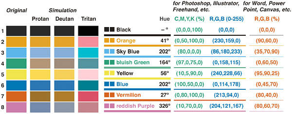
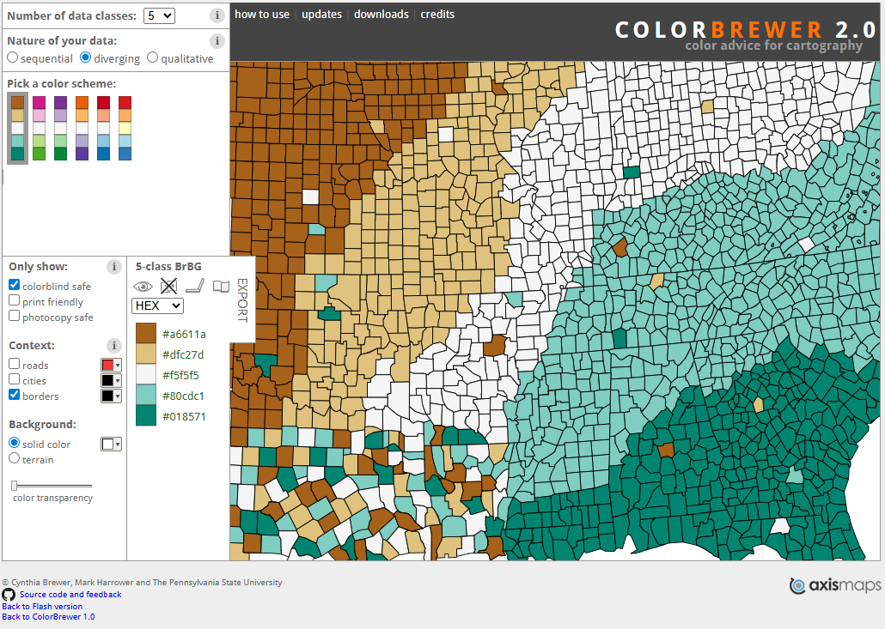
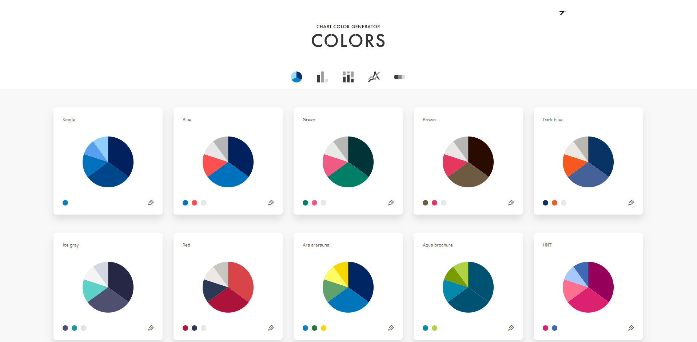
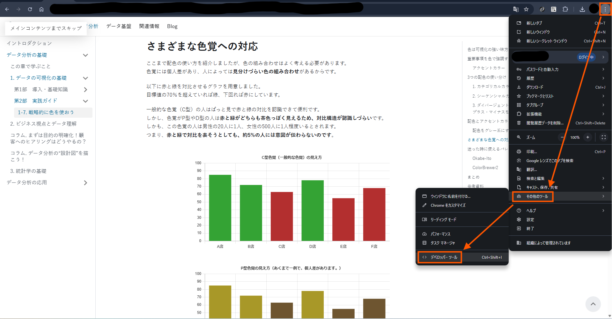
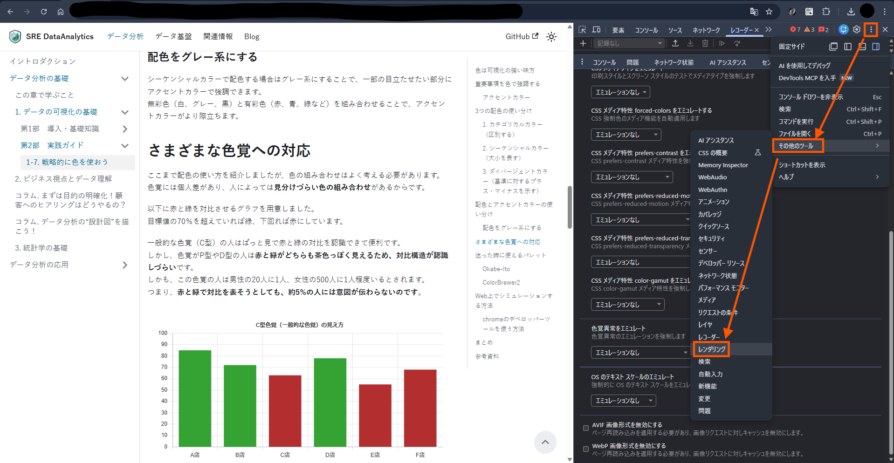
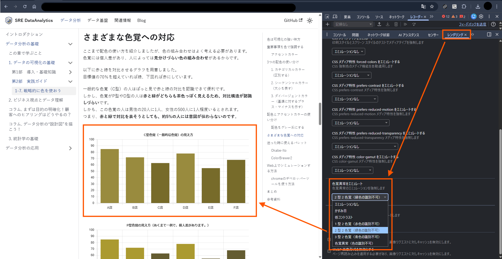

# 1-7. 戦略的に色を使おう

**投稿者：Yukina Matsumoto**

## 色は可視化の強い味方

グラフを作成するときに重要なのが、色の使い方です。  
色は組み合わせることによってあらゆる効果を発揮し、グラフをよりわかりやすくすることができます。  
さらに、カラーユニバーサルデザイン（CUD）を意識することで、見る人の色覚の違いにかかわらず情報を正しく伝えられます。  

しかし、色は影響度が大きい分、雑に使うとかえって**見づらくなったり伝えたいことを阻害する**こともあります。  
そこで、**目的に応じて戦略的に色を使う**ことで、色を効果的に使えるようになりましょう。

## 色を使う目的と使い分け

グラフで何を伝えたいかによって、適切な色の使い方は変わります。  
ここでは主要な目的に合った色の使い方を紹介します。  

### 1. 重要な情報を強調する（アクセントカラー）

グラフでもっともよく使われる色の目的は、**重要な情報を強調すること**です。  
これをシンプルに実現する方法が、**アクセントカラー**です。  
**基本はグレーなどの目立ちにくい色で統一し、強調したい要素だけ赤・青などの目立つ色をつける**手法です。  
人間の脳は周囲と異なる色を一瞬で認識できるため、アクセントカラーの部分に自然と目が向きます。

**使用例：**
- 自社と他社の比較
- 目標達成した要素の強調
- 全体の中の賛成の割合

具体例を見てみましょう。

以下は、架空の事業所別の売上を比較したグラフです。  
もし**事業者Bの立ち位置を把握したいという目的**であれば、事業者Bを強調した以下のグラフが適しています。  

<SreGenericChart
    chartType="bar"
    chartData={{
        labels: ['事業所A', '事業所B', '事業所C', '事業所D', '事業所E'],
        datasets: [
            {
                label: '売上',
                data: [280, 242, 203, 180, 150],
                backgroundColor: ['rgb(180, 180, 180)', 'rgb(252, 198, 21)', 'rgba(180, 180, 180, 1)', 'rgba(180, 180, 180, 1)', 'rgba(180, 180, 180, 1)'],
            },
        ],
    }}
    chartOptions={{
        indexAxis: 'y',
        plugins: {
            legend: {
                display: false,
            },
            title: {
                display: true,
                text: '事業所別売上',
            },
            datalabels: {
                display: true,
                formatter: function(value, context) {
                    return value + '千円';
                },
            },
        },
        scales: {
            x: {
                beginAtZero: true,
                grid: {
                    display: true,
                },
                ticks: {
                    stepSize: 50,
                    callback: function(value, index, ticks) {
                        return index < ticks.length - 1 ?
                        this.getLabelForValue(value) :
                        ['千円', this.getLabelForValue(value)];
                    },
                },
            },
            y: {
                grid: {
                    display: false,
                },
            },
        },
    }}
/>

一方、**各事業所が目標を達成したかどうかを把握することが目的**ならば、**目標を下回っている事業所を赤く強調することで危機感を持たせる**ことができます。  
<SreGenericChart
    chartType="bar"
    chartData={{
        labels: ['事業所A', '事業所B', '事業所C', '事業所D', '事業所E'],
        datasets: [
            {
                label: '売上',
                data: [280, 242, 203, 180, 150],
                backgroundColor: ['rgba(180, 180, 180, 1)', 'rgba(180, 180, 180, 1)', 'rgba(180, 180, 180, 1)', 'rgb(210, 80, 60)', 'rgb(210, 80, 60)'],
            },
        ],
    }}
    chartOptions={{
        indexAxis: 'y',
        plugins: {
            legend: {
                display: false,
            },
            title: {
                display: true,
                text: '事業所別売上',
            },
            datalabels: {
                display: true,
                formatter: function(value, context) {
                    return value + '千円';
                },
            },
        },
        scales: {
            x: {
                beginAtZero: true,
                grid: {
                    display: true,
                },
                ticks: {
                    stepSize: 50,
                    callback: function(value, index, ticks) {
                        return index < ticks.length - 1 ?
                        this.getLabelForValue(value) :
                        ['千円', this.getLabelForValue(value)];
                    },
                },
            },
            y: {
                grid: {
                    display: false,
                },
            },
        },
    }}
    referenceXLines={[{ x: 200, color: '#e05555', label: '目標: 200千円' }]}
/>

このように、**伝えたいメッセージによって強調すべき要素は変わります**。  
自分がそのグラフで何を伝えたいのかを明確にしたうえで、強調する要素を選びましょう。  

### 2. データをグループで区別する（カテゴリカルカラー）

**複雑なデータを分類・グループ化して理解を容易にしたい**ときに使う配色を**カテゴリカルカラー**といいます。  
**色同士に順序や大小が存在しない**ため、**並列な関係性のデータを区別**するときに有効です。  

**使用例：**
- 居住地域
- 商品カテゴリ
- 事業別

具体例を見てみましょう。  

以下は国・地域別のインターネット普及率、平均寿命、人口の関係を表したバブルチャートです。  
横軸がインターネット普及率、縦軸が平均寿命、バブルのサイズが人口を表します。  
参考として、インターネット普及率と平均寿命の世界平均の補助線を入れています。  

アジアやヨーロッパといった**地域区分で色分けすることで、地域区分同士で比較しやすくなります**。  
それにより、以下のようなことがすぐに読み取れます。  

- アフリカはインターネット普及率が50%未満の国が多く、平均寿命も短い傾向がある
- ヨーロッパと北アメリカはインターネット普及率が高く、平均寿命も長い傾向がある
- アジアはヨーロッパよりばらつきが大きく、両方高い水準の国も多いが、平均付近の国も複数ある

<SreGenericChart
  chartType="bubble"
  maxWidth="100%"
  containerStyle={{ height: '520px' }}
  chartData={{
        datasets: [
      {
        label: 'アジア',
        data: [{"label":"中国","x":92,"y":78,"r":35},{"label":"インド","x":64.9,"y":72.2,"r":35},{"label":"インドネシア","x":72.8,"y":71.3,"r":25.3},{"label":"パキスタン","x":57.3,"y":67.8,"r":23.8},{"label":"バングラデシュ","x":53.4,"y":74.9,"r":19.8},{"label":"日本","x":85.5,"y":84,"r":16.7},{"label":"フィリピン","x":67.3,"y":69.9,"r":16.1},{"label":"ベトナム","x":84.2,"y":74.7,"r":15.1},{"label":"イラン","x":85.3,"y":77.9,"r":14.4},{"label":"タイ","x":90.9,"y":76.6,"r":12.7},{"label":"韓国","x":97.9,"y":83.6,"r":10.8},{"label":"イラク","x":81.5,"y":72.4,"r":10.2},{"label":"アフガニスタン","x":16.1,"y":66.3,"r":9.8},{"label":"ウズベキスタン","x":89.5,"y":72.5,"r":9},{"label":"マレーシア","x":98,"y":76.8,"r":8.9},{"label":"サウジアラビア","x":100,"y":79,"r":8.9},{"label":"ネパール","x":46.3,"y":70.6,"r":8.2},{"label":"スリランカ","x":54.6,"y":77.7,"r":7},{"label":"カザフスタン","x":93.4,"y":74.5,"r":6.8},{"label":"カンボジア","x":68.5,"y":70.8,"r":6.3},{"label":"ヨルダン","x":95.6,"y":78,"r":5.1},{"label":"UAE","x":100,"y":83.1,"r":5},{"label":"タジキスタン","x":55.8,"y":71.9,"r":4.9},{"label":"アゼルバイジャン","x":90.4,"y":74.6,"r":4.8},{"label":"イスラエル","x":88.2,"y":83.2,"r":4.7},{"label":"ラオス","x":65.6,"y":69.2,"r":4.2},{"label":"香港","x":95.8,"y":85.4,"r":4.1},{"label":"キルギス","x":92,"y":72.4,"r":4},{"label":"シンガポール","x":94.4,"y":83.3,"r":3.7},{"label":"レバノン","x":80.6,"y":77.9,"r":3.6},{"label":"オマーン","x":95.3,"y":80.2,"r":3.4},{"label":"クウェート","x":99.7,"y":84.6,"r":3.3},{"label":"アルメニア","x":81.3,"y":78.3,"r":3},{"label":"バーレーン","x":100,"y":81.4,"r":3},{"label":"ブータン","x":91.3,"y":73.3,"r":3},{"label":"ブルネイ","x":96.3,"y":75.5,"r":3},{"label":"ジョージア","x":83.8,"y":74.7,"r":3},{"label":"モルディブ","x":85.2,"y":81.3,"r":3},{"label":"モンゴル","x":85.1,"y":72.4,"r":3},{"label":"カタール","x":98.1,"y":82.5,"r":3},{"label":"マカオ","x":89.8,"y":83.3,"r":3}],
        backgroundColor: 'rgba(230, 159, 0, 0.7)',
      },
      {
        label: 'ヨーロッパ',
        data: [{"label":"ロシア","x":94.4,"y":73.4,"r":18},{"label":"トルコ","x":87.3,"y":77.4,"r":13.9},{"label":"ドイツ","x":93.5,"y":80.8,"r":13.7},{"label":"イギリス","x":95.5,"y":81.4,"r":12.5},{"label":"フランス","x":88.7,"y":83,"r":12.4},{"label":"イタリア","x":89.2,"y":84,"r":11.5},{"label":"スペイン","x":95.8,"y":83.9,"r":10.5},{"label":"ウクライナ","x":82.5,"y":74.7,"r":9.2},{"label":"ポーランド","x":88.6,"y":78.4,"r":9.1},{"label":"ルーマニア","x":91.3,"y":76.5,"r":6.5},{"label":"オランダ","x":97,"y":82,"r":6.4},{"label":"ベルギー","x":95.8,"y":82.3,"r":5.2},{"label":"チェコ","x":87.7,"y":80,"r":5},{"label":"ポルトガル","x":88.5,"y":82.4,"r":4.9},{"label":"スウェーデン","x":95.5,"y":84.1,"r":4.9},{"label":"ギリシャ","x":86.3,"y":81.8,"r":4.8},{"label":"ハンガリー","x":93.8,"y":76.7,"r":4.6},{"label":"オーストリア","x":94.9,"y":82,"r":4.5},{"label":"ベラルーシ","x":94.3,"y":74.4,"r":4.5},{"label":"スイス","x":97.3,"y":84.4,"r":4.5},{"label":"ブルガリア","x":82.4,"y":75.8,"r":3.8},{"label":"セルビア","x":87.7,"y":76,"r":3.8},{"label":"デンマーク","x":99.8,"y":82.3,"r":3.7},{"label":"フィンランド","x":93.7,"y":82.3,"r":3.6},{"label":"アイルランド","x":97.2,"y":83,"r":3.5},{"label":"ノルウェー","x":99,"y":83.2,"r":3.5},{"label":"スロバキア","x":89.8,"y":78.4,"r":3.5},{"label":"アルバニア","x":85.9,"y":79.8,"r":3},{"label":"アンドラ","x":94.4,"y":84.2,"r":3},{"label":"ボスニア・ヘルツェゴビナ","x":86.1,"y":78,"r":3},{"label":"クロアチア","x":83.6,"y":78.9,"r":3},{"label":"キプロス","x":89.6,"y":81.8,"r":3},{"label":"エストニア","x":92.2,"y":79.3,"r":3},{"label":"アイスランド","x":98.2,"y":82.8,"r":3},{"label":"ラトビア","x":92.7,"y":76.4,"r":3},{"label":"リトアニア","x":89.2,"y":77.2,"r":3},{"label":"ルクセンブルク","x":98.8,"y":83.2,"r":3},{"label":"マルタ","x":93.9,"y":83,"r":3},{"label":"モルドバ","x":77.4,"y":71.3,"r":3},{"label":"モンテネグロ","x":88.9,"y":77.9,"r":3},{"label":"北マケドニア","x":93.6,"y":76.6,"r":3},{"label":"スロベニア","x":90.8,"y":82.3,"r":3},{"label":"リヒテンシュタイン","x":98.3,"y":84.2,"r":3},{"label":"サンマリノ","x":97.4,"y":85.8,"r":3},{"label":"モナコ","x":99,"y":86.5,"r":3}],
        backgroundColor: 'rgba(86, 180, 233, 0.7)',
      },
      {
        label: 'アフリカ',
        data: [{"label":"ナイジェリア","x":41.2,"y":54.6,"r":22.9},{"label":"エチオピア","x":21.9,"y":67.6,"r":17.2},{"label":"エジプト","x":74.6,"y":71.8,"r":16.2},{"label":"コンゴ民主共和国","x":19.7,"y":62.1,"r":15.7},{"label":"タンザニア","x":31.2,"y":67.2,"r":12.4},{"label":"南アフリカ","x":78.4,"y":66.3,"r":12},{"label":"ケニア","x":35,"y":63.8,"r":11.3},{"label":"ウガンダ","x":8.9,"y":68.5,"r":10.6},{"label":"アルジェリア","x":77.4,"y":76.5,"r":10.3},{"label":"モロッコ","x":91.2,"y":75.5,"r":9.3},{"label":"アンゴラ","x":40.7,"y":64.8,"r":9.2},{"label":"ガーナ","x":72.2,"y":65.7,"r":8.8},{"label":"モザンビーク","x":20.5,"y":63.8,"r":8.8},{"label":"コートジボワール","x":41.4,"y":62.1,"r":8.5},{"label":"マダガスカル","x":18.7,"y":63.8,"r":8.5},{"label":"カメルーン","x":46.3,"y":64,"r":8.1},{"label":"ニジェール","x":15.6,"y":61.4,"r":7.8},{"label":"マリ","x":36.8,"y":60.7,"r":7.4},{"label":"ブルキナファソ","x":28.3,"y":61.3,"r":7.3},{"label":"マラウイ","x":19,"y":67.6,"r":7},{"label":"ザンビア","x":17.1,"y":66.5,"r":6.9},{"label":"チャド","x":12.6,"y":55.2,"r":6.8},{"label":"セネガル","x":60.1,"y":68.9,"r":6.5},{"label":"ソマリア","x":27.9,"y":59,"r":6.5},{"label":"ジンバブエ","x":41.6,"y":63.1,"r":6.1},{"label":"ギニア","x":33.3,"y":60.9,"r":5.8},{"label":"ベナン","x":34,"y":61,"r":5.7},{"label":"ルワンダ","x":31.7,"y":68,"r":5.7},{"label":"ブルンジ","x":8.6,"y":63.8,"r":5.6},{"label":"チュニジア","x":76.5,"y":76.7,"r":5.3},{"label":"トーゴ","x":39.5,"y":62.9,"r":4.6},{"label":"シエラレオネ","x":25.1,"y":62,"r":4.4},{"label":"リビア","x":82,"y":71.1,"r":4.1},{"label":"コンゴ共和国","x":47.3,"y":66,"r":3.8},{"label":"リベリア","x":32.2,"y":62.3,"r":3.6},{"label":"中央アフリカ","x":13.8,"y":57.7,"r":3.5},{"label":"モーリタニア","x":45.8,"y":68.7,"r":3.4},{"label":"ボツワナ","x":57.5,"y":69.3,"r":3},{"label":"カーボベルデ","x":74.7,"y":76.2,"r":3},{"label":"コモロ","x":32.5,"y":67,"r":3},{"label":"ジブチ","x":65.3,"y":66.2,"r":3},{"label":"赤道ギニア","x":63.3,"y":63.9,"r":3},{"label":"エスワティニ","x":63.4,"y":64.3,"r":3},{"label":"ガボン","x":68.7,"y":68.5,"r":3},{"label":"ガンビア","x":49.5,"y":66.1,"r":3},{"label":"ギニアビサウ","x":29.8,"y":64.3,"r":3},{"label":"レソト","x":51.8,"y":57.8,"r":3},{"label":"モーリシャス","x":73.3,"y":73.8,"r":3},{"label":"ナミビア","x":64.9,"y":67.5,"r":3},{"label":"サントメ・プリンシペ","x":59.1,"y":69.9,"r":3}],
        backgroundColor: 'rgba(0, 158, 115, 0.7)',
      },
      {
        label: '北アメリカ',
        data: [{"label":"アメリカ","x":94.7,"y":78.9,"r":27.7},{"label":"メキシコ","x":83.1,"y":75.3,"r":17.2},{"label":"カナダ","x":94.4,"y":82.1,"r":9.6},{"label":"グアテマラ","x":60.2,"y":72.7,"r":6.4},{"label":"ドミニカ共和国","x":91,"y":73.9,"r":5.1},{"label":"ハイチ","x":47.9,"y":65.1,"r":5.1},{"label":"キューバ","x":70.5,"y":78.3,"r":5},{"label":"ホンジュラス","x":58.6,"y":73,"r":4.9},{"label":"ニカラグア","x":61.4,"y":75.1,"r":3.9},{"label":"エルサルバドル","x":66.5,"y":72.3,"r":3.8},{"label":"コスタリカ","x":87.2,"y":81,"r":3.4},{"label":"パナマ","x":72.8,"y":79.8,"r":3.2},{"label":"アンティグア・バーブーダ","x":72.7,"y":77.8,"r":3},{"label":"バハマ","x":92.5,"y":74.7,"r":3},{"label":"バルバドス","x":70.4,"y":76.3,"r":3},{"label":"ベリーズ","x":80,"y":73.7,"r":3},{"label":"ドミニカ国","x":82,"y":71.3,"r":3},{"label":"グレナダ","x":70.2,"y":75.4,"r":3},{"label":"ジャマイカ","x":90.1,"y":71.6,"r":3},{"label":"セントクリストファー・ネービス","x":76.9,"y":72.3,"r":3},{"label":"セントルシア","x":68.2,"y":72.8,"r":3},{"label":"セントビンセント・グレナディーン","x":76.2,"y":71.4,"r":3},{"label":"トリニダード・トバゴ","x":82.2,"y":73.6,"r":3}],
        backgroundColor: 'rgba(0, 114, 178, 0.7)',
      },
      {
        label: '南アメリカ',
        data: [{"label":"ブラジル","x":84.5,"y":76,"r":21.8},{"label":"コロンビア","x":79.3,"y":77.9,"r":10.9},{"label":"アルゼンチン","x":89.7,"y":77.5,"r":10.1},{"label":"ペルー","x":82,"y":77.9,"r":8.8},{"label":"ベネズエラ","x":76.7,"y":72.7,"r":8},{"label":"チリ","x":95.6,"y":81.4,"r":6.7},{"label":"エクアドル","x":77.2,"y":77.6,"r":6.4},{"label":"ボリビア","x":79.7,"y":68.7,"r":5.3},{"label":"パラグアイ","x":81.6,"y":74,"r":3.9},{"label":"ガイアナ","x":83,"y":70.3,"r":3},{"label":"スリナム","x":87.4,"y":73.8,"r":3},{"label":"ウルグアイ","x":92,"y":78.3,"r":3}],
        backgroundColor: 'rgba(213, 94, 0, 0.7)',
      },
      {
        label: 'オセアニア',
        data: [{"label":"オーストラリア","x":96.1,"y":83.1,"r":7.8},{"label":"パプアニューギニア","x":18.8,"y":66.3,"r":4.9},{"label":"ニュージーランド","x":93.5,"y":82,"r":3.4},{"label":"フィジー","x":74.7,"y":67.5,"r":3},{"label":"キリバス","x":89.4,"y":66.6,"r":3},{"label":"マーシャル諸島","x":65.9,"y":67.1,"r":3},{"label":"ミクロネシア","x":39.5,"y":67.4,"r":3},{"label":"ナウル","x":83,"y":62.3,"r":3},{"label":"パラオ","x":83.9,"y":69.4,"r":3},{"label":"ソロモン諸島","x":29,"y":70.7,"r":3},{"label":"トンガ","x":67.4,"y":73.1,"r":3}],
        backgroundColor: 'rgba(204, 121, 167, 0.7)',
      },
    ],
  }}
  chartOptions={{
    maintainAspectRatio: false,
    scales: {
      x: {
        title: { display: true, text: 'インターネット普及率（%）' },
      },
      y: {
        title: { display: true, text: '平均寿命（歳）' },
      },
    },
    plugins: {
      title: {
        display: true,
        text: '国・地域別のインターネット普及率・平均寿命・人口（2024年）',
      },
      legend: {
        display: true,
      },
      tooltip: {
        callbacks: {
          label: function(context) {
            const raw = context.raw;
            return `${raw.label}  インターネット普及率: ${raw.x}%  平均寿命: ${raw.y}歳`;
          },
        },
      },
      datalabels: {
        display: false,
      },
    },
  }}
  referenceXLines={[{ x: 71, label: '世界平均 71%', color: '#888888' }]}
  referenceLines={[{ y: 73, label: '世界平均 73歳', labelPosition: 'left', color: '#888888' }]}
/>

[World Bank Open Data](https://data.worldbank.org/)のデータをもとに作成

### 3. 量の大小・順序を表す（シーケンシャルカラー）

**数値の大小や順序を表す**場合に使うのが**シーケンシャルカラー**です。  
小さい値は淡い色、大きい値は濃い色といったように、**順序尺度や量的データの大小を視覚的に変換**するのに適しています。  

**使用例：**
- 頻度
- 人数
- 金額

具体例を見てみましょう。  

以下は架空のWebサイトのアクセス数を時間帯と曜日別に集計したヒートマップです。  
ヒートマップはシーケンシャルカラーを用いた可視化の代表例で、行列データの値を色の濃淡で表現します。  

ヒートマップにすることで以下のようなことがすぐに理解できます。

- 全体的に午前より午後にアクセスが多い
- 平日は12～15時、18～21時のアクセスが多いので、昼休みや帰宅後にアクセスが集中していると推測できる
- 土日は平日と比べて特定の時間帯に集中する傾向が弱く、アクセスが分散している
- 土日は0～3時のアクセスが平日より多く、休日で夜更かしする人が増えると推測できる

<table style={{ borderCollapse: 'collapse', textAlign: 'center', margin: '0.5rem 0', color: '#333' }}>
  <thead>
    <tr>
      <th style={{ padding: '6px 10px', border: '1px solid #ccc', background: '#f0f0f0' }}>時間帯</th>
      <th style={{ padding: '6px 10px', border: '1px solid #ccc', background: '#f0f0f0' }}>月</th>
      <th style={{ padding: '6px 10px', border: '1px solid #ccc', background: '#f0f0f0' }}>火</th>
      <th style={{ padding: '6px 10px', border: '1px solid #ccc', background: '#f0f0f0' }}>水</th>
      <th style={{ padding: '6px 10px', border: '1px solid #ccc', background: '#f0f0f0' }}>木</th>
      <th style={{ padding: '6px 10px', border: '1px solid #ccc', background: '#f0f0f0' }}>金</th>
      <th style={{ padding: '6px 10px', border: '1px solid #ccc', background: '#f0f0f0' }}>土</th>
      <th style={{ padding: '6px 10px', border: '1px solid #ccc', background: '#f0f0f0' }}>日</th>
    </tr>
  </thead>
  <tbody>
    <tr>
      <th style={{ padding: '6px 10px', border: '1px solid #ccc', background: '#f0f0f0' }}>0〜3時</th>
      <td style={{ padding: '6px 10px', border: '1px solid #ccc', background: '#eff3ff' }}>8</td>
      <td style={{ padding: '6px 10px', border: '1px solid #ccc', background: '#eff3ff' }}>7</td>
      <td style={{ padding: '6px 10px', border: '1px solid #ccc', background: '#eff3ff' }}>6</td>
      <td style={{ padding: '6px 10px', border: '1px solid #ccc', background: '#eff3ff' }}>7</td>
      <td style={{ padding: '6px 10px', border: '1px solid #ccc', background: '#eff3ff' }}>12</td>
      <td style={{ padding: '6px 10px', border: '1px solid #ccc', background: '#bdd7e7' }}>22</td>
      <td style={{ padding: '6px 10px', border: '1px solid #ccc', background: '#bdd7e7' }}>20</td>
    </tr>
    <tr>
      <th style={{ padding: '6px 10px', border: '1px solid #ccc', background: '#f0f0f0' }}>3〜6時</th>
      <td style={{ padding: '6px 10px', border: '1px solid #ccc', background: '#eff3ff' }}>3</td>
      <td style={{ padding: '6px 10px', border: '1px solid #ccc', background: '#eff3ff' }}>3</td>
      <td style={{ padding: '6px 10px', border: '1px solid #ccc', background: '#eff3ff' }}>2</td>
      <td style={{ padding: '6px 10px', border: '1px solid #ccc', background: '#eff3ff' }}>3</td>
      <td style={{ padding: '6px 10px', border: '1px solid #ccc', background: '#eff3ff' }}>5</td>
      <td style={{ padding: '6px 10px', border: '1px solid #ccc', background: '#eff3ff' }}>10</td>
      <td style={{ padding: '6px 10px', border: '1px solid #ccc', background: '#eff3ff' }}>8</td>
    </tr>
    <tr>
      <th style={{ padding: '6px 10px', border: '1px solid #ccc', background: '#f0f0f0' }}>6〜9時</th>
      <td style={{ padding: '6px 10px', border: '1px solid #ccc', background: '#eff3ff' }}>18</td>
      <td style={{ padding: '6px 10px', border: '1px solid #ccc', background: '#bdd7e7' }}>20</td>
      <td style={{ padding: '6px 10px', border: '1px solid #ccc', background: '#eff3ff' }}>17</td>
      <td style={{ padding: '6px 10px', border: '1px solid #ccc', background: '#eff3ff' }}>19</td>
      <td style={{ padding: '6px 10px', border: '1px solid #ccc', background: '#bdd7e7' }}>22</td>
      <td style={{ padding: '6px 10px', border: '1px solid #ccc', background: '#bdd7e7' }}>20</td>
      <td style={{ padding: '6px 10px', border: '1px solid #ccc', background: '#eff3ff' }}>18</td>
    </tr>
    <tr>
      <th style={{ padding: '6px 10px', border: '1px solid #ccc', background: '#f0f0f0' }}>9〜12時</th>
      <td style={{ padding: '6px 10px', border: '1px solid #ccc', background: '#bdd7e7' }}>25</td>
      <td style={{ padding: '6px 10px', border: '1px solid #ccc', background: '#bdd7e7' }}>22</td>
      <td style={{ padding: '6px 10px', border: '1px solid #ccc', background: '#bdd7e7' }}>20</td>
      <td style={{ padding: '6px 10px', border: '1px solid #ccc', background: '#bdd7e7' }}>24</td>
      <td style={{ padding: '6px 10px', border: '1px solid #ccc', background: '#bdd7e7' }}>28</td>
      <td style={{ padding: '6px 10px', border: '1px solid #ccc', background: '#6baed6' }}>55</td>
      <td style={{ padding: '6px 10px', border: '1px solid #ccc', background: '#6baed6' }}>52</td>
    </tr>
    <tr>
      <th style={{ padding: '6px 10px', border: '1px solid #ccc', background: '#f0f0f0' }}>12〜15時</th>
      <td style={{ padding: '6px 10px', border: '1px solid #ccc', background: '#2171b5', color: '#fff' }}>68</td>
      <td style={{ padding: '6px 10px', border: '1px solid #ccc', background: '#2171b5', color: '#fff' }}>72</td>
      <td style={{ padding: '6px 10px', border: '1px solid #ccc', background: '#2171b5', color: '#fff' }}>65</td>
      <td style={{ padding: '6px 10px', border: '1px solid #ccc', background: '#2171b5', color: '#fff' }}>70</td>
      <td style={{ padding: '6px 10px', border: '1px solid #ccc', background: '#2171b5', color: '#fff' }}>75</td>
      <td style={{ padding: '6px 10px', border: '1px solid #ccc', background: '#2171b5', color: '#fff' }}>72</td>
      <td style={{ padding: '6px 10px', border: '1px solid #ccc', background: '#2171b5', color: '#fff' }}>70</td>
    </tr>
    <tr>
      <th style={{ padding: '6px 10px', border: '1px solid #ccc', background: '#f0f0f0' }}>15〜18時</th>
      <td style={{ padding: '6px 10px', border: '1px solid #ccc', background: '#bdd7e7' }}>35</td>
      <td style={{ padding: '6px 10px', border: '1px solid #ccc', background: '#bdd7e7' }}>30</td>
      <td style={{ padding: '6px 10px', border: '1px solid #ccc', background: '#bdd7e7' }}>32</td>
      <td style={{ padding: '6px 10px', border: '1px solid #ccc', background: '#bdd7e7' }}>38</td>
      <td style={{ padding: '6px 10px', border: '1px solid #ccc', background: '#6baed6' }}>42</td>
      <td style={{ padding: '6px 10px', border: '1px solid #ccc', background: '#2171b5', color: '#fff' }}>75</td>
      <td style={{ padding: '6px 10px', border: '1px solid #ccc', background: '#2171b5', color: '#fff' }}>78</td>
    </tr>
    <tr>
      <th style={{ padding: '6px 10px', border: '1px solid #ccc', background: '#f0f0f0' }}>18〜21時</th>
      <td style={{ padding: '6px 10px', border: '1px solid #ccc', background: '#084594', color: '#fff' }}>88</td>
      <td style={{ padding: '6px 10px', border: '1px solid #ccc', background: '#084594', color: '#fff' }}>85</td>
      <td style={{ padding: '6px 10px', border: '1px solid #ccc', background: '#084594', color: '#fff' }}>90</td>
      <td style={{ padding: '6px 10px', border: '1px solid #ccc', background: '#084594', color: '#fff' }}>83</td>
      <td style={{ padding: '6px 10px', border: '1px solid #ccc', background: '#084594', color: '#fff' }}>92</td>
      <td style={{ padding: '6px 10px', border: '1px solid #ccc', background: '#2171b5', color: '#fff' }}>70</td>
      <td style={{ padding: '6px 10px', border: '1px solid #ccc', background: '#2171b5', color: '#fff' }}>65</td>
    </tr>
    <tr>
      <th style={{ padding: '6px 10px', border: '1px solid #ccc', background: '#f0f0f0' }}>21〜24時</th>
      <td style={{ padding: '6px 10px', border: '1px solid #ccc', background: '#2171b5', color: '#fff' }}>65</td>
      <td style={{ padding: '6px 10px', border: '1px solid #ccc', background: '#2171b5', color: '#fff' }}>62</td>
      <td style={{ padding: '6px 10px', border: '1px solid #ccc', background: '#2171b5', color: '#fff' }}>60</td>
      <td style={{ padding: '6px 10px', border: '1px solid #ccc', background: '#2171b5', color: '#fff' }}>68</td>
      <td style={{ padding: '6px 10px', border: '1px solid #ccc', background: '#2171b5', color: '#fff' }}>78</td>
      <td style={{ padding: '6px 10px', border: '1px solid #ccc', background: '#2171b5', color: '#fff' }}>68</td>
      <td style={{ padding: '6px 10px', border: '1px solid #ccc', background: '#6baed6' }}>58</td>
    </tr>
  </tbody>
</table>

### 4. 基準値から両方向の差異を表す（ダイバージェントカラー）

黒字・赤字や賛成・反対など、**任意の基準値から両方向に意味があるデータ**を表す場合は、**ダイバージェントカラー**を使うのが効果的です。  
ダイバージェントカラーは、基準値にニュートラルな色を置き、そこから両方向に異なる色のシーケンシャルカラーを配置する手法です。  
これにより**色の違いを見るだけで両方向の差異を認識**でき、**色の濃淡でその強さも表現**できます。  

**使用例：**
- 利益
- 賛否
- 満足度

具体例を見てみましょう。

以下は、架空の家電カテゴリ別の利益を表した棒グラフです。  
黒字であるほど青色が濃く、赤字であるほど赤色が濃くなっています。  
このように、**反対の意味を持つ値を対照的な色で表現し、色の濃さでその強さを表す**ことで、どのカテゴリが利益・損失を出しているのか、その度合いがどのくらいかが一目でわかります。  

<SreGenericChart
    chartType="bar"
    maxWidth="650px"
    chartData={{
        labels: ['エアコン', '美容家電', '炊飯器', '冷蔵庫', '掃除機', 'テレビ', 'スマートフォン'],
        datasets: [
            {
                label: '利益（万円）',
                data: [820, 480, 270, 90, -70, -200, -390],
                backgroundColor: [
                    'rgb(8, 48, 107)',
                    'rgb(95, 115, 144)',
                    'rgb(138, 147, 162)',
                    'rgb(164, 168, 173)',
                    'rgb(186, 162, 149)',
                    'rgb(197, 126, 90)',
                    'rgb(210, 85, 20)',
                ],
            },
        ],
    }}
    chartOptions={{
        indexAxis: 'y',
        plugins: {
            legend: {
                display: false,
            },
            title: {
                display: true,
                text: '家電カテゴリ別 利益（万円）',
            },
            tooltip: {
                callbacks: {
                    label: function(context) {
                        const value = context.parsed.x;
                        return (value >= 0 ? '+' : '') + value + '万円';
                    },
                },
            },
        },
        scales: {
            x: {
                grid: {
                    display: true,
                },
                ticks: {
                    callback: function(value) {
                        return (value >= 0 ? '+' : '') + value + '万円';
                    },
                },
            },
            y: {
                grid: {
                    display: false,
                },
            },
        },
    }}
/>

:::tip 色の持つイメージとデータの意味を一致させよう
ダイバージェントカラーでは異なる2色を用いますが、**色自体に共通イメージがある**ため、**データの意味と色のイメージを一致**させることが重要です。  
例えば、**青系統は「黒字」や「賛成」などのポジティブ**、**赤系統は「赤字」や「反対」などのネガティブ**を表すことが多いです。  
気温であれば**青系統が「低温」**、 **赤系統が「高温」** を表すことが一般的です。  
このように、色のイメージとデータの意味を一致させることで、**視覚的な理解がスムーズになり、認知的負荷を軽減**できます。
:::

## さまざまな色覚への対応

### 色覚の違いを考慮しよう

ここまで配色の使い方を紹介しましたが、色の組み合わせはよく考える必要があります。  
色覚には個人差があり、人によっては**見分けづらい色の組み合わせ**があるからです。  

以下に赤と緑を対比させるグラフを用意しました。  
賛成と反対の5件法を可視化したもので、賛成であるほど緑が濃く、反対であるほど赤が濃いです。 

一般的な色覚（C型）の人はぱっと見で赤と緑の対比を認識できて便利です。  
しかし、色覚がP型（赤を認識しづらい）やD型（緑を認識しづらい）の人は**赤と緑がどちらも茶色っぽく見えるため、C型のように一瞬で賛成・反対を認識できません**。  
しかも、この色覚の人は男性の20人に1人、女性の500人に1人程度いるとされます。  
つまり、**赤と緑で対比を表そうとしても、約5%の人には伝わりづらい**のです。  

<SreGenericChart
  chartType="bar"
  chartData={{
    labels: ['施策A', '施策B', '施策C', '施策D', '施策E'],
    datasets: [
      {
        label: '強く賛成',
        data: [20, 10, 35, 5, 18],
        backgroundColor: '#2d962d',
      },
      {
        label: 'やや賛成',
        data: [35, 22, 30, 15, 28],
        backgroundColor: '#7dc87d',
      },
      {
        label: 'どちらでもない',
        data: [20, 18, 15, 20, 24],
        backgroundColor: '#dddddd',
      },
      {
        label: 'やや反対',
        data: [15, 28, 12, 30, 18],
        backgroundColor: '#f5ada0',
      },
      {
        label: '強く反対',
        data: [10, 22, 8, 30, 12],
        backgroundColor: '#e25441',
      },
    ],
  }}
  chartOptions={{
    indexAxis: 'y',
    plugins: {
      title: { display: true, text: 'C型色覚（一般的な色覚）の見え方' },
      legend: { display: true },
      datalabels: {
        display: true,
        color: '#fff',
        formatter: function(value) { return value > 8 ? value + '%' : ''; },
      },
    },
    scales: {
      x: {
        stacked: true,
        min: 0,
        max: 100,
        ticks: { callback: function(value) { return value + '%'; } },
        grid: { display: false },
      },
      y: {
        stacked: true,
        grid: { display: false },
      },
    },
  }}
/>

<SreGenericChart
  chartType="bar"
  chartData={{
    labels: ['施策A', '施策B', '施策C', '施策D', '施策E'],
    datasets: [
      {
        label: '強く賛成',
        data: [20, 10, 35, 5, 18],
        backgroundColor: '#91852e',
      },
      {
        label: 'やや賛成',
        data: [35, 22, 30, 15, 28],
        backgroundColor: '#cec071',
      },
      {
        label: 'どちらでもない',
        data: [20, 18, 15, 20, 24],
        backgroundColor: '#dddddd',
      },
      {
        label: 'やや反対',
        data: [15, 28, 12, 30, 18],
        backgroundColor: '#c0ba9e',
      },
      {
        label: '強く反対',
        data: [10, 22, 8, 30, 12],
        backgroundColor: '#86753b',
      },
    ],
  }}
  chartOptions={{
    indexAxis: 'y',
    plugins: {
      title: { display: true, text: 'P型色覚の見え方（あくまで一例で、個人差があります。）' },
      legend: { display: true },
      datalabels: {
        display: true,
        color: '#fff',
        formatter: function(value) { return value > 8 ? value + '%' : ''; },
      },
    },
    scales: {
      x: {
        stacked: true,
        min: 0,
        max: 100,
        ticks: { callback: function(value) { return value + '%'; } },
        grid: { display: false },
      },
      y: {
        stacked: true,
        grid: { display: false },
      },
    },
  }}
/>

<SreGenericChart
  chartType="bar"
  chartData={{
    labels: ['施策A', '施策B', '施策C', '施策D', '施策E'],
    datasets: [
      {
        label: '強く賛成',
        data: [20, 10, 35, 5, 18],
        backgroundColor: '#917d3d',
      },
      {
        label: 'やや賛成',
        data: [35, 22, 30, 15, 28],
        backgroundColor: '#b6a56c',
      },
      {
        label: 'どちらでもない',
        data: [20, 18, 15, 20, 24],
        backgroundColor: '#dddddd',
      },
      {
        label: 'やや反対',
        data: [15, 28, 12, 30, 18],
        backgroundColor: '#c5bc88',
      },
      {
        label: '強く反対',
        data: [10, 22, 8, 30, 12],
        backgroundColor: '#9e9233',
      },
    ],
  }}
  chartOptions={{
    indexAxis: 'y',
    plugins: {
      title: { display: true, text: 'D型色覚の見え方（あくまで一例で、個人差があります。）' },
      legend: { display: true },
      datalabels: {
        display: true,
        color: '#fff',
        formatter: function(value) { return value > 8 ? value + '%' : ''; },
      },
    },
    scales: {
      x: {
        stacked: true,
        min: 0,
        max: 100,
        ticks: { callback: function(value) { return value + '%'; } },
        grid: { display: false },
      },
      y: {
        stacked: true,
        grid: { display: false },
      },
    },
  }}
/>

そこで重要なのが、 **カラーユニバーサルデザイン（CUD）** です。  
CUDとは、**色覚多様性を考慮し、より多くの人に伝わりやすい配色を選ぶ**という考え方です。  

CUDを意識することで、異なる色覚の人にも同じ意図を伝えやすくなります。  
例えば、先ほどのグラフの緑を青に変えてみましょう。

<SreGenericChart
  chartType="bar"
  chartData={{
    labels: ['施策A', '施策B', '施策C', '施策D', '施策E'],
    datasets: [
      {
        label: '強く賛成',
        data: [20, 10, 35, 5, 18],
        backgroundColor: '#3546a7',
      },
      {
        label: 'やや賛成',
        data: [35, 22, 30, 15, 28],
        backgroundColor: '#7d8bc8',
      },
      {
        label: 'どちらでもない',
        data: [20, 18, 15, 20, 24],
        backgroundColor: '#dddddd',
      },
      {
        label: 'やや反対',
        data: [15, 28, 12, 30, 18],
        backgroundColor: '#f5ada0',
      },
      {
        label: '強く反対',
        data: [10, 22, 8, 30, 12],
        backgroundColor: '#e25441',
      },
    ],
  }}
  chartOptions={{
    indexAxis: 'y',
    plugins: {
      title: { display: true, text: 'C型色覚（一般的な色覚）の見え方' },
      legend: { display: true },
      datalabels: {
        display: true,
        color: '#fff',
        formatter: function(value) { return value > 8 ? value + '%' : ''; },
      },
    },
    scales: {
      x: {
        stacked: true,
        min: 0,
        max: 100,
        ticks: { callback: function(value) { return value + '%'; } },
        grid: { display: false },
      },
      y: {
        stacked: true,
        grid: { display: false },
      },
    },
  }}
/>

<SreGenericChart
  chartType="bar"
  chartData={{
    labels: ['施策A', '施策B', '施策C', '施策D', '施策E'],
    datasets: [
      {
        label: '強く賛成',
        data: [20, 10, 35, 5, 18],
        backgroundColor: '#1f56a8',
      },
      {
        label: 'やや賛成',
        data: [35, 22, 30, 15, 28],
        backgroundColor: '#718fce',
      },
      {
        label: 'どちらでもない',
        data: [20, 18, 15, 20, 24],
        backgroundColor: '#dddddd',
      },
      {
        label: 'やや反対',
        data: [15, 28, 12, 30, 18],
        backgroundColor: '#c0ba9e',
      },
      {
        label: '強く反対',
        data: [10, 22, 8, 30, 12],
        backgroundColor: '#86753b',
      },
    ],
  }}
  chartOptions={{
    indexAxis: 'y',
    plugins: {
      title: { display: true, text: 'P型色覚の見え方（あくまで一例で、個人差があります。）' },
      legend: { display: true },
      datalabels: {
        display: true,
        color: '#fff',
        formatter: function(value) { return value > 8 ? value + '%' : ''; },
      },
    },
    scales: {
      x: {
        stacked: true,
        min: 0,
        max: 100,
        ticks: { callback: function(value) { return value + '%'; } },
        grid: { display: false },
      },
      y: {
        stacked: true,
        grid: { display: false },
      },
    },
  }}
/>

<SreGenericChart
  chartType="bar"
  chartData={{
    labels: ['施策A', '施策B', '施策C', '施策D', '施策E'],
    datasets: [
      {
        label: '強く賛成',
        data: [20, 10, 35, 5, 18],
        backgroundColor: '#244ab4',
      },
      {
        label: 'やや賛成',
        data: [35, 22, 30, 15, 28],
        backgroundColor: '#6085ca',
      },
      {
        label: 'どちらでもない',
        data: [20, 18, 15, 20, 24],
        backgroundColor: '#dddddd',
      },
      {
        label: 'やや反対',
        data: [15, 28, 12, 30, 18],
        backgroundColor: '#c5bc88',
      },
      {
        label: '強く反対',
        data: [10, 22, 8, 30, 12],
        backgroundColor: '#9e9233',
      },
    ],
  }}
  chartOptions={{
    indexAxis: 'y',
    plugins: {
      title: { display: true, text: 'D型色覚の見え方（あくまで一例で、個人差があります。）' },
      legend: { display: true },
      datalabels: {
        display: true,
        color: '#fff',
        formatter: function(value) { return value > 8 ? value + '%' : ''; },
      },
    },
    scales: {
      x: {
        stacked: true,
        min: 0,
        max: 100,
        ticks: { callback: function(value) { return value + '%'; } },
        grid: { display: false },
      },
      y: {
        stacked: true,
        grid: { display: false },
      },
    },
  }}
/>

<SreGenericChart
  chartType="bar"
  chartData={{
    labels: ['施策A', '施策B', '施策C', '施策D', '施策E'],
    datasets: [
      {
        label: '強く賛成',
        data: [20, 10, 35, 5, 18],
        backgroundColor: '#16676d',
      },
      {
        label: 'やや賛成',
        data: [35, 22, 30, 15, 28],
        backgroundColor: '#508485',
      },
      {
        label: 'どちらでもない',
        data: [20, 18, 15, 20, 24],
        backgroundColor: '#dddddd',
      },
      {
        label: 'やや反対',
        data: [15, 28, 12, 30, 18],
        backgroundColor: '#ff9c9c',
      },
      {
        label: '強く反対',
        data: [10, 22, 8, 30, 12],
        backgroundColor: '#fd3758',
      },
    ],
  }}
  chartOptions={{
    indexAxis: 'y',
    plugins: {
      title: { display: true, text: 'T型色覚の見え方（あくまで一例で、個人差があります。）' },
      legend: { display: true },
      datalabels: {
        display: true,
        color: '#fff',
        formatter: function(value) { return value > 8 ? value + '%' : ''; },
      },
    },
    scales: {
      x: {
        stacked: true,
        min: 0,
        max: 100,
        ticks: { callback: function(value) { return value + '%'; } },
        grid: { display: false },
      },
      y: {
        stacked: true,
        grid: { display: false },
      },
    },
  }}
/>

緑を青に変更したことで、P型やD型の人も異なる色として認識できるため、対比構造が認識しやすくなりました。  
さらに少数派ですが、T型（青を認識しづらい）の人も認識できるので問題ないでしょう。  

以上のように、赤と緑は人によっては見分けにくいです。  
そのため、**赤と緑を対比のために用いたり、隣り合う配置にするのは避ける**ことをおすすめします。  
どうしても隣り合う場合は明度差をつけるなど工夫しましょう。  

:::tip 他の組み合わせにも注意！
赤と緑以外にも、**青と紫**、**水色とピンク**といった色の組み合わせも見分けづらいことがあるため要注意です。  
詳しくは下記ページ等を参考にしてください。
- [カラーユニバーサルデザイン機構](https://cudo.jp/)
- [東京都カラーユニバーサルデザインガイドライン](https://www.fukushi.metro.tokyo.lg.jp/documents/d/fukushi/colorudguideline2)
:::

## 迷った時に使えるパレット

色以外も工夫したほうがいいですが、やはり色のインパクトは大きいので配色には気を使いたいです。  
先人が色覚多様性を考慮したカラーパレットを作ってくれているので、配色に迷ったら活用しましょう。  

### Okabe-Ito Scale

Fig. 16 Okabe and Ito (2002)

[Okabe-Ito Scale](https://jfly.uni-koeln.de/color/#pallet)は、岡部氏、伊藤氏によって考案された、色覚問わず見やすいカテゴリカルカラーパレットです。  
オリジナル、P型、D型、T型の色覚でそれぞれどう見えるかというサンプルが上図に示されています。  
どの色覚の人でも隣り合う色の差がわかりやすいことがわかります。

### ColorBrewer2

[ColorBrewer2](https://colorbrewer2.org/#type=sequential&scheme=BuGn&n=3)は、マップ上での見え方をシミュレーションできるツールで、シーケンシャルカラーやダイバージェントカラーも用意されています。  
同じ配色でも3～12まで区分の数を変更でき、各色のカラーコードを確認できるのが便利です。  

colorblind safeにチェックを入れると、色覚多様性を考慮した配色に絞り込むことができます。  
マップでの見え方に特化していますが、通常のグラフの配色にも活用できます。

### COLORS

[COLORS](https://colors.design4u.jp/)は、任意の画像から色を抽出して配色を作成してくれる無料ツールです。  
コーポレートカラーを使った配色を作ることも可能です。  
1～10色までの配色を作成可能で、各色の明るさの差や色相の差を直感的に編集できるのが特徴です。  
出来上がった配色のカラーコードも取得できますし、白黒で見たときにどう見えるかも確認できるため印刷物にも向いています。  

デフォルトでたくさんのパレットが用意されており、それらも色覚多様性に対応しているものが多いので、どの色を使うか迷ったときに活用できます。

## 色覚の違いをシミュレーションしてみよう

実はChromeなどのブラウザ上で、色覚のシミュレーションをすることができます。  
ご自身が作成したグラフをブラウザ上で確認できるなら試してみるといいでしょう。  

### Chromeのデベロッパーツールを使う方法

1. Chromeの右上のメニューから「その他のツール」>「デベロッパーツール」を選択（またはF12キーを押す）

2. デベロッパーツールが表示されるので、右上のメニューから「その他のツール」>「レンダリング」を選択

3. 下の段のメニューに「レンダリング」というタブが表示されるので選択し、下にスクロールすると「色覚異常をエミュレート」という項目があるので、この中からシミュレーションしたい色覚を選択する。

▲ 図のように、「2型2色覚（緑色の識別不可）」を選択すると、赤と緑が両方とも茶色っぽく見えるようになります。

あくまでシミュレーションなので実際の見え方には個人差があります。  
しかし、比較的簡単に色覚による見え方の違いを確認できるのでぜひ活用してみてください。

## まとめ

色の使い方について紹介しましたが、一番大事なのは**なぜそのような色使いをしたのか説明できる**ことです。  
説明できるということは**目的に応じて色を使えている**ということなので、まずはこの状態を目指しましょう。  

また、色は見栄えにも影響しますが、**メッセージを的確に伝える目的で色を使うとおのずと見栄えもよくなります**。  
なので、**見栄えを気にするより先に、目的を果たせているかどうか**を意識してみましょう。

## 参考資料

- [『データ視覚化のデザイン』](https://amzn.asia/d/eZEJuGJ)
- [データの可視化 (Data Visualization)](https://note.com/s_s286/n/ndd9552d0a4e3?sub_rt=share_pw)
- [デザイン知識がなくてもOK！グラフの配色術](https://note.com/macromill/n/nce5ada46f4ab?sub_rt=share_pw)
- [World Bank Open Data](https://data.worldbank.org/)
- [e-Stat](https://www.e-stat.go.jp/)
- [カラーユニバーサルデザイン機構](https://cudo.jp/)
- [東京都カラーユニバーサルデザインガイドライン](https://www.fukushi.metro.tokyo.lg.jp/documents/d/fukushi/colorudguideline2)
- [色覚バリアフリーなカラーパレット](https://note.com/masakudamatsu/n/nafb946d33ee0?sub_rt=share_sb)
- [Okabe-Ito](https://jfly.uni-koeln.de/color/#pallet)
- [ColorBrewer2](https://colorbrewer2.org/#type=sequential&scheme=BuGn&n=3)
- [COLORS](https://colors.design4u.jp/)