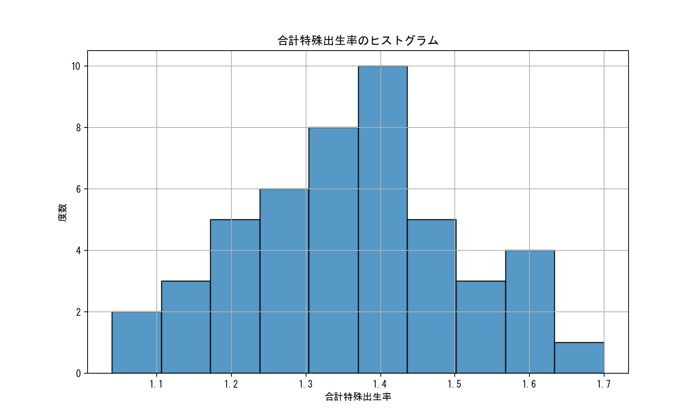
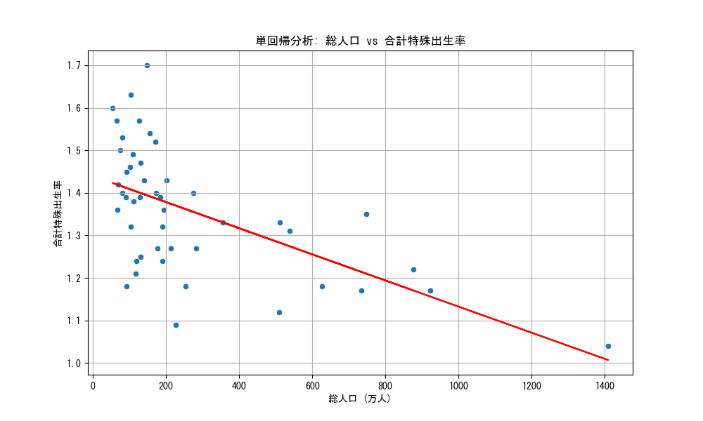

# 記述統計的な実際のデータ解析例

この記事では独立行政法人統計センターの提供している[SSDSE](https://www.nstac.go.jp/use/literacy/ssdse/)のデータを用いて、記述統計的なデータ解析を行い、その結果を解釈する例を示します。
Pythonの環境構築は別途行っている前提です。

## データと解析方法

今回使用するデータは全国・47都道府県×多分野93項目を含む[SSDSE-基本素材（SSDSE-E）](https://www.nstac.go.jp/use/literacy/ssdse/#SSDSE-E)です。
このデータを用いて、Python+Jupyter Notebookを活用したデータ解析を行います。

## データの読み込み

まずは、**Pandas**ライブラリを用いてデータを読み込みます。
この時、データの文字コードがShift-JISであるため、文字コード変換を別途行うか、Pandasの`read_csv`関数の引数で指定します。

```python
import pandas as pd

df_row_csv = pd.read_csv('./SSDSE-E-2025.csv', encoding='shift_jis')
df_row_csv.head(6)
```

データを確認すると

|SSDSE-E-2025|Prefecture|A1101|A1102|
|---|---|---|---|
||年度|2023|2023|
|地域コード|都道府県|総人口|日本人人口|
|R00000|全国|124352000|121193000|
|R01000|北海道|5092000|5041000|
|R02000|青森県|1184000|1177000|
|R03000|岩手県|1163000|1154000|

のような形で、1行目と2行目がヘッダー情報、3行目以降がデータ本体であることがわかります。
このため、Pandasの`read_csv`関数の引数でヘッダー行を指定します。

```python
df = pd.read_csv('./SSDSE-E-2025.csv', encoding='shift_jis', header=[2])
df.head(6)
```

これにより、不要な行を除いたデータフレームが得られました。
それでは実際に、記述統計的なデータ解析を行いましょう。

## 基本的な記述統計量の算出

まずは、基本的な記述統計量を算出する前に、データの中身を確認します。
先ほどのコードを実行した際に、データフレームの中に全国のデータが存在することに気が付いた人もいるでしょう。
ここでは全国のデータを除外し、47都道府県のデータのみを対象にします。

```python
# 地域コードがR00000の行を削除
df = df[df['地域コード'] != 'R00000']
```

前処理も完了したので、それでは算出に移りましょう。
分析の対象は、**合計特殊出生率**にしてみましょう。

### ヒストグラム化

まずは、合計特殊出生率のヒストグラムを描画してみます。

```python
import matplotlib.pyplot as plt
import seaborn as sns

plt.figure(figsize=(10, 6))
sns.histplot(df['合計特殊出生率'], bins=10)
plt.title('合計特殊出生率のヒストグラム')
plt.xlabel('合計特殊出生率')
plt.ylabel('度数')
plt.grid()
plt.show()
```



少し崩れていますが、ここでは一度正規分布になっているとして話を進めます。

### 平均値・中央値

次に、データの中心的な傾向を示す指標である**平均値**と**中央値**を算出します。

```python
mean_fertility_rate = df['合計特殊出生率'].mean()
print(f'合計特殊出生率の平均値: {mean_fertility_rate}')
median_fertility_rate = df['合計特殊出生率'].median()
print(f'合計特殊出生率の中央値: {median_fertility_rate}')
```

2025年版のデータを使用すると以下の値が得られるかと思います。

```result
合計特殊出生率の平均値: 1.3582978723404258
合計特殊出生率の中央値: 1.36
```

### 分散・標準偏差

次に、データのばらつきを示す指標である**分散**と**標準偏差**を算出します。

```python
variance_fertility_rate = df['合計特殊出生率'].var()
print(f'合計特殊出生率の分散: {variance_fertility_rate}')
std_fertility_rate = df['合計特殊出生率'].std()
print(f'合計特殊出生率の標準偏差: {std_fertility_rate}')
```

2025年版のデータを使用すると以下の値が得られるかと思います。

```result
合計特殊出生率の分散: 0.022310083256244218
合計特殊出生率の標準偏差: 0.14936560265417276
```

これらの数値から合計特殊出生率は平均値のおよそ1.358を中心に、±0.15程度のばらつきの中に68%の都道府県が、±0.30程度のばらつきの中に95%の都道府県が存在すると解釈できます。

### 結果

ここまでの結果から、合計特殊出生率が平均値・中央値ともに1.36程度であることと、±0.30程度の幅にほぼすべての都道府県が入っていることがわかりました。

### 解釈例

ここまでの結果を踏まえて、データの解釈を行います。

- 合計特殊出生率の平均値と中央値がほぼ同じであることから、データが大きく偏っていない
- 標準偏差が0.15程度であることから、ほぼすべての都道府県の合計特殊出生率が1.06から1.66の範囲に収まっている
- ヒストグラムを確認しても、極端に高い値や低い値が存在しない

### 本当にこの結論はあっているのか

ここで最初に取り除いた全国の値を確認すると、1.26となっています。
求めた代表値から0.1もずれています。自然に考えると、全国の値は47都道府県の値を平均したものに近いはずです。
実際の数値をもとに計算をしたにもかかわらず、なぜこのようなことが起きたのでしょうか。

考えられる要因の一つに、各都道府県間にある人口差の影響を考慮していないことがあります。
そこで次は、人口差を考慮した**加重平均値**を算出してみましょう。

### 加重平均値

平均値は、データの総和をデータの個数で割った値ですが、今回の例のようにデータの中にはサンプル数の違う値や、重要度が異なる値が含まれる場合があります。
このような場合には、加重平均値を用いることが有効です。

加重平均値は、各データに重みを付けて平均を計算する方法です。
$$\text{加重平均値} = \frac{\sum_{i=1}^{n} w_i x_i}{\sum_{i=1}^{n} w_i}$$
ここで、$ w_i $ は各データの重み、$ x_i $ は各データです。

今回の例では、人口の少ない鳥取県と人口の多い東京都が同じ重みで扱われてしまっていました。
そこで、各都道府県の人口を重みとして加重平均値を計算してみましょう。

```python
# 各都道府県の人口を重みとして加重平均値を計算
weighted_mean_fertility_rate = (df['合計特殊出生率'] * df['総人口']).sum() / df['総人口'].sum()
print(f'合計特殊出生率の加重平均値: {weighted_mean_fertility_rate}')
```

```result
合計特殊出生率の加重平均値: 1.2694039548704092
```

このように、加重平均値を用いることで、全国の合計特殊出生率に近い値を得ることができました。
それでは、重み付きの分散や標準偏差も計算してみましょう。

### 加重分散・加重標準偏差

加重分散は、各データの重みを考慮した分散の計算方法です。
$$\text{加重分散} = \frac{\sum_{i=1}^{n} w_i (x_i - \bar{x}_w)^2}{\sum_{i=1}^{n} w_i}$$
ここで、$ \bar{x}_w $ は加重平均値です。
加重標準偏差は、加重分散の平方根です。
$$\text{加重標準偏差} = \sqrt{\text{加重分散}}$$

加重分散や加重標準偏差を計算することで、不正確だったり母数が異なるデータを含む場合でも、より正確なばらつきの指標を得ることができます。
それでは今までと同様に加重分散と加重標準偏差を計算してみましょう。

```python
# 加重分散を計算
weighted_variance_fertility_rate = (df['総人口'] * (df['合計特殊出生率'] - weighted_mean_fertility_rate) ** 2).sum() / df['総人口'].sum()
print(f'合計特殊出生率の加重分散: {weighted_variance_fertility_rate}')
# 加重標準偏差を計算
weighted_std_fertility_rate = weighted_variance_fertility_rate ** 0.5
print(f'合計特殊出生率の加重標準偏差: {weighted_std_fertility_rate}')
```

```result
合計特殊出生率の加重分散: 0.02177321513059592
合計特殊出生率の加重標準偏差: 0.14755749771053966
```

このような結果が得られました。

### まとめ

ここまでの結果を踏まえて、データの解釈を行うと以下のようになります。

- 合計特殊出生率は平均値が1.36であり、全国の合計特殊出生率が1.26であることから単純平均だけでは不十分な要素が存在する。
- 合計特殊出生率の加重平均値が1.269であることから、全国の合計特殊出生率に近い値である。
- 加重標準偏差が0.148程度であることから、ほぼすべての都道府県の合計特殊出生率が1.12から1.42の範囲に収まっている。

このように、記述統計量を用いてデータの中心的な傾向やばらつきを把握し、適切な解釈を行うことができます。

> **注意1**
> ここでの解析はすでに全国での合計特殊出生率が算出されており、それと比較することで適切な代表値を選択しました。
> しかし、実際のデータ解析の現場では算出する数値は未知であり、正しい数値がわからないことがほとんどです。
> データの分布や特性をよく理解し、適切な記述統計量を選択することでより正確なデータ解析が可能になります。

> **注意2**
> 合計特殊出生率は比率です。
> 今回は説明の簡略化のために単純平均を用いましたが、比率の平均を求める際は調和平均を用いることが適切な可能性があります。そのため、現実の現場ではこのようなケースにおいては調和平均を用いることも検討してください。

## 回帰分析

先ほどまでの例では、合計特殊出生率のような一つの変数を解析しましたが、実際のデータ解析では複数の変数間の関係を理解することが重要です。
例えば先ほどの例では、単純平均の値と人口で重みを付けた加重平均の値を比べると後者が小さくなっており、人口の多い都道府県ほど合計特殊出生率が低い傾向があるのではないかと推定できます。
このような複数の変数間の関係を理解するために、**回帰分析**を行ってみましょう。

### 単回帰分析

まずは目的変数が合計特殊出生率、説明変数が総人口とした単回帰分析を行います。

```python
import scipy.stats as stats
import matplotlib.pyplot as plt
import seaborn as sns

slope, intercept, r_value, p_value, std_err = stats.linregress(df['総人口'] / 10000, df['合計特殊出生率'])
print(f'回帰直線の傾き: {slope:.6f}')
print(f'回帰直線の切片: {intercept:.6f}')
print(f'決定係数(R^2): {r_value**2:.6f}')
print(f'P値: {p_value:.6f}')
print(f'標準誤差: {std_err:.6f}')
df['総人口 (万人)'] = df['総人口'] / 10000
# 回帰直線を描画
plt.figure(figsize=(10, 6))
sns.scatterplot(x='総人口 (万人)', y='合計特殊出生率', data=df)
# 総人口は単位を万人にする
plt.plot(df['総人口 (万人)'], intercept + slope * df['総人口 (万人)'], color='red')
plt.title('単回帰分析: 総人口 vs 合計特殊出生率')
plt.xlabel('総人口 (万人)')
plt.ylabel('合計特殊出生率')
plt.grid()
plt.show()
```

||数値|
|---|---|
|回帰直線の傾き | -0.000307|
|回帰直線の切片 | 1.439538|
|決定係数($R^2$) | 0.330738|
|P値 | 0.000024|
|標準誤差 | 0.000065|



### 解釈例

この結果から以下のようなことがわかります。

- 回帰直線の傾きが負であることから、総人口が増加するほど合計特殊出生率が低下する傾向がある。
- 決定係数($ R^2 $)が0.331であることから、総人口は合計特殊出生率の変動のうち$1/3$程度を説明できる。
- P値が非常に小さいことから、総人口と合計特殊出生率の間には統計的に有意な関係があると言える。

## まとめ

以上のように、記述統計量を用いてデータの中心的な傾向やばらつきを把握し、適切な解釈を行うことが可能です。
同時に、ただ単純に平均値を求めるだけでは不十分な場合もあり、データの特性をよく理解した上で適切な手法を選択することが大切であることも理解して頂けたかと思います。
また、回帰分析を用いることで複数の変数間の関係を理解し、データの背後にあるパターンや傾向を明らかにすることができます。
これらの手法を組み合わせることで、より深い洞察を得ることができ、データに基づいた意思決定や、問題解決に役立ててください。

## 参考文献

- [SSDSE](https://www.nstac.go.jp/use/literacy/ssdse/)
- [統計WEB](https://bellcurve.jp/statistics/)
