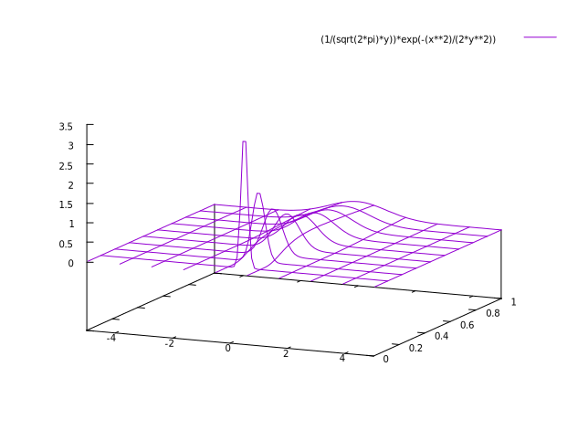

# 分散と標準偏差

前セクションでは、データの中心的な傾向を表す代表値について学びました。そこでは代表値を選ぶ際はデータの分布を考慮することが重要であることが分かったかと思います。
今回は、そのデータの分布のなかでも、特にデータのばらつきを表す指標である分散と標準偏差について学びます。

## 分散

分散は、分布のひろがりを表す統計量の一つで、データの各値が平均からどれだけ離れているかを示します。分散は以下の式で計算されます。

``` math

\sigma^2 = \frac{1}{n} \sum_{i=1}^{n} (x_i - \bar{x})^2

```

ここで、$ \sigma^2 $ は分散、$ n $ はデータの個数、$ x_i $ は各データ、$ \bar{x} $ は平均値です。
下のグラフは正規分布と呼ばれる分布のグラフです。奥行方向は分散を表し、左右と上下がデータの分布を表している。このグラフからわかるように、分散が大きいとピークは低くなだらかになり、データの分布は広がります。逆に分散が小さいとピークは高く鋭くなるとともに、データの分布は狭くなる傾向があります。



## 標準偏差

標準偏差は、分散の平方根であり、データのばらつきを表す指標です。分散と同様に、データの各値が平均からどれだけ離れているかを示しますが、単位が元のデータと同じになるため、解釈しやすいという特徴があります。標準偏差は以下の式で計算されます。

``` math

\sigma = \sqrt{\frac{1}{n} \sum_{i=1}^{n} (x_i - \bar{x})^2}

```

ここで、$ \sigma $ は標準偏差です。分散と同様に、標準偏差もデータのばらつきを示しますが、単位が元のデータと同じになるため、より直感的に理解しやすいとされています。

>**標準偏差と偏差値**
>
>標準偏差と聞いて偏差値を思い出す人も多いでしょう。偏差値は、標準偏差を用いてデータの相対的なポジションを示す指標です。偏差値は以下の式で計算されます。
>
>``` math
>
>偏差値 = 50 + 10 \times \frac{(x - \bar{x})}{\sigma}
>
>```
>
>ここで、$ x $ は個々のデータ、$ \bar{x} $ は平均値、$ \sigma $ は標準偏差です。偏差値は、平均値を50、標準偏差を10としたときの相対的な位置を示します。ここで、平均値との差をとるときに符号が残るため、高偏差値や低偏差値が出ることになります。
>偏差値は算出時に平均との差分を標準偏差で割った値を足しています。よって、平均値との差分が同じ場合でも標準偏差が大きい(ばらつきが大きい)場合には偏差値は50に近くなります。このように、偏差値はデータ分布のばらつきも考慮するためより正確な相対位置を示すことができます。
