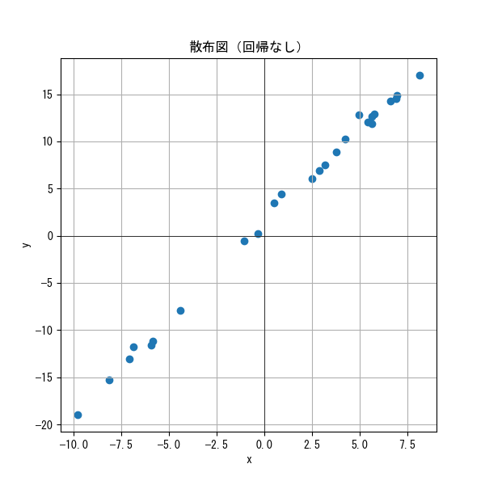
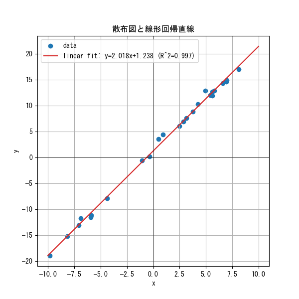
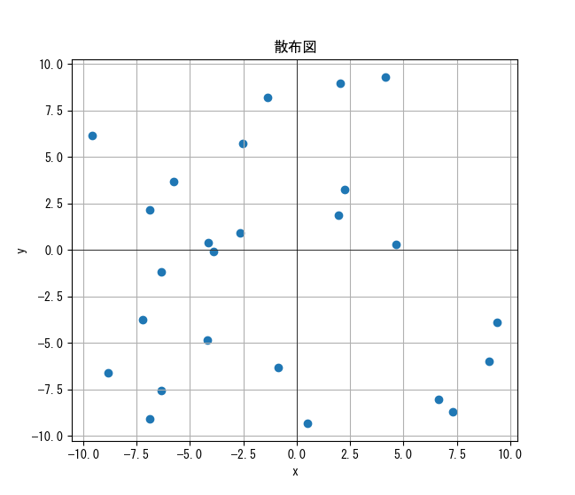

# 回帰分析

## 回帰分析とは

回帰分析とは、どのように変化するかを知りたい変数(**目的変数**)が、ほかの変数(**説明変数**)によりどのように変わるかを分析しモデル化し、分析する手法です。
回帰分析には、[**単回帰分析**](#単回帰分析)と[**重回帰分析**](#重回帰分析)があります。

## 単回帰分析と重回帰分析

単回帰分析とは、1つの説明変数を用いて目的変数を予測する手法です。
例えば、ある商品の販売価格(説明変数)と販売数量(目的変数)の関係をモデル化し分析することで、販売価格が販売数量に与える影響を調べることができます。

重回帰分析とは、複数の説明変数を用いて目的変数を予測する手法です。
先ほどの例では、販売価格(説明変数)と販売数量(目的変数)の関係をモデル化しましたが、販売数量は販売価格が同じでも、他の要素により増減することは容易に想像できるでしょう。
そこで、販売数量に影響を与える他の要素、例えば広告費や季節要因などを説明変数として追加し、販売数量(目的変数)を予測する手法を重回帰分析といいます。

今回は、単回帰分析について学びます。

## 単回帰分析

単回帰分析とは、1つの説明変数を用いて目的変数を予測する手法です。
多くの場合は線形回帰分析と呼ばれる線形回帰モデルを用いた分析が行われます。

### 線形回帰モデル

単回帰分析を行う際はまずは以下の線形回帰と呼ばれるモデルが使われます。
$$
y = a x + b
$$
ここで、$ y $ は**目的変数**、$ x $ は**説明変数**、$ a $ は**回帰係数(傾き)**、$ b $ は**切片**です。

- **回帰係数(傾き)**: 説明変数が1単位増加したときに、目的変数が平均してどれだけ増加するかを示す値です。傾きが正の場合、説明変数が増加すると目的変数も増加し、傾きが負の場合、説明変数が増加すると目的変数は減少します。
- **切片**: 説明変数が0のときの目的変数の値を示します。切片は、説明変数が目的変数に与える影響を考慮しない場合の基準値として解釈されます。

線形回帰をまずあてはめる理由は、計算が比較的簡単であり、結果の解釈も容易であるためです。また、多くの場合、線形回帰モデルはデータの傾向を十分に捉えることができます。
線形回帰モデルを用いて単回帰分析を行う際は、[最小二乗法](#最小二乗法)と呼ばれる手法が使われます。

最小二乗法を用いた線形回帰分析を行った場合、その回帰の確からしさを評価するために、決定係数($ R^2 $)がよく使われます。
決定係数は、目的変数の分散のうち、説明変数によって説明される割合を示す指標です。決定係数は0から1の範囲で表され、1に近いほど説明変数が目的変数をよく説明していることを意味します。
$$ R^2 = 1 - \frac{SS_{res}}{SS_{tot}} $$
ここで、$ SS_{res} $ は残差平方和、$ SS_{tot} $ は全変動平方和です。

- **残差平方和($ SS_{res} $)**: 観測値と回帰モデルによって予測された値との差の二乗和です。残差平方和が小さいほど、回帰モデルが観測データに適合していることを意味します。
- **全変動平方和($ SS_{tot} $)**: 観測値と観測値の平均値との差の二乗和です。全変動平方和は、目的変数の全体的なばらつきを示します。

#### 線形回帰が適切な例

例えば以下のようなデータを考えます。これは$y=2x+1$にノイズを加えて生成したもので、見るからに線形っぽいです。

|index|x|y|
|---|---|---|
|0 |5.627562519361103 |12.646948981504316|
|1 |3.7667040203167126 |8.863293821970274|
|2 |5.780339122454198 |12.874784282285878|
|3 |5.619521669521779 |11.90907266772677|
|4 |8.135600535284954 |17.018388507800385|
|5 |-9.801807935868478 |-18.971235981815557|
|6 |-6.875268834275485 |-11.753871244911526 |
|7 |-1.0507931961933643 |-0.572097098948566 |
|8 |4.96492823174005 |12.816318362862175|
|9 |3.1575181922868403 |7.526797404758563 |
|10 |0.512400652651241 |3.5018257863467053|
|11 |-5.870675672767414 |-11.191355361399264|
|12 |-8.155312672622792 |-15.260092044486766|
|13 |6.601526174181444 |14.274539685194664|
|14 |6.962727602064213 |14.841486620536758|
|15 |5.4229409833131825 |12.019814230825096|
|16 |-5.944301919173521 |-11.57713363313574|
|17 |-7.073551183221132 |-13.09438698672471|
|18 |-0.3373851875216989 |0.1874060943514299|
|19 |-4.399796331943482 |-7.938540269269474|
|20 |0.8996908687633258 |4.442383022606458|
|21 |4.228042344235201 |10.228241914463911|
|22 |6.909977133521494 |14.571177971485382|
|23 |2.8754144342610015 |6.905979957687794|
|24 |2.4984103763313357 |6.033118626948296|

ここに線形回帰を当てはめてやると

のようになります。
RSS(残差平方和)は10.006993、TSS(全変動平方和)は3025.270506だったので、決定係数は0.996692となり、説明変数が目的変数を非常によく説明できていることがわかります。

#### 線形回帰モデルが適切でない例

例えば以下のようなデータがあったとします。これはPythonで$x,y=±10$の範囲でランダムに生成したデータです。

|index|x|y|
|---|---|---|
|0|-2.50919762305275|5.703519227860273|
|1|9.014286128198322|-6.006524356832806|
|2|4.639878836228101|0.28468876827223255|
|3|1.973169683940732|1.8482913772408498|
|4|-6.87962719115127|-9.070991745600045|
|5|-6.880109593275947|2.1508970380287664|
|6|-8.83832775663601|-6.58951752625417|
|7|7.323522915498703|-8.69896814029441|
|8|2.0223002348641756|8.977710745066666|
|9|4.161451555920909|9.312640661491187|
|10|-9.588310114083951|6.167946962329221|
|11|9.398197043239886|-3.9077246165325867|
|12|6.648852816008436|-8.046557719872322|
|13|3.6846605302431374|-5.753217786434477|
|14|-6.363500655857988|-1.196950125207973|
|15|-6.331909802931324|-7.5592353031044235|
|16|-3.9151551408092455|-0.09646179777459629|
|17|0.49512863264475726|-9.312229577695632|
|18|-1.3610996271576852|8.186408041575643|
|19|-4.175417196039161|-4.824400367999662|
|20|2.23705789444759|3.2504456870796403|
|21|-7.210122786959163|-3.7657784782117805|
|22|-4.157107029295637|0.40136042355621626|
|23|-2.672763134126166|0.934205586865593|
|24|-0.8786003156592805|-6.302910889489459|

このデータに対して線形回帰モデルをあてはめると以下のようになります。

その結果RSS(残差平方和)は848.299687、TSS(全変動平方和)は854.209807でした。
よって決定係数は0.006919となり、ほとんど説明変数が目的変数を説明できていないことがわかります。

### その他の回帰モデル

線形回帰以外にも単回帰分析に利用可能な様々なモデルがあります。
例えば、以下のようなモデルがあります。

#### ロジスティック回帰

##### 用途

目的変数が二値(例: 成功/失敗、はい/いいえ)である場合や、0～1の間に収まる(例:確率)場合に使用されます。
ロジスティクス回帰分析は単回帰・重回帰の両方に適用可能です。

##### 詳細

このモデルは限られた範囲しか目的変数が取れない場合に、説明変数がどのような値をとっても適用できるよう工夫がされています。
それが**ロジット変換**と呼ばれる以下の変換です。
まず、ある二値データ$y$が説明関数$x$に対して、$y=1$となる確率を$P(y=1|x)$と置きます。その時ロジット変換と呼ばれる以下の変換を考えます。

$$ logit(y=1|x) = \ln\left(\frac{P(y=1|x)}{1 - P(y=1|x)}\right) $$

この変換の右辺にある自然対数の真数、$ \frac{P(y=1|x)}{1 - P(y=1|x)} $は**オッズ比**と呼ばれ、ある事象が起こる確率を起こらない確率で割ったものです。

> **INFO**
> オッズ比には発生する確率が発生しない確率より極端に高い時は数値が無限大まで発散するのに対して、発生する確率が発生しない確率より極端に低くても0に収束するだけという非対称な性質があります。ここでは、オッズ比の対数をとることで確率がそのような場合でも対称的に扱えるようになっています。

このロジット変換されたPを線形回帰モデルにあてはめることで、以下のようなロジスティック回帰モデルが得られます。

$$ \ln\left(\frac{P(y=1|x)}{1 - P(y=1|x)}\right) = a x + b \tag{1}$$
ここで、$ a $ は**回帰係数(傾き)**、$ b $ は**切片**です。

この式$(1)$を変形すると以下のようになります。
$$\begin{align*}
\ln\left(\frac{P(y=1|x)}{1 - P(y=1|x)}\right) &= a x + b \tag{1}\\
\ln\left(\frac{1 - P(y=1|x)}{P(y=1|x)}\right) &= -(a x + b) \\
\frac{1 - P(y=1|x)}{P(y=1|x)} &= e^{-(a x + b)} \\
1 - P(y=1|x) &= P(y=1|x)e^{-(a x + b)}\\
P(y=1|x) + P(y=1|x)e^{-(a x + b)} &= 1 \\
P(y=1|x)(1 + e^{-(a x + b)}) &= 1 \\
P(y=1|x) &= \frac{1}{1 + e^{-(a x + b)}} \tag{2} \\
\end{align*}$$

このロジットの逆変換をロジスティクス変換と呼び、式$(2)$の関数をロジスティクス関数やシグモイド関数と呼びます。

$$P(y=1|x) = \frac{1}{1 + e^{-(a x + b)}} \tag{2}$$
$$lim_{x \to -\infty} P(y=1|x) = 0 \\
lim_{x \to +\infty} P(y=1|x) = 1$$

であることからもわかるように、ロジスティクス関数は0～1の間の値をとり、確率として解釈することができます。
<!-- 
## 重回帰分析

重回帰分析とは、複数の説明変数を用いて目的変数を予測する手法です。
重回帰分析を行う時は様々なモデルを用います。

### 線形回帰モデル
$$
y = a_1 x_1 + a_2 x_2 + \ldots + a_n x_n + b
$$

ここで、$ y $ は**目的変数**、$ x_1, x_2, \ldots, x_n $ は**説明変数**、$ a_1, a_2, \ldots, a_n $ は**偏回帰係数**、$ b $ は**切片**です。

- **偏回帰係数**: 他の説明変数の影響を一定に保ったまま、特定の説明変数が目的変数に与える影響を示す値です。偏回帰係数は、各説明変数が目的変数に与える独立した影響を評価するために使用されます。
- **切片**: すべての説明変数が0のときの目的変数の値を示します。切片は、説明変数が目的変数に与える影響を考慮しない場合の基準値として解釈されます。

重回帰分析を用いて目的変数を予測する際も、[最小二乗法](#最小二乗法)と呼ばれる手法が使われます。

説明変数と目的変数の関係をモデル化した後、以下のような数値を用いてモデルの適合度を評価します。

- **標準偏回帰係数**: 各説明変数の偏回帰係数を、その説明変数の標準偏差で割った値です。標準偏回帰係数は、各説明変数が目的変数に与える影響の大きさを比較するために使用されます。標準偏回帰係数の絶対値が大きいほど、その説明変数が目的変数に与える影響が大きいことを意味します。

### 線形以外の回帰モデル

#### 多項式回帰

目的変数と説明変数の関係が非線形である場合に使用されます。多項式回帰では、説明変数のべき乗を用いてモデルを構築します。例えば、2次の多項式回帰モデルは以下のように表されます。
$$y = a_2 x^2 + a_1 x + b$$

このモデル化により、非線形な関係を捉えることができます。 -->

## 最小二乗法

最小二乗法は、観測データとモデルの予測値との差(以下誤差 $ u_i $)の二乗和$ S $を最小化するように説明変数を求める方法です。

$$ S = \sum_{i=1}^{n} (y_i - f(x_i))^2 $$

ここで、$ n $ はデータの個数、$ y_i $ は観測データの目的変数、$ x_i $ は観測データの説明変数です。

最小二乗法が有効に機能するためには、以下の前提条件が満たされている必要があります。
<!-- no toc -->
- [誤差の偏りが存在しない](#誤差の偏りが存在しない)
- [誤差の分散が一定](#誤差の分散が一定)
- [各測定が独立](#各測定が独立)
- [誤差が正規分布に従う](#誤差が正規分布に従う)
- [測定値の真の値を表現できるモデル関数が存在する](#測定値の真の値を表現できるモデル関数が存在する)

### 誤差の偏りが存在しない

誤差の偏りが存在しないとは、観測データとモデルの予測値との差が平均してゼロであることを意味します。

### 誤差の分散が一定

誤差の分散が一定とは、観測データとモデルの予測値との差のばらつきが説明変数$ x_i $やそのほかの変数$ Z_i $の値に依存しないことを意味します。
もし別の変数に誤差が依存する場合は、重回帰分析を検討する必要があります。

### 各測定が独立

各測定が独立とは、観測データとモデルの予測値との差が他の観測データとモデルの予測値との差に影響されないことを意味します。
もし、ある観測データとモデルの予測値との差が他の観測データとモデルの予測値との差に影響される場合は、時系列データのように自己相関が存在する場合が考えられます。
時系列データの場合は、自己回帰モデルや移動平均モデルなどの時系列解析手法を検討する必要があります。

### 誤差が正規分布に従う

誤差が正規分布に従うとは、観測データとモデルの予測値との差が正規分布に従うことを意味します。
もし、誤差が正規分布に従わない場合は、データの変換やロバスト回帰などの手法を検討する必要があります。

### 測定値の真の値を表現できるモデル関数が存在する

これは、もしも誤差が存在しなければ以下の条件を満たすモデル関数が存在することを意味します。
もしそういったモデル関数が存在しない場合は、そのモデル自体が不適切と考えられます。

1. すべての観測データの真の値に対して、モデル関数が真の値を表現できる。
2. モデルに用いられるフィッティングパラメーターの数が観測データの数よりも少ない。

### 例

例えば[先ほどの不適切な線形回帰の例](#線形回帰モデルが適切でない例)は一番下の条件を満たさず、線形回帰モデルが不適切であると言えます。

> **注意**
> 必ずしもこれらの前提条件を満たすことが必須ではありません。しかし、その場合結果の解釈には注意が必要です。
