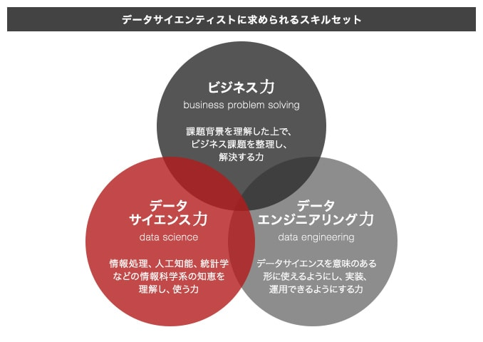

# データ活用のニーズ

昨今、多様な情報処理端末やネットサービスの普及などにより、企業内に蓄積されるデータ量は増加の一途をたどっています。

生成AIの台頭により大量データの中から価値ある情報を発掘し、ビジネス施策につなげる分析力が、企業の競争力を左右する時代となっており、データ活用人材に大きな注目が集まっています。

今後、データ活用人材の活躍できる領域はますます広がると考えられ、その需要が継続的に増加すると予測されています。

## データ活用人材に求められるスキルセット

新しいキャリアパスとしてデータ活用人材（データサイエンティスト）を可能性の一つとしてご検討されている方も多いのではないでしょうか。では、データ活用人材となるためには何が必要なのでしょうか。

### データサイエンティストに求められるスキルセット

　[一般社団法人データサイエンティスト協会（DS協会）](https://www.datascientist.or.jp/)が定義する「[データサイエンティストに求められるスキルセット](https://www.datascientist.or.jp/dssjournal/dssjournal-2138/)」を軸に、データ活用人材（データサイエンティスト）になるために必要となるスキルや領域をご紹介します。

データサイエンティストには「ビジネス力」「データサイエンス力」「データエンジニアリング力」という三つのスキルが求められると言われています。

   
出典: 一般社団法人データサイエンティスト協会 ([URL](https://www.brainpad.co.jp/school/about/skill))

## データビジネスをするには３つのスキルが必要

データはビジネスの未来を拓く力です。
今、企業が求めるのは、データから価値を創造し、ビジネスを変革できるデータサイエンティストです。

### 「スーパースター」神話より「実践力」を

トーマス H. ダベンポートが提唱するような、「**高度なスキルを持つスーパースター**」はごく稀です。

日本で本当に求められているのは

データを分析し、その結果をビジネスに活かして新たな価値を生み出せる「**実践的なプロフェッショナル**」

です。

深い分析だけでなく、**データを整理・可視化するだけでも、ビジネスに大きなインパクト**を与えられます。

重要なのは、**「データの持つ力を解き放ち、ビジネス変革へ繋げる」**ことなのです。

:::note[トーマス H. ダベンポートが提唱するデータサイエンティスト]

ダベンポート氏は、データサイエンティストに求められる典型的な能力を以下のように類型化

- ハッカー（プログラミング、Hadoop運用などのITスキル）
- サイエンティスト（科学的根拠に基づく意思決定力）
- アドバイザー（コミュニケーション能力）
- 計量アナリスト（統計分析能力）
- ビジネス・エキスパート（ビジネスへの理解力）

> トーマス・H・ダベンポート氏の近著「データ・アナリティクス3.0（原題：Big Data at Work）[出典](https://xtech.nikkei.com/it/atcl/watcher/14/334361/111900118/) : データサイエンティストって何なのさ
:::

### 必須スキルと効率的な学習法：鍵は「現場力」

データサイエンティストに不可欠なのは、

- **ビジネス力**
- **データサイエンス力**
- **データエンジニアリング力**

の3つのスキルです。
これらは座学だけでは身につかず、「**現場力**」が決定的に重要です。

#### 1. まずは「主軸」スキルから

全てのスキルを一度に習得するのは困難です。

まずは最低限必要となる知識を学び、
残りのスキルは書籍やオンライン教材、 **OJT（実務トレーニング）** で補完しましょう。

#### 2. 「チーム」で相乗効果を

企業では、各スキルに強みを持つ人材がチームを組み、組織としてデータ分析力を発揮するのが効率的です。

メンバー全員が最低限の知識を持つことで、円滑な連携が可能になります。

そのうえで、個々の得意な分野を活かし、チーム全体で高い成果を上げることが理想です。

#### 3. 「現場力」を磨く実践の場

社会人の方: 身近なデータ課題に取り組むか、外部研修で実践力を養いましょう。

学生・若手社会人の方: ハッカソンやインターンで実データに触れる機会を積極的に活用しましょう。また、自身の業界やビジネスへの理解を深めることが、将来の大きな武器となります。

さあ、データと共にビジネスの未来を切り拓く、エキサイティングな一歩を踏み出しましょう！

## SRE分析チームが考えるデータサイエンティストの歩き方

まずは、全体感がわかる範囲で基礎を固め、そのうえで実践的は課題を行なうことで経験を積み重ねていくことが重要と考えました。

以下を段階的に学ぶことで、データサイエンティストとしての基礎を築き、実践力を高めていく土台を作成することができます。

### 1. データ可視化の基礎を学ぶ

主に以下のスキルを身につけます。これにより、ビジネスにインパクトを効率的に与えることができます

- 分析結果を適切に「伝える」ことでビジネスにインパクトを与えるスキル
- データを分析できる状態にするための「データエンジニアリング力」のスキル

詳しくは [「データ分析の基礎」](./fundamentals/index.md) を参照してください.

### 2. ビジネス視点とデータ理解

データ分析が「誰のために、何の課題を解決するのか」を明確にする最も重要なスキルです。

- ビジネス課題の特定と分解
  - 漠然とした課題を具体的なデータ分析で解決できる形に落とし込む方法を学びます。
- KPI設定と目標設計
  - 分析結果をビジネス目標にどう繋げるか、適切な指標の選び方を習得します。
- 仮説構築と検証の考え方
  - データからどのような仮説を立て、どのように検証していくかの思考プロセスを学びます。

詳しくは [「データ分析の基礎」](./fundamentals/index.md) を参照してください.

### 3. 統計学の基礎を学ぶ

統計学はデータ分析の根幹を成す重要なスキルです。

- 記述統計と推測統計
  - データの要約や傾向を把握するための基本的な統計手法を学びます。
  - 母集団と標本の概念、標本から母集団を推測する推測統計の基本的な考え方を学びます。
- 確率と確率分布
- 相関関係と因果関係
  - 2つの変数の関係性を示す相関関係と、原因と結果の関係を示す因果関係の違いを理解します。
  - 相関関係があるからといって、必ずしも因果関係があるとは限らないことを認識します。

詳しくは [「データ分析の基礎」](./fundamentals/index.md) を参照してください.

### 4. 機械学習の基礎を学ぶ

機械学習は、データからパターンを学習し、予測や分類を行うための強力なツールです。

- 教師あり学習と教師なし学習
  - 予測や分類に使う教師あり学習、未知のパターンを発見する教師なし学習の概要を学びます。
  - 代表的なアルゴリズムの仕組みを理解し、機械学習がどんなビジネス課題に応用できるのか、そしてその可能性と限界を把握します。
  - 線形回帰、ロジスティック回帰、決定木、k-meansなどの基本的なアルゴリズムの仕組みを概念的に理解します。
  - アルゴリズムの選択における基本的な考え方を学びます。
  - 機械学習の精度や解釈性に関する限界を理解します。
    - どのようなビジネス課題に機械学習が適用できるのか、具体的な事例を知ります。
    - 機械学習の精度や解釈性に関する限界を理解します。
    - 機械学習の適用範囲と限界を理解します。

詳しくは [「データ分析の応用」](./applications/index.md) を参照してください.

### 5. 実践的なデータ分析プロジェクト

実際のビジネス課題に対してデータ分析を実行する能力を養います。

- データ収集と前処理
  - 実際のデータを収集し、分析に適した形に整形するスキルを学びます。
- 分析手法の選定と実装
  - ビジネス課題に応じた適切な分析手法を選び、実装する能力を養います。
- 分析結果の解釈と報告
  - 分析結果をビジネスにどう活用するか、具体的なアクションに落とし込む方法を学びます。

詳しくは [「データ分析の応用」](./applications/index.md) を参照してください.

---

## コメント