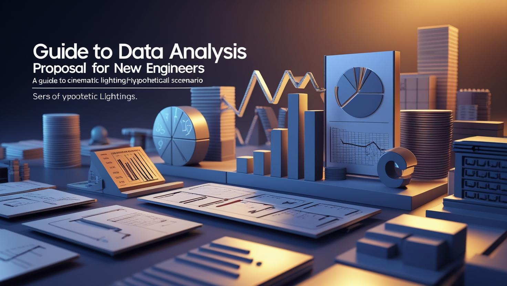

# “仮説シナリオ”で差がつく！新人エンジニアのためのデータ分析提案ガイド



〜お客様の“本音”を引き出し、プロジェクトを成功に導くストーリー型ヒアリング＆提案術〜

## 導入：あなたも“探偵”になれる

「ヒアリングはできるけど、会話が深まらない」「本質的な課題にたどり着けない」――そんな悩み、ありませんか？

**このガイドは「仮説シナリオ駆動型」アプローチを、ストーリー仕立てで“自分でもやってみたい！”と思えるように解説します。**

### ◆ “仮説シナリオ”って何？

仮説シナリオは「推理小説の探偵」みたいなものです。

探偵は、現場の状況や登場人物の行動から「きっとこういうことが起きたはず」と仮説を立てて、関係者に質問します。

**自分なりの“物語”を持って質問することで、相手も「実は…」と本音を話しやすくなり、事件（課題）の核心に迫れるのです。**

このガイドでは、あなたが“探偵”になって、お客様の“本当の課題”を引き出す方法を、実践例とともに紹介します。

これを実践することで、

- **お客様は「そう、実は…」と、より本質的な課題を語り始める（議論の深化）**
- **課題認識のすり合わせが圧倒的に早くなる（時間短縮）**
- **「この担当者は、我々のビジネスを深く考えてくれている」と強い信頼を得られる（信頼獲得）**

**このガイドは、「脚本（シナリオ）」と「演出（対話法）」の指南書です。**

## Phase 0：事前準備フェーズ（“探偵の台本”を書く）

このフェーズでやること：

- **お客様の業界や会社について徹底的に調べる**
- **「今、どんな物語が起きているか？」を自分なりにストーリー化する**
- **その仮説をもとに、提案書の下書きを作る**

> 💡 **いきなり「何に困っていますか？」と聞くのではなく、まず“自分なりの事件の筋書き”を用意しておく！**

下表はサンプルです。実際にはお客様の業種や状況に合わせてアレンジしましょう。

|項目|やること|具体例（旅行会社の場合）|
|:----|:----|:----|
|1. 情報収集|お客様や業界の現状を幅広く調べる。プレスリリース、IR情報、業界ニュース、公式サイトやブログ、SNSの評判、競合他社の動向などをチェックする。|「体験価値」「サステナブルツーリズム」への注目が高まっている。一方、オンラインレビューでは「団体客のマナー」や「施設の古さ」への不満も見られる。競合A社は富裕層向けの「パーソナルガイド付きツアー」で成功している。|
|2. 課題シナリオの作成|集めた情報から「なぜ今この課題が起きているのか」をストーリーとして整理する。 **「Aという状況があるのでBという問題が起き、結果Cという望ましくない状態になっているのでは？」** という因果関係で考える。|【仮説シナリオ】「Web広告の効率化で 集客数（A）は維持できているが、顧客層が価格重視のライトユーザーに偏り始めている。その結果、リピートが減り、文化や習慣への理解不足から提携施設との摩擦（B）が発生。これが積み重なり、ブランドイメージの低下や優良施設の離脱リスク（C）に繋がっているのでは？」|
|3. 提案書ドラフト作成|作成したシナリオをもとに、後述の【雛形】各項目を埋めて提案書の下書きを作る。|シナリオに沿った「分析の問い」や「施策仮説」を盛り込んだ提案書ドラフトを準備する。|

実際に作成する流れは、[こちらの記事](../../data-analysis/fundamentals/columns-dataanalysis-and-scenario-creation.md) をご参照ください。

## Phase 1：提案・ヒアリングフェーズ（“探偵ショー”の開幕）

このフェーズでやること：

- **作ったシナリオ（台本）をもとに、お客様と対話する**
- **お客様の反応や本音を引き出し、シナリオをどんどんアップデートする**

> 💡 **会話は“台本通り”に進まないのが当たり前。お客様の言葉や表情からヒントを拾い、シナリオをその場で書き換えよう！**

---

### 【雛形】と各セクションの進め方

#### セクション1：プロジェクトビジョンの提示と確認

- **ゴール：目指すべき“理想の未来”をお客様と一緒に描き、共通認識を作る**

まずは「私たちはこういう未来を目指していると理解していますが、合っていますか？」と自分の言葉で伝えましょう。お客様の反応や言葉を拾い、その場で“理想像”を一緒にアップデートしていきます。

|やること|旅行会社の例|
|:----|:----|
|提案シナリオの提示例（話すこと）|「事前調査を拝見し、貴社が単なる『旅行代理店』から、『お客様の人生を豊かにする文化体験のプロデューサー』へと進化しようとされている、と私たちは解釈いたしました。価格競争ではなく、唯一無二の体験価値で選ばれるブランドを目指す、というこの方向性の認識は合っておりますでしょうか？」|
|仮説を深めるための質問リスト（聞くこと）|「その『体験価値』という言葉を、職員やお客様の皆様は、どのような言葉で語られていますか？」、「5年後、お客様に『〇〇といえば、□□だよね』と言われるとしたら、□□には何が入ると嬉しいですか？」|
|提案書への反映方法（書くこと）|お客様が使った生の言葉を拾い、用語や目的をその場で修正する。「すべての人のマナーが改善」が「地域と旅人をつなぐコンシェルジュ」という言葉に変わるなど、より解像度の高い表現に進化させる。|

> 📝 **お客様の「本音ワード」や「印象的なフレーズ」は必ずメモし、提案書に反映しましょう！**

考えられるシナリオかつ実現可能性が高いものを選定し、優先度とその理由を明確にします。

#### セクション2：課題シナリオの提示と“答え合わせ”

- **ゴール：仮説シナリオ（事件の筋書き）をぶつけて、お客様の“本音”や“現場感覚”とすり合わせる**

「少し踏み込んだ仮説ですが、こんなことが起きていませんか？」と熱意を込めて語りましょう。お客様の反応をよく観察し、「どこが一番気になるか」「実は違うポイントがあるか」などを深掘りします。

> 🕵️‍♂️ **「どこが一番気になりますか？」「最近あった具体的なエピソードは？」など、相手の“感情”や“現場のリアル”に迫る質問を意識しましょう。**

|やること|旅行会社の例|
|:----|:----|
|提案シナリオの提示例（話すこと）|「その素晴らしいビジョンを踏まえた上で、本日ぜひ議論させていただきたい『仮説シナリオ』がございます。少々踏み込んだ内容かもしれませんが、お聞きいただけますでしょうか。（Phase 0で作成したシナリオを、熱意を込めて語る）『…Web広告で集客はできているものの、顧客が価格重視層に偏り、提携施設との間で摩擦を生むことがある。これが結果として、貴社のブランド価値を毀損するリスクに繋がりつつあるのではないか。』…いかがでしょうか。**このシナリオは、どのくらい現実の感覚に近いですか？ あるいは、全くの見当違いでしょうか**？」|
|仮説を深めるための質問リスト（聞くこと）|・「このシナリオの中で、今、最も胸が痛む部分はどこですか？」・「『〇〇県との摩擦』について、差し支えなければ、最近起きた具体的なエピソードを教えていただけませんか？」・「私たちのシナリオで、見落としている重要な登場人物や要素はありますか？」|
|提案書への反映方法（書くこと）|お客様のフィードバックを元に、シナリオをライブで修正する。・（例）お客様の反応： 「いや、〇〇との摩擦はまさにその通りだが、原因は価格重視層というより、そもそも我々が事前案内を怠っていることにあるんだ…」・→ シナリオの修正： 課題の根本原因を「顧客層」から「コミュニケーション不足」へとピボットさせ、より的確な問題設定に書き換える。|

#### セクション3＆4：分析の問いと仮説を“設計図”に落とし込む

- **ゴール：本質的な課題を解決するための「分析設計図」を一緒に作る**

「この課題を解決するには、まずこの問いにデータで答えを出すべきだと考えます」と、具体的な分析の問いと仮説を提示します。お客様から「現場の肌感覚」や「隠れた要因」も引き出し、設計図をどんどんアップデートしましょう。

> 🛠 **「現場の肌感覚は？」「他に影響しそうな“隠れた要因”は？」と問いかけ、分析の幅を広げましょう。**

|やること|旅行会社の例|
|:----|:----|
|提案シナリオの提示例（話すこと）|「ありがとうございます。では、その『コミュニケーション不足が根本原因』という、より解像度の高い課題を解決するために、私たちはまず、この問いにデータで答えを出すべきだと考えます。分析の問い： 『提携施設から高評価を得ている顧客と、ネガティブなフィードバックがあった顧客では、予約から出発までの**Web上の行動（案内メールの開封、お作法ページの閲覧など）に、どのような決定的な違いがあるのか？』この問いを検証するため、私たちは『事前の情報接触量が、顧客体験の質を左右する』**という仮説を立てます。」|
|仮説を深めるための質問リスト（聞くこと）|・「この仮説について、現場の皆様の肌感覚としてはいかがでしょうか？」・「Web上の行動以外で、お客様の満足度やマナーに影響を与えそうな**『隠れた要因』**に心当たりはありますか？（例：予約時の担当者の説明など）」|
|提案書への反映方法（書くこと）|お客様から出た「隠れた要因」を、追加の分析仮説として取り込む。これにより、分析がより網羅的になり、お客様の参画意識も高まる。|

#### セクション5：施策イメージの“共創”

- **ゴール：分析後の“ワクワクする未来”を一緒に描き、「このプロジェクトをやりたい！」と思ってもらう**

「もしこの仮説が正しかったら、こんな素敵な未来が待っています！」と、施策のアイデアをストーリー仕立てで語りましょう。お客様と一緒にアイデアを出し合い、“共創した施策案”として提案書にまとめます。

> 🌱 **「他にもできそうな“おもてなし”は？」「どの顧客層から試すと効果的？」など、未来を一緒に想像する質問で盛り上げましょう。**

---

## 【次のステップ：あなたも“仮説シナリオ”を書いてみよう！】

1. 気になる業界や会社を1つ選び、プレスリリースやニュースを調べてみましょう。
2. 「今、その会社でどんな物語が起きているか？」を自分なりにストーリー化してみましょう。
3. その仮説をもとに、「どんな課題がありそうか？」「どんな質問を投げかけると本音が引き出せそうか？」を考えてみましょう。

> まずは“自分なりの探偵ストーリー”を1つ作ってみることから始めてみてください！

|やること|旅行会社の例|
|:----|:----|
|提案シナリオの提示例（話すこと）|「そして、もしこの仮説が正しかった場合、素晴らしい未来が待っています。例えば、**『危険なサイン（案内メール未開封など）を検知したお客様にだけ、出発3日前に『旅のしおりダイジェスト』のショート動画をLINEで自動配信する』といった施策が可能です。これは単なるマナー改善ではなく、お客様の不安を解消し、旅の期待感を高める『おもてなし』**そのものだと言えないでしょうか？」|
|仮説を深めるための質問リスト（聞くこと）|・「このような『おもてなし』のアイデア、他にも何かできそうなことはありますか？」・「この施策を実行するとしたら、どの顧客層から試してみるのが効果的だと思われますか？」|

|提案書への反映方法（書くこと）|お客様とブレインストーミングしたアイデアを、**「お客様と共創した施策案」**として複数リストアップする。これにより、提案書が一方的なものではなく、共同作業の成果物となる。|

---

## まとめ：あなたの“仮説シナリオ”が未来を変える

**このガイドで紹介した「仮説シナリオ駆動型」のアプローチは、単なるヒアリング手法ではありません。あなた自身が“探偵”となり、相手の本音や現場のリアルに迫ることで、「本当に価値ある提案」を生み出すための“武器”になります。**

- 事前準備で“台本”を作り、
- 対話で“本音”を引き出し、
- 一緒に“未来”を描く。

**最初はうまくいかなくても大丈夫。大切なのは「自分なりのストーリー」を持って臨むこと、そして相手の言葉や表情からヒントを拾い、柔軟にシナリオを書き換えていくことです。**

> **あなたの“仮説シナリオ”が、お客様の未来も、あなた自身の成長も切り拓きます。ぜひ一歩踏み出して、実践してみてください！**

---

## おまけ：すぐ使える「仮説シナリオ提案」雛形Markdown

以下の雛形をコピーして、あなたの提案書やヒアリングメモにご活用ください。

```markdown
## 1. プロジェクトビジョン（理想の未来）

- **ゴール例**：
    - 「〇〇業界で唯一無二の体験価値を提供し、顧客から選ばれるブランドへ」
- **お客様の言葉・印象的なフレーズ**：
    - 例：「“人生を豊かにする文化体験”」

## 2. 仮説シナリオ（現状と課題の物語）

- **仮説例**：
    - 「Web広告で集客はできているが、顧客層が価格重視層に偏り、提携施設との摩擦が増加。その結果、ブランド価値毀損のリスクが高まっているのでは？」
- **深掘り質問**：
    - 「どこが一番気になりますか？」
    - 「最近あった具体的なエピソードは？」

## 3. 分析の問い・仮説

- **問い例**：
    - 「高評価顧客とネガティブ顧客のWeb行動にどんな違いがあるか？」
- **仮説例**：
    - 「事前の情報接触量が顧客体験の質を左右する」
- **追加で聞くこと**：
    - 「他に影響しそうな“隠れた要因”は？」

## 4. 施策イメージ（未来の共創）

- **施策例**：
    - 「危険サインを検知した顧客にだけ、旅のしおり動画を自動配信」
- **ブレストしたアイデア**：
    - 「他にもできそうな“おもてなし”は？」
    - 「どの顧客層から試すと効果的？」

## 5. メモ・お客様の反応

- 「“〇〇”という表現が響いていた」
- 「“△△”は現場感覚と違うとの指摘」
```
