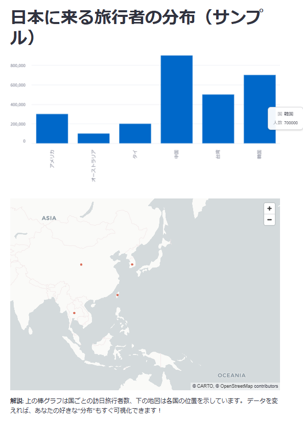

# 10分でわかる！Streamlitでデータ分析アプリを作ろう

## はじめに：Excel職人から“アプリ職人”へ

みなさん、データ分析といえば何を思い浮かべますか？

「Tableau」や「Power BI」などのBIツールで、マウスをカチカチしながらグラフを作る――そんな“Excel職人”のような作業が主流でした。

でも、もし「Pythonのコードを書くだけで、魔法のようにWebアプリができたら？」

そんな夢を叶えてくれるのが、**Streamlit**です。

このガイドでは、従来のBIツールとStreamlitの違いをストーリー仕立てで解説し、なぜ今“コードファースト”なアプローチが注目されているのかを、初心者にも分かりやすく紹介します。

<div><iframe width="600" height="400" src="https://s3-us-west-2.amazonaws.com/assets.streamlit.io/videos/hero-video.mp4"></iframe></div>
出典：streamlit.io公式([URL](https://streamlit.io/))

- [GitHubリポジトリ](https://github.com/streamlit/streamlit)
- [Streamlit公式ドキュメント](https://docs.streamlit.io/)
- [Streamlitコンポネント](https://streamlit.io/components)

---

### 1.1. パラダイムシフト：GUIから「コードで作る」時代へ

従来のBIツール（Tableau/Power BI）は、まるで「レゴブロック」のように、パーツを組み合わせてグラフやレポートを作るイメージです。

誰でも簡単に使える反面、「もっと自由にカスタマイズしたい！」「複雑なロジックを入れたい！」と思った瞬間、急に“壁”が現れます。

一方、Streamlitは「自分で粘土をこねて、好きな形の作品を作る」ようなもの。

Pythonでコードを書くだけで、インタラクティブなWebアプリがサクッと作れます。HTMLやCSSの知識は不要。まるで“魔法”のように、あなたのアイデアがそのままアプリになります。

---

#### 従来のBIツールの哲学：誰でも使える“レゴ型”

GUI主導で、ドラッグ＆ドロップで直感的にデータを可視化できるのが最大の強みです。
プログラミングが苦手な人でも、標準的なレポートやダッシュボードをすぐに作れます。

でも、複雑な計算や独自のロジックを入れたいときは、専用の数式言語（Tableau CalculationsやDAX）を覚える必要があったり、そもそも実現できないことも多いのが現実です。

しかし、この使いやすさは柔軟性のトレードオフの上に成り立っています。複雑な計算や独自のビジネスロジックを実装しようとすると、`Tableau Calculations` や `Power BI` の `DAX` といった**独自の数式言語の学習が必要になったり、あるいはそもそもツール側の制約で実現不可能**であったりするケースが少なくありません。

#### Streamlitの哲学 : Python利用者向けの開発者中心のアプローチ

対照的に、`Streamlit`は「スクリプティング」というパラダイムを採用しています 。

これは、**開発者が使い慣れた純粋なPythonコードを書くだけで、インタラクティブなWebアプリケーションを構築できる** という考え方です。HTML、CSS、JavaScriptといったフロントエンドの専門知識は一切不要で 、UIはPythonスクリプトから自動的に生成されます。

この体験は、まるで簡単なスクリプトが魔法のようにWebアプリに変身するかのようです 。このアプローチは本質的に開発者中心（デベロッパーセントリック）であり、開発者が持つプログラミングの力を最大限に引き出すことを目指しています。

#### 1.2. 主な差別化要因：開発速度、柔軟性、エコシステム連携

Streamlitが開発者にとって魅力的な選択肢となる理由は、その開発哲学から生まれる具体的な利点にあります。

- **圧倒的な開発速度**
  - Python開発者にとって、`Streamlit`の開発速度は驚異的です。データ分析スクリプトをわずか数分 、あるいは1日で共有可能なWebアプリケーションに変換できる能力は 、プロトタイピングとイテレーションのサイクルを劇的に加速させます 。これは、BIツールのGUI内で試行錯誤を繰り返すよりも高速な場合があります。**ソースファイルを保存するだけで即座にブラウザ上のアプリが更新されるため、思考を中断することなく開発に集中できます**。
- **比類なき柔軟性とコントロール**
  - `Streamlit`最大の利点は、Pythonの広大なエコシステムとネイティブに、そしてシームレスに連携できる点です。これにより、**データ操作のためのPandas、数値計算のためのNumPyといった基本的なライブラリはもちろん、Scikit-learn、TensorFlow、PyTorchといった高度な機械学習フレームワークまで、あらゆるPythonライブラリを直接利用**できます 。これは、単なるデータの可視化に留まらず、インタラクティブな機械学習モデルのデモ 、データ駆動型のシミュレーション、複雑なデータ前処理パイプラインの構築といった、従来のBIツールでは困難、あるいは不可能なカスタムアプリケーションの実現を可能にします 。BIツールにもPython連携機能は存在しますが、その多くは機能が限定的で、Streamlitほどインタラクティブではありません。
- **コストモデル**
  - `Streamlit`は、商用利用も可能なMITライセンスの下で公開されているオープンソースフレームワークであり、**完全に無料で利用**できます。これは、Tableau（例えば$75/ユーザー/月）やPower BI Premiumのような、しばしば高額なライセンス費用が発生するエンタープライズBIツールとは対照的です。特に、小規模なチームやプロジェクト単位での導入において、このコストの差は大きなメリットとなります。

これらの違いは、どちらか一方が絶対的に優れているということではなく、ツールが解決しようとしている課題と、想定しているユーザーが根本的に異なることを示しています。BIツールが「コードを抽象化してアナリストに力を与える」ことを目指すのに対し、Streamlitは「コードを活用して開発者に力を与える」ことを目指します。この哲学的な違いこそが、それぞれのツールの長所と短所の根源であり、開発者がツール選定を行う上で最も重視すべき視点です。

表1: Streamlit vs. 従来のBIツール（Tableau/Power BI）- 比較分析

|特徴|Streamlit|従来のBIツール（Tableau/Power BI）|
|:----|:----|:----|
|主要ユーザー|Python開発者、データサイエンティスト|ビジネスアナリスト、非技術者|
|コアパラダイム|コードファースト、スクリプティング|GUIベース、ドラッグ＆ドロップ|
|開発速度|プロトタイピングとイテレーションが非常に高速|標準的なダッシュボード作成は高速だが、複雑なカスタマイズは時間がかかる|
|カスタマイズ性|非常に高い。Pythonで書けることはほぼ全て実現可能|限定的。GUIの範囲内でのカスタマイズが主|
|機械学習連携|ネイティブかつシームレス。Scikit-learn、TensorFlow等と直接連携|限定的。Python/Rスクリプトの実行は可能だが、インタラクティブ性に欠ける|
|コスト|オープンソースで無料|ユーザー単位または容量ベースの高額なライセンス費用が発生|
|UIコントロール|限定的。標準コンポーネントが主だが、CSSで一部調整可能|比較的高い。豊富なビジュアルオプションとレイアウト設定|
|エンタープライズ認証|標準では提供されず、別途構築が必要|SAML/OAuth等の認証機能を標準で提供|
|デプロイモデル|柔軟。Community Cloudから自社サーバー、クラウドまで多様|主に専用のクラウドサービスまたはオンプレミスサーバー|

## セクション2: Streamlitが“輝く場面”と“ちょっと待った！”な場面

Streamlitはとてもパワフルなツールですが、どんな現場でも“最強”というわけではありません。

たとえば、包丁は野菜を切るのに最適ですが、ネジを締めるのには向いていませんよね。
ツール選びも同じです。

このセクションでは、Streamlitが「最高に活躍するシーン（スイートスポット）」と「ちょっと立ち止まって考えたいシーン（デンジャーゾーン）」を、具体例とともに分かりやすく紹介します。

### 2.1. Streamlitが“無双”するシーン（スイートスポット）

Streamlitが「神ツール」になるのは、こんなとき！

- **とにかく早く動くものを見せたいとき**
  - 例：機械学習モデルのデモを、ステークホルダーに“体験”してもらいたいとき。値を入力→即座に予測結果が出るアプリを、数分〜1日で作れます。
- **エンジニア・データサイエンティスト向けの社内ツール**
  - 例：Gitの履歴を可視化するツールや、社内データでAIプロンプトを試すインターフェースなど。凝ったUIより「速さ・機能性」重視なら、標準コンポーネントで十分！
- **インタラクティブなデータサイエンスレポート**
  - 例：Jupyter Notebookでは伝えきれない“深掘り”を、スライダーやドロップダウンで誰でも体験できるWebアプリに。
- **Pythonの力をフル活用したカスタムアプリ**
  - 例：複雑なデータ変換や外部API連携、分析結果のDB書き戻しなど、従来のBIツールでは無理だった“やりたい放題”が可能。

共通点は「開発者が“サービス提供者”になる」こと。全社標準のレポートを一括提供するのではなく、現場ごとに“ちょうどいい”ツールをサクッと作って配る――そんな“分散型・現場主導”の働き方にピッタリです。

### 2.2. Streamlitで“ちょっと待った！”なシーン（デンジャーゾーン）

逆に、Streamlitが「万能薬」ではない場面もあります。

- **全社標準の“ガチ”レポートを作りたいとき**
  - 例：数百人の非エンジニアが使う、統一デザイン・厳格な権限管理が必要なダッシュボード。→ こういうときは従来のBIツールが本領発揮！
- **ピクセル単位でデザインにこだわりたいとき**
  - 例：ブランドイメージに合わせて細部までUIを作り込みたい場合。Streamlitは「シンプル＆おまかせ」思想なので、Flask＋Reactなどの本格Web開発が向いています。
- **大量アクセス・複雑な状態管理が必要なWebサービス**
  - 例：大規模な公開サイトや、複雑なページ遷移が必要なアプリ。Streamlitは「1ユーザー＝1スクリプト再実行」型なので、パフォーマンスや構造面で限界があります。

ただし、「本番で使えるか？」という問い自体がナンセンスな場合も。大事なのは“設計”と“運用”です。
キャッシュや非同期処理、スケーラブルなインフラ（AWS ECSなど）を組み合わせれば、Streamlitでも十分“本番グレード”のアプリが作れます！

## セクション3: さあ作ろう！Streamlitアプリ開発の“はじめの一歩”

ここからは、Streamlitアプリを実際に作るための「超・実践ガイド」です。
「理論はいいから、まず動かしてみたい！」という人も、これを読めばすぐに“アプリ職人”デビューできます。

### 1. インストール

``` bash
# まずはプロジェクトを作成
uv init streamit-sample
# プロジェクトディレクトリに移動
cd streamit-sample
# Pythonのバージョンを確認
uv run python --version
# Pythonのバージョンを3.12に設定
uv python pin 3.12
# Pythonの仮想環境作成
uv venv
# Streamlitをインストール
uv add streamlit pandas
# Streamlitのバージョンを確認
uv run streamlit --version
```

※新しい、python 実行方法として `uv` を使うことを推奨します。

### 2. 最初のアプリケーション

app.pyという名前でPythonファイルを作成し、以下のコードを記述します。

``` python
import streamlit as st

# タイトルを表示
st.title("Hello, Streamlit!")
st.write("Welcome to your first Streamlit app!")
```

### 3. アプリケーションの起動

``` bash
# アプリケーションを起動
uv run streamlit run app.py
```

このコマンドを実行すると、自動的にWebブラウザが起動し、ローカルサーバー上でアプリケーションが表示されます。

### 4. インタラクティブな開発サイクル

Streamlitの最大の特徴の一つは、app.pyファイルを保存するたびに、ブラウザ上のアプリケーションが自動的に再読み込みされ、変更が即座に反映されることです 。これにより、コードの変更と結果の確認を高速に繰り返す、非常に効率的な開発サイクルが実現します。

## 3.2. コアビルディングブロック：ウィジェットとレイアウト

Streamlitアプリケーションは、様々な「ウィジェット」を組み合わせることで構築されます。

ウィジェットは、ユーザーとのインタラクションを可能にするUIコンポーネントであり、テキスト入力、スライダー、チェックボックス、ドロップダウンメニューなど、多岐にわたります。

- **データの表示**
基本的なテキストやデータを表示するには、以下の関数を使用します。

  - `st.title()`, `st.header()`: タイトルやヘッダーを表示します。
  - `st.write()`: テキスト、数値、PandasのDataFrameなど、様々なオブジェクトをインテリジェントに表示します。
  - `st.dataframe()`: DataFrameをインタラクティブなテーブルとして表示します。
  - `st.markdown()`: Markdown記法を使ってリッチなテキストを表示できます。

- **インタラクティブウィジェット**
ユーザーからの入力を受け取るためのウィジェットは、アプリケーションをインタラクティブにする心臓部です。

  - `st.button()`: クリック可能なボタン。
  - `st.selectbox()`: ドロップダウンリスト。
  - `st.slider()`: 数値範囲を選択するスライダー。
  - `st.text_input()`: 1行のテキスト入力フィールド。
  - `st.file_uploader()`: ファイルアップロード機能。

これらのウィジェットの戻り値を変数に格納することで、ユーザーの入力に応じてアプリケーションの動作を制御できます。

``` python
# 例: selectboxで選択された値に応じて表示を変更する
option = st.selectbox(
    '好きな果物を選んでください',
    ('りんご', 'バナナ', 'オレンジ'))

st.write('あなたが選んだのは:', option)
```

- **レイアウトと構成**
ウィジェットを効果的に配置し、見やすいダッシュボードを作成するためには、レイアウト機能が重要です。
  - `st.sidebar`: 画面の左側にサイドバーを作成し、フィルターや設定項目を配置するのに適しています。
  - `st.columns()`: 画面を複数の列に分割し、情報を並べて表示できます。
  - `st.set_page_config()`: ページのタイトル、アイコン、レイアウトモード（"centered"または"wide"）を設定します。データダッシュボードを作成する際は、layout="wide"を指定することが一般的です。

## 3.3. パフォーマンスは機能の一部：キャッシュの習得

パフォーマンスは“使いやすさ”のカギ！特にデータアプリでは「キャッシュ」が超重要です。

- **よくある落とし穴**
  - Streamlitは、ウィジェットを操作するたびにスクリプト全体を最初から再実行します。
  - もしキャッシュを使わないと、毎回「重いデータ読み込み」や「時間のかかる計算」が何度も何度も繰り返されてしまい、アプリが“激重”に……。

- **解決の魔法：`st.cache_data`**
  - そんなときは「冷蔵庫に作り置きしておく」イメージで、`@st.cache_data`デコレータを使いましょう！
  - データ読み込みや重い処理をする関数にこれを付けると、「同じ材料（引数）なら、前に作った料理（結果）をすぐ出す」＝キャッシュしてくれます。

- **実践例：5秒かかるデータ読み込みも一瞬に！**
  - 例えば、下の例では最初だけ5秒かかりますが、2回目以降は“冷蔵庫から即出し”で一瞬です。

```python
import streamlit as st
import pandas as pd
import time

@st.cache_data
def load_data(file_path):
    # ここで“重い処理”を再現（5秒待つ）
    time.sleep(5)
    df = pd.read_csv(file_path)
    return df

st.title("キャッシュのデモ")

if st.button("データを再読み込み"):
    # キャッシュをクリアしたいときはこれ！
    st.cache_data.clear()

# データを読み込む
my_large_df = load_data("my_data.csv")
st.dataframe(my_large_df)
```

> 💡 **ポイント**：最初は5秒かかるけど、2回目以降は“冷蔵庫から即出し”で一瞬！

- **キャッシュの“賞味期限”も設定できる**
  - データが定期的に変わる場合は、`ttl`（Time to Live）パラメータで「何秒で作り置きを捨てるか」も指定できます。
  - 例：10分ごとにデータを更新したい場合は `@st.cache_data(ttl=600)` と書くだけ。

  - 本番運用では“賞味期限”の設定がとても大事です！

## サンプルで体験！「日本に来る旅行者の分布」を可視化しよう

「実際にどんなアプリが作れるの？」と気になった方のために、
Streamlitで“日本に来る旅行者の分布”を地図とグラフで可視化するサンプルを用意しました。

> 💡 **ポイント**：たったこれだけのコードで、地図もグラフもサクッと作れます！

```python:sample_japan_visitors.py
import streamlit as st
import pandas as pd

# サンプルデータ：国別の訪日旅行者数（仮データ）
data = {
    '国': ['中国', '韓国', '台湾', 'アメリカ', 'タイ', 'オーストラリア'],
    '人数': [900000, 700000, 500000, 300000, 200000, 100000],
    '緯度': [35.8617, 35.9078, 23.6978, 37.0902, 15.8700, -25.2744],
    '経度': [104.1954, 127.7669, 120.9605, -95.7129, 100.9925, 133.7751]
}
df = pd.DataFrame(data)

st.title("日本に来る旅行者の分布（サンプル）")

# 棒グラフで国別人数を表示
st.bar_chart(df.set_index('国')['人数'])

# 地図上に各国の位置と人数を表示
st.map(df.rename(columns={'緯度': 'lat', '経度': 'lon'}))

st.write("\n**解説**: 上の棒グラフは国ごとの訪日旅行者数、下の地図は各国の位置を示しています。\nデータを変えれば、あなたの好きな“分布”もすぐ可視化できます！")
```

このファイルを `sample_japan_visitors.py` として保存し、以下のコマンドで実行します。

```bash
uv run streamlit run sample_japan_visitors.py
```

ブラウザが自動で開き、訪日旅行者の分布が地図とグラフで表示されます。


---

## おわりに：あなたも“アプリ職人”デビュー

ここまで読んでくれたあなたは、もう「Streamlitでデータアプリを作る」ための“地図”と“道具”を手に入れました。

難しく考えず、まずはサンプルをコピペして動かしてみましょう。
「あ、動いた！」という小さな感動が、きっと次の一歩につながります。

> 💡 **さあ、あなたの“最初の一歩”は？**
>
> - サンプルコードを動かしてみる
> - 好きなデータでグラフを作ってみる
> - チームの“困りごと”をStreamlitで解決してみる

あなたの“アプリ職人”デビューを、心から応援しています！

## 参考リンク集

- [Streamlit公式ドキュメント](https://docs.streamlit.io/)
- [Streamlit GitHubリポジトリ]([haa](https://github.com/streamlit/streamlit))
- [Streamlitコンポーネント一覧](https://streamlit.io/components)
- [Pythonのスクリプトからウェブアプリを簡単に作れるStreamlitをさわってみた](https://dev.classmethod.jp/articles/streamlit-intro/)
