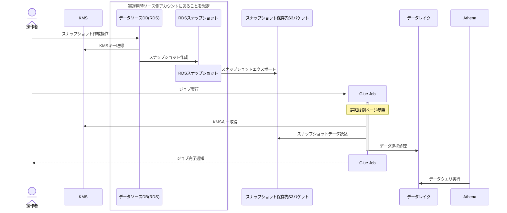

**検討時期**: 2025年12月

## やったこと

RDS for PostgreSQL(以下RDS)上のデータを連携するうえで、要件を整理し各手法の比較検討を行った。
その際は、連携先を現在運用しているデータレイクにこだわらず広く検討することで、最適な手法を選定することを目標に技術検証対象を決定した。
まずは、データ保存先として、セルフマネージドのIcebergテーブルをS3上に構築するか、それのフルマネージドサービスとして提供されているS3 Tablesを利用するかの2つの手法のどちらかに絞り、連携手法によりどちらかを選択することにした。
次に、連携手法をRDSのスナップショットをGlueジョブ経由で連携する方法に決定した。この方法は両方のデータ保存先に対応しているため、保存先は使用経験のないS3 Tablesを選択した。

## 背景

現在運用しているサービスではDynamoDBとRDSの2種のシステムをデータ保存先として活用している。
2025年度の時点ではDynamoDBのデータに関してはデータ分析チームが使用しているデータ基盤への連携が完了していたが、RDS上のデータの連携はサービスの機能である帳票出力経由に頼っており限定的かつ、手作業が必須なものであった。その結果、DynamoDB上のデータはデータ基盤で分析可能である一方、RDS上のデータを自由に分析することが難しい状況になっていた。
さらに、2026年度から一部のデータの保存先がDynamoDBからRDSに移行されることになり、その移行データの中にユーザーの属性情報といった分析に必須な情報が含まれていた。こうした流れの中で「RDS上のデータをデータレイク上で自由に活用できるようにする」ことの重要性が無視できないレベルにまで高まった。
また、それ以外にもデータ分析チームに期待されるデータ分析の範囲が拡大しており、RDS上のデータを活用することで新たな知見を得られる可能性もあった。
これらの理由から、RDS上のデータをデータレイクに連携する手法の検討を開始することになった。

## 要件の定義

RDS上のデータをデータレイクに連携するにあたり、以下の要件を満たすことを目標に手法の選定を開始した。

1. 本番環境のRDSインスタンスにかかる負荷を減らすこと
2. 同じデータベース上に、個人情報などの機微データが存在するため、連携するデータを制御できること
3. データレイクはサービスを運用しているAWSアカウントとは別のAWSアカウントに構築すること
4. 運用の際にサービスの設計運用を行うチームとデータ基盤の運用チームの間での調整コストが低いこと
5. データの更新は1日1回程度とする
6. コストはなるべく抑えること
7. 特定のサービスに過度に依存したり、密結合なアーキテクチャにならないこと
8. フルマネージドサービスをなるべく採用すること
9. 実現性と継続性が高いこと

### 1.〜9.の要件の背景

1. **本番環境のRDSインスタンスにかかる負荷を減らすこと**
現在運用しているインスタンスはフルスキャンや大規模なクエリを走らせる想定になっていない。そのため直接RDSに接続してデータを抽出するといった手法は採用できない
2. **同じデータベース上に、個人情報などの機微データが存在するため、連携するデータを制御できること**
運用中のRDS上には個人情報などの機微データが存在する。また、運用上リストとしてこういった情報を取得する必要があるため、これらをCognitoといったほかのサービスに移行することは難しい。しかし、データレイクにこれら個人情報を保持することは管理コストの増加やセキュリティリスクの増加を招く。よって、安全なデータのみを連携できるよう制御する必要がある
3. **データレイクはサービスを運用しているAWSアカウントとは別のAWSアカウントに構築すること**
サービスを運用しているAWSアカウントとは別にデータ基盤用のAWSアカウントがあり、そこにデータを集約するほうがセキュリティ的に望ましいため
4. **運用の際にサービスの設計運用を行うチームとデータ基盤の運用チームの間での調整コストが低いこと**
サービスを運用しているチームとデータ基盤を運用しているチームは別である。現状は直接話せる環境であり、そこまで大きな調整コストは発生していなかった。しかし、今後の運用を想定したときにCI/CD[^1]のパイプラインの変更などサービス側の大きな変更で、場合によってはデータ分析チームがサービス側のコードを変更する必要も想定される。こういった事態を避けるため、疎結合を保てるようなアーキテクチャが望ましい
5. **データの更新は1日1回程度とする**
データの更新頻度は高くないため、リアルタイム性は求められずCDC[^6]のような手法も不要
6. **コストはなるべく抑えること**
予算の制約もあるため、コストはなるべく抑えたい。そのためのコストの概算は、データレイクに連携するデータ量がGBスケールと多くはないことを前提に行っている
7. **特定のサービスに過度に依存したり、密結合なアーキテクチャにならないこと**
将来的に他のクラウドサービスなどに移行することも可能なように、AWSのサービスに過度に依存しないことが望ましい。また、部分的な変更を容易にするためにも疎結合なアーキテクチャが望ましい
8. **フルマネージドサービスをなるべく採用すること**
データ分析チームのリソースが極めて小さいことと、本質的な価値を生み出す業務に集中したい。そのため、運用コストの低いフルマネージドサービスを中心に検討した
9. **実現性と継続性が高いこと**
実現のための工数が膨大になったり、技術的難易度が高い手法は避けたい。また将来的なメンテナンスやサポートが期待できること

## データ保存先の検討

RDS上のデータをデータレイクに連携する手法として、まずはデータを集積する場所を役割ごとに分類、検討した。

### 検討対象にした保存先の種別

#### DWH(データウェアハウス)

Amazon RedshiftやSnowflake、Google BigQueryなどのDWH[^2]。
DWHは大量のデータを高速に分析することに特化したサービスであり、本来データレイクを別途用意することが多い。しかし、DWH自体に管理しやすい形でデータを保管できるため、データレイクの代替として利用することも可能。

#### 旧来のデータレイク

何らかの方法で、S3などのオブジェクトストレージ上にデータを保存し、AthenaやEMRなどでクエリを実行する手法。
AWS上で構築する場合は、S3上にParquetやORCなどのカラムナ形式でデータを保存し、Athenaでクエリを実行することが多い。

#### データレイクハウス

IcebergやDelta Lake、Apache Hudiなどのオープンテーブルフォーマット(OTF)を利用してS3上にデータレイクを構築し、AthenaやEMR、Databricksなどでクエリを実行する手法。
OTFを利用することで、データのバージョニングやスキーマエボリューション、ACIDトランザクションなどの機能が利用できるため、データレイクの運用性や拡張性が向上する。

### 検討結果

以下の表のように整理した結果、以下の3つの構成が有力候補として残った。

- データレイクハウス利用構成
  - S3Tables + Athena
  - S3 + Iceberg + GlueCatalog + Athena
- DWH利用構成
  - Google BigQuery

|大分類|具体的サービス|強み|弱み|所感|
|-|--|--|--|--|
|DWH|Amazon Redshift|AWSのフルマネージドサービスであり、連携手段が豊富|費用が高価 AWSのエコシステムありき ベンダーロックインの危険|インスタンス課金制なので、コスト面から除外|
||Snowflake|代表的DWHで、高機能 様々なクラウドプロバイダから選択して運用可能|高価|費用面と目的から今回ここまでする必要性は薄いと判断し除外|
||Google BigQuery|比較的低コストな従量課金制 メジャーな選択肢|マルチクラウド構成になる すぐに検証環境を用意できない|安価にDWH環境を試せ、GCPの他のサービスとの連動性もよい|
|旧来のデータレイク|S3 + Athena|構成がシンプル RDS・DynamoDBともに、S3上にデータをマネージドな機能でエクスポート可能|拡張していくにしたがって、データの運用が難しくなる データ分析の基盤として設計されているわけではないため歪が出る|拡張時の運用性を考慮し除外|
|データレイクハウス|S3 + GlueCatalog + Iceberg + Athena|2025年度にDynamoDBのデータで実行済み|管理が手動|運用性と拡張性が高く、AWS内のサービスとの相性が良い|
||S3Tables + Athena|マネージドなIcebergテーブル|一部のAWSのマネージドサービスとの接続が難しい|運用性と拡張性が高く、AWS内のサービスとの連携も期待できる|
||Iceberg以外のOTF|データ基盤の要件を満たしている 疎結合が実現できる 将来的にDWHへの接続も視野に入る|AWSサービスとの連携が弱い|AWSを前提にするならIcebergが相性面で有利なため対象から除外 マルチクラウドならば使用料もかかるので、一足飛びにDWHを採用するほうが良いと判断し除外|

### データレイク検討結果まとめ

先ほど挙げた3つの構成について、連携手法も加えて詳細に検討を進めた。

|構成|連携手法|管理|環境準備|備考|
|:--:|:--:|:--|:--|:--|
|S3Tables|1. Glue Job経由 2. DMS[^3]経由|設定は最小限|既存のPoC[^5]用AWSアカウントが利用可能|運用経験はないが、AWSでの経験は効く|
|セルフマネージドな、S3上のIcebergテーブル|1. Glue Job経由 2. DMS[^3]経由 3. Firehose経由|コンパクション[^4]など設定が必要|既存のPoC[^5]用AWSアカウントが利用可能|2025年度に既に、ある程度運用している|
|BigQuery|1. Data Transfer Service|DWH的な機能が豊富で管理も容易|新規GCPアカウントが必要|GCPの経験値がほぼない|

結果、以下の理由からAWSのS3上でIcebergテーブルを利用するデータレイクハウス構成のどちらかを採用することにした。
また連携が可能な場合は、検証を兼ねるためにS3Tablesを優先的に利用することにした。

**共通の理由**:

- 検証環境をすぐに用意できる
  - BigQueryは検証環境を用意できていなかった
- 連携手段が複数あり、方針変更がしやすい
  - Glue Job経由、DMS[^3]経由、Firehose経由と複数の手法が検討できる

**S3Tablesの利用を優先する理由**:

- S3Tablesを試していないため、検証を兼ねられる
  - S3+Iceberg+GlueCatalog+Athena構成は2025年度にDynamoDBのデータで実証済み

## 連携方法の検討

RDSのスナップショットデータをS3上のIcebergテーブルに連携する手法として、以下の3つの手法を検討した。

- Firehose経由で連携
- DMS[^3]経由で連携
- Glue Job経由で連携

### Firehose経由で連携

本命として検討した手法。

#### 内容

[FirehoseによるRDSのCDCの更新をIcebergテーブルへ配信する機能](https://aws.amazon.com/jp/blogs/news/replicate-changes-from-databases-to-apache-iceberg-tables-using-amazon-data-firehose/)を利用し、更新を逐次データレイクに反映する。
この方式を使う場合はセルフマネージドのテーブルを使用する必要がある。

#### 強み

- リアルタイム性が高い
- 運用コストが低い
- 構築が容易
- RDSインスタンスへの負荷が低い
- 連携するデータを柔軟に制御できる
  - Filter機能が利用できる

#### 弱み

- CDCキャプチャのために、RDSインスタンスの設定変更が必要
  - 変更自体は軽微
- RDSインスタンスのバージョンが対応していないと利用できない
  - 現在のRDSインスタンスで対応可能
- S3Tablesには連携できない
- プレビュー版であり、一般提供ではない
- **提供が2025年の10月でいったん終了していた**

### DMS経由で連携

#### 内容

DMS[^3]のIcebergターゲットエンドポイントを利用して、RDSのCDC[^6]をS3TablesもしくはセルフマネージドなIcebergテーブルに連携する。

#### 強み

- リアルタイム性が高い
- 文献が多い
- データの連携に特化したサービスである
- フィルタ機能があり、連携するデータを柔軟に制御できる

#### 弱み

- RDSインスタンスの負荷が高い
- サービスのコストが高い
- RDSを保持しているアカウントでDMSを構築するのが自然な構成
  - サービス間の結合度が高くなる

### Glue Job経由で連携

#### 内容

RDSのスナップショットをS3にエクスポートし、Glue JobでS3TablesもしくはセルフマネージドなIcebergテーブルに連携する。

#### 強み

- RDSインスタンスへの負荷が低い
  - スナップショットの取得はすでに運用しており、新規に与える負荷はない
- 連携するデータを柔軟に制御できる
  - スナップショットのエクスポート時に、ホワイトリスト方式[^7]でのテーブル選択が可能
- 切り替えが容易
  - 将来的にDMS[^3]やFirehoseに切り替えることも可能

#### 弱み

- リアルタイム性が低い
  - スナップショットの取得頻度が1日1回程度のため
- 運用コストが高い
  - Glue Jobのメンテナンスが必要
  - Jobの実行にもコストがかかり、規模が大きくなるとDMS[^3]よりも高価になる
- 構築がやや複雑
  - Glue Jobの実装が必要
  - 権限設定もやや複雑

### 連携方式検討結果まとめ

以下の理由から**Glue Job経由でRDSのスナップショットデータをS3Tablesに連携する**手法を試すことにした。

- **スナップショットとGlue Job経由**
  - 以下のメリットを重視した
    - RDSインスタンスへの負荷が低い
    - 連携するデータを柔軟に制御できる
    - データソース側での設定が必要最小限
  - 以下のデメリットは許容
    - リアルタイム性が低い
      - 今回の要件では不要
    - 変換コードのメンテナンスが必要
      - 構造化データのみならばコードは汎用的にできる
    - 構築がやや複雑
      - IaC[^8]化を検討
    - 大規模になるとコストが跳ね上がる
      - 現状の規模ならこちらの方が経済的
    - 処理が大規模になったらDMS[^3]や(GA[^9]された場合は)Firehoseへの乗り換える必要性がある
- **Firehose経由**
  - 最有力候補もプレビュー提供が終わっていたため候補から除外
- **DMS経由**
  - 以下のデメリットが重く不採用
    - RDSインスタンスへの負荷が高い
    - 小規模な転送だとコストが高い
    - AWSのマネージドサービスへの依存性に対する懸念
  - 以下のメリットは魅力的だった
    - リアルタイム性が高い
    - データ転送に特化

## 選定結果

以上の結果、今回検証する構成は以下のようになる。

### 検証構成

今回はPoC[^5]用アカウント上にRDSインスタンスを立ち上げて1アカウント構成で検証を実施した。

#### 今回の検証構成

#### 実運用の予定構成

別途スナップショットのクロスアカウント共有が可能なことは確認している。

### 連携処理フロー

今回実装した処理のフローを以下に示す。

[^1]: CI/CD (Continuous Integration/Continuous Delivery): 継続的インテグレーション/継続的デリバリー。コードの変更を自動的にビルド、テスト、デプロイするための開発手法

[^2]: DWH (Data Warehouse): データウェアハウス。大量のデータを集約して分析するためのデータベースシステム

[^3]: DMS (Database Migration Service): データベース移行サービス。データベース間のデータ移行やレプリケーションを行うAWSのサービス

[^4]: コンパクション (Compaction): Icebergテーブルの最適化処理。小さなファイルを統合して読み取り性能を向上させたり、孤立したデータを削除したりする

[^5]: PoC (Proof of Concept): 概念実証。新しい技術やアイデアの実現可能性を検証すること

[^6]: CDC (Change Data Capture): 変更データキャプチャ。データベースの変更をリアルタイムで検出・取得する技術

[^7]: ホワイトリスト方式: 指定したもののみを許可する方式。指定されていないものは拒否される。対義語はブラックリスト方式

[^8]: IaC (Infrastructure as Code): コードとしてのインフラ。インフラ構成をコードで管理する手法

[^9]: GA (General Availability): 一般提供。AWSのサービスが正式に提供されること
