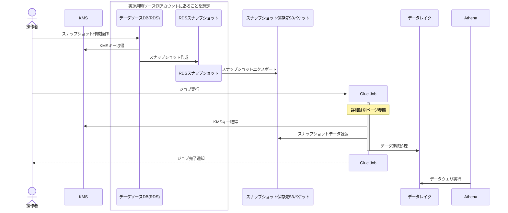
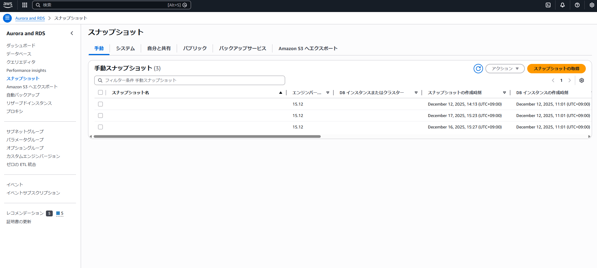
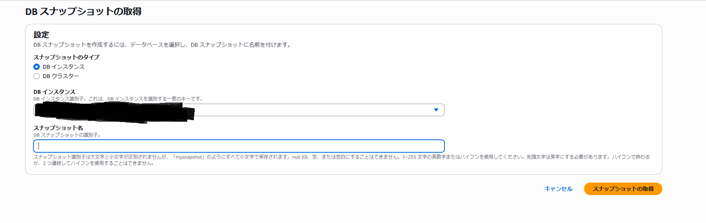
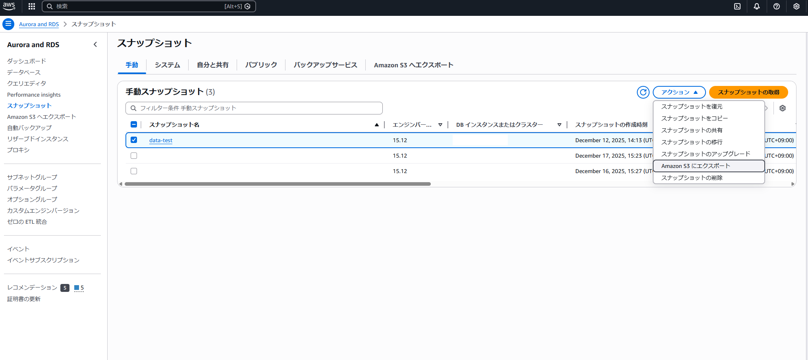
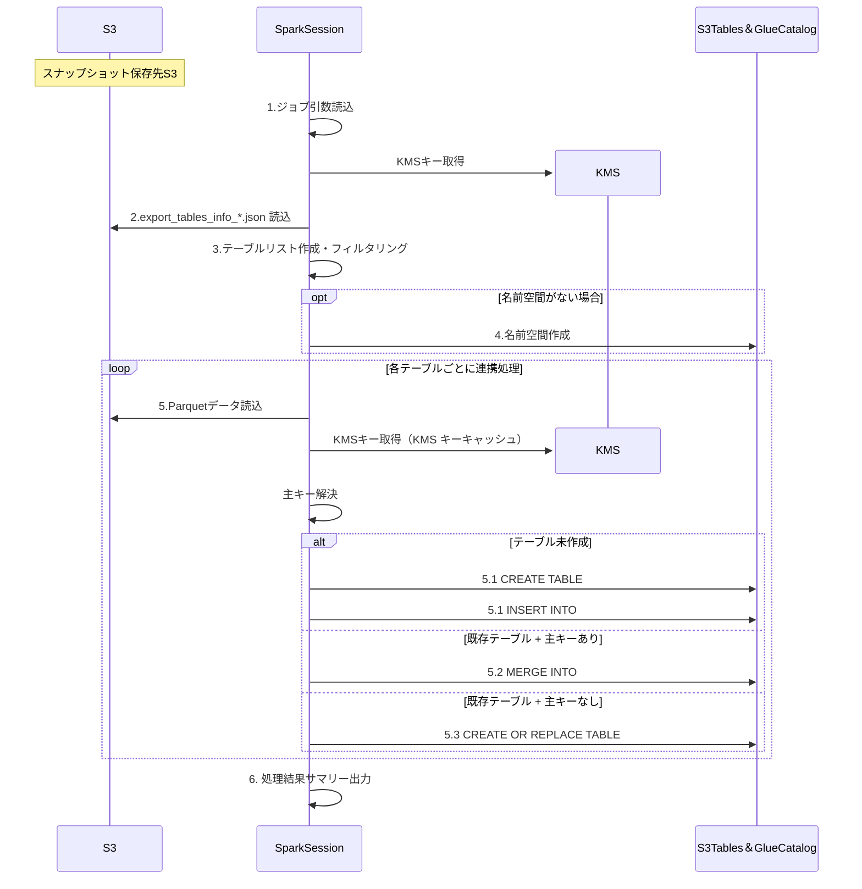
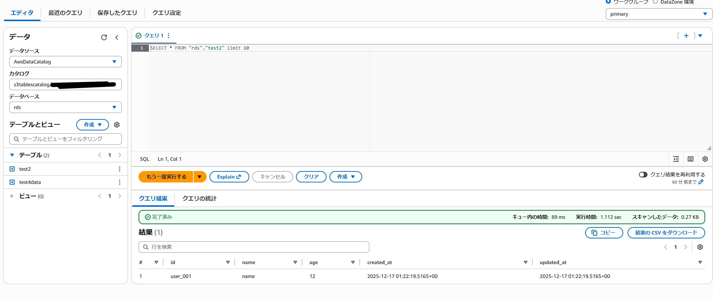

## はじめに

前回の記事でRDS起点のデータ連携方式を検討した[^1]。
その結果、以下のような**RDSのスナップショットのGlue経由のS3 Tables連携**を試すことにした。
**システム構成図**

**全体のシーケンス図**



## この記事の目標

S3 Tables[^2]もしくはIceberg[^3]テーブルにスナップショット経由でRDSのデータを連携するための、Glue-Sparkジョブの実装方法を解説する。

## 技術検証の内容

1. 連携に必要なIAM権限の用意
2. KMSキー準備
3. スナップショット取得
4. スナップショットのS3エクスポート
5. Glue ジョブの設定と準備
6. Glue ジョブの実行
7. Lake Formationでの権限付与
8. Athenaでのクエリ実行
9. 問題発生時の確認ガイド

## 連携に必要なIAM権限の用意

ここでは処理に必要な権限のみ記載する。
閲覧の際はLake Formationでの権限付与も必要になるが、それに関しては別途記載する。

### IAMで作成するロール

**RDSからスナップショットをエクスポートするロール**
RDSからスナップショットをエクスポートする際に使用したロールに付与した権限

``` json
{
    "Version": "2012-10-17",
    "Statement": [
        {
            "Sid": "S3BucketAccess",
            "Effect": "Allow",
            "Action": [
                "s3:GetBucketLocation",
                "s3:ListBucket"
            ],
            "Resource": "arn:aws:s3:::<エクスポート先のバケット>"
        },
        {
            "Sid": "S3ObjectAccess",
            "Effect": "Allow",
            "Action": [
                "s3:PutObject*",
                "s3:GetObject*",
                "s3:DeleteObject*",
                "s3:AbortMultipartUpload"
            ],
            "Resource": "arn:aws:s3:::<エクスポート先のバケット>/*"
        }
    ]
}
```

**GlueのJobに付与するロール**
マネージドポリシーから

- GlueServiceRole
- S3FullAccess

をアタッチした。
加えて以下のカスタムポリシーをアタッチしている。
>⚠️**注意**
>マネージドポリシーの権限だと強すぎるため、実際の運用時には必要な権限に絞る必要がある
>また、追加したカスタムポリシーはresourceを限定していないので、実際の運用時には適切に制限すること

```json
{
    "Version": "2012-10-17",
    "Statement": [
        {
            "Effect": "Allow",
            "Action": [
                "lakeformation:GetDataAccess",
                "lakeformation:GetWorkUnits",
                "lakeformation:StartQueryPlanning",
                "lakeformation:GetWorkUnitResults",
                "lakeformation:GetQueryState",
                "lakeformation:GetQueryStatistics"
            ],
            "Resource": "*"
        },
        {
            "Effect": "Allow",
            "Action": [
                "s3tables:CreateTableBucket",
                "s3tables:GetTableBucket",
                "s3tables:ListTableBuckets",
                "s3tables:DeleteTableBucket",
                "s3tables:CreateNamespace",
                "s3tables:GetNamespace",
                "s3tables:ListNamespaces",
                "s3tables:DeleteNamespace",
                "s3tables:CreateTable",
                "s3tables:GetTable",
                "s3tables:DeleteTable",
                "s3tables:RenameTable",
                "s3tables:GetTableData",
                "s3tables:PutTableData",
                "s3tables:GetTableMetadataLocation",
                "s3tables:UpdateTableMetadataLocation",
                "s3tables:PutTablePolicy",
                "s3tables:GetTablePolicy",
                "s3tables:PutTableEncryption",
                "s3tables:GetTableEncryption",
                "s3tables:PutTableMaintenanceConfiguration",
                "s3tables:GetTableMaintenanceConfiguration"
            ],
            "Resource": "*"
        }
    ]
}
```

## KMSキー準備

> 📝**メモ**
> 既に適切なKMSキーがある場合はこのセクションはスキップする代わりに、そのキーの閲覧権限を先ほど作成したロールに付与してもよい

S3へのエクスポート時の暗号化に必須なため、KMSキーを用意する。

### 作成方法

コンソールでの作成方法

1. AWS KMSのコンソールに入り、カスタマー管理型のキーを選択
2. 「キーの作成」を選択

3. コンソール上で設定を行う
    - ステップ1:キーを設定
      - 対象のキーの種類: 対称
      - キーの使用方法: データの暗号化と復号
      - 詳細オプション
        - キーマテリアルオリジン: KMS
        - リージョンごと: 単一リージョンキー[^4]
    - ステップ2:ラベルを追加
      - エイリアスや説明・タグを適宜追加
    - ステップ3: キーの管理アクセス許可を定義(オプション)
      - キー管理者とするIAMユーザー or ロールが必要なら追記
    - ステップ4: キーの使用法アクセス許可を定義
      - [前章](#iamで作成するロール)で作成した2つのロールを選択し、キーの使用権限を付与する
    - ステップ5: キーポリシーを編集 (オプション)
      - ここまでで設定した内容が反映されている
    - ステップ6: 確認
      - 問題なければキーを作成する

### 注意点

- RDSと別のアカウントにエクスポートする場合、クロスアカウントでKMSキーの使用権限を付与する必要がある
- KMSキーは保持しているだけでコストが発生するため、不要になったら削除すること

## スナップショット取得

手動スナップショットでも自動スナップショットでもよいが、今回は手動取得のためそちらを用いて解説する。

### 手順

1. RDSのコンソールに入り、左カラムのスナップショットを選択
2. 「スナップショットの取得」を選択

3. DBスナップショットの取得画面で必要な項目に入力する
   - スナップショットのタイプ: スナップショットを取りたいDBの形式を選択
   - DBインスタンス: スナップショットを取得したいRDSインスタンスを選択
   - スナップショット名: スナップショットの名前を入力


### 注意点

- 小さいインスタンスであってもスナップショット取得に少し時間がかかる(15分程度)
- スナップショットの名前はこの後エクスポートされるフォルダの名前になるため、わかりやすい名前にすること

## スナップショットのS3エクスポート

### エクスポート処理前の準備

S3へのエクスポートにはKMSキーが必要なため、[先ほど作成し](#kmsキー準備)ていなければ作成する。

### エクスポート処理

必要な設定のうえ、Amazon S3 にエクスポートの項目からエクスポートを行う。

#### 手動で行う際の手順

1. Aurora and RDSのコンソールに入り、左カラムのスナップショットを選択
2. 「手動」もしくは「システム」のタブから処理したいスナップショットを選択[^5]
3. アクションから`Amazon S3 へエクスポート`を選択

4. コンソール上で設定を行いエクスポートする
    - エクスポート識別子
      - エクスポートの名前
    - エクスポートされたデータ
      - エクスポートするデータの範囲を指定
        - 一部:識別子を指定するとそのテーブルのみ、もしくはそれ以下のdbやスキーマのみエクスポートなどができる
        - 全部:文字通り
    - S3送信先
      - S3バケット:送信先のS3バケット名
      - S3プレフィックス:指定のディレクトリに入れたい場合に
    - IAMロール
      - [先ほど作成した](#iamで作成するロール)ロールを付与
    - 暗号化
      - AWS KMSキー:準備したものを指定する

## Glue ジョブの設定と準備

この章では全てGlueコンソール上での操作を前提としている。

### 手順

スクリプトを入れ実行する前に必要な準備をまずは済ませる。

#### 1.スナップショットを入れたS3のURI確認

この時、スナップショットのメタデータのあるディレクトリを指定する。
通常はエクスポート時のパラメタに従って、`S3://<S3送信先>/<エクスポート識別子>`を指定すればよい。

#### 2.連携先の設定

- コンソール画面からS3 Tablesのテーブルバケットを作成
- ここより先は Spark[^6]で自動的に処理される

#### 3.Job Details内の設定

以下はデフォルト以外の値および重要な設定項目のみ抽出している。
4以降の設定はAdvanced properties内にある。

1. IAM Roleの設定
   - [すでに述べた](#kmsキー準備)KMSの参照権限があるロールを指定。今回は検証目的で新規ロールを作成して実行
2. Glue version設定
   - 5.0を指定する。低いとIcebergテーブルに書き込めない
3. Worker type
   - 最小のG 1Xを指定した。稼働時間×インスタンスサイズでコストが決まるので、実運用では速度向上が見られなくなる直前のサイズまでスケールアップしたほうが時短になりお得
4. Temporary path
   - 一時的にファイルを置くためのバケット。未指定の場合は任意のS3パスを指定（スクリプトを配置しているバケットにフォルダを作成するなど）
5. Job parameters
   - スクリプト作成の項目で設定

#### 4.スクリプト作成

AWS Glue（サーバレスETL）上で動作する PySpark ジョブを作成する。

#### 処理の概要

Glue Jobのスクリプトで以下のような処理を行わせる

1. ジョブ引数(環境変数などの定義)を受け取る
2. エクスポートメタデータ（export_tables_info_*.json）をS3から読み、対象テーブルを列挙
3. 除外パターンでテーブルをフィルタ（個人情報保護: "private" を含むテーブルを除外）
4. カタログ設定（Glue Catalog経由で S3 Tables へ接続）を行い、名前空間（データベース）を用意
5. 各テーブルごとに Parquet[^8] を読み、
    1. テーブルが未作成なら CREATE（スキーマ作成）+ INSERT（データ挿入）
    1. 既存テーブルで主キーがあるなら MERGE[^9]（更新・新規・削除を反映）
    1. 主キーがないなら CREATE OR REPLACE（全置換）
6. 実行結果をまとめてログ出力



#### 連携スクリプト例

実際にPoCで作成したスクリプト

**ジョブ引数の設定**
Glue ジョブ起動時に渡すキーと内容一覧
**注意**: キーの先頭にある`--`も必要

| キー | 説明 | 例 |
|------|------|-----|
| `--JOB_NAME` | ジョブ名（Glueの実行識別に使用） | `your-good-job-name` |
| `--EXPORT_S3_BUCKET` | RDSエクスポートのS3先頭パス | `s3://my-export-bucket` |
| `--SNAPSHOT_NAME` | 対象スナップショット名 | `2024-12-01` |
| `--TABLE_BUCKET_NAME` | 書き込み先の S3 Tables のテーブルバケット名 | `my-s3tables-bucket` |
| `--TARGET_NAMESPACE` | S3 Tables 上で使う名前空間（DB名に相当） | `rds` |
| `--EXCLUDE_PATTERN` | 個人情報を含むテーブルを除外するため、対象外にするテーブル名の部分文字列 | `private` |
| `--PRIMARY_KEY_MAP` | 主キー定義のJSON | `{"public.orders":"order_id,item_id"}` |
| `--ACCOUNT_ID` | AWS アカウントID（Glue Catalog連携に使用） | `1111111111` |
| `--REGION` | リージョン | `ap-northeast-1` |
| `--datalake-formats` | S3 Tables 統合の場合はicebergを設定する必要がある | `iceberg` |
| `--conf spark.hadoop.fs.s3.cse.kms.key.caching` | Spark/Glue が KMS キー復号結果をキャッシュするかどうかのフラグ。trueにするとKMSのコストが減少するようなスクリプトになっている | `true` |

```Python
from awsglue.transforms import *
from awsglue.utils import getResolvedOptions
from pyspark.context import SparkContext
from awsglue.context import GlueContext # Glue 上で Spark を扱うためのラッパ（ヘルパー）
from awsglue.job import Job
from pyspark.sql import SparkSession
import sys
import json
import logging
import re
import time
from dataclasses import dataclass, field
from typing import Dict, List, Optional, Tuple
from urllib.parse import urlparse

import boto3

# ログ設定
logging.basicConfig(
    level=logging.INFO,
    format='%(asctime)s - %(levelname)s - %(message)s'
)
logger = logging.getLogger(__name__)


@dataclass
class TableInfo:
    """エクスポートされたテーブルの情報"""
    target: str  # e.g., "data_test.public.test2"
    db_name: str
    schema_name: str
    table_name: str
    columns: List[str]
    s3_path: str
    status: str


@dataclass
class ProcessResult:
    """テーブル処理結果"""
    table_name: str
    status: str  # "success", "failed", "skipped"
    record_count: int = 0
    elapsed_time: float = 0.0
    error_message: str = ""
    write_mode: str = ""  # "merge", "replace", "create"


@dataclass
class JobConfig:
    """ジョブ設定"""
    job_name: str
    export_s3_bucket: str
    snapshot_name: str
    target_namespace: str
    table_bucket_name: str
    exclude_pattern: str
    primary_key_map: Dict[str, List[str]]
    account_id: str
    region: str
    catalog_name: str = "s3tablescatalog" # Glue Catalogの名前(S3 Tablesに連携する場合はこれに固定)
    
    @property
    def export_s3_path(self) -> str:
        """エクスポートのS3パスを構築"""
        bucket = self.export_s3_bucket.rstrip('/')
        return f"{bucket}/{self.target_namespace}/{self.snapshot_name}"
    
    @classmethod
    def from_args(cls, args: dict) -> 'JobConfig':
        """ジョブパラメータからJobConfigを生成"""
        # PRIMARY_KEY_MAPのJSON解析（カンマ区切りの複合キー対応）
        pk_map_raw = args.get('PRIMARY_KEY_MAP', '{}')
        try:
            pk_map_parsed = json.loads(pk_map_raw)
            primary_key_map = {
                k: [col.strip() for col in v.split(',')]
                for k, v in pk_map_parsed.items()
            }
        except json.JSONDecodeError:
            logger.warning(f"PRIMARY_KEY_MAP の解析に失敗しました: {pk_map_raw}")
            primary_key_map = {}
        
        return cls(
            job_name=args['JOB_NAME'],
            export_s3_bucket=args['EXPORT_S3_BUCKET'],
            snapshot_name=args['SNAPSHOT_NAME'],
            target_namespace=args.get('TARGET_NAMESPACE', '{"<名前空間名>"}'),
            table_bucket_name=args['TABLE_BUCKET_NAME'],
            exclude_pattern=args.get('EXCLUDE_PATTERN', '{"<除外パターン>"}'),
            primary_key_map=primary_key_map,
            account_id=args.get('ACCOUNT_ID'),
            region=args.get('REGION', 'ap-northeast-1'),
        )


# ジョブパラメータ取得
args = getResolvedOptions(sys.argv, [
    'JOB_NAME',
    'EXPORT_S3_BUCKET',
    'SNAPSHOT_NAME',
    'TABLE_BUCKET_NAME',
    'TARGET_NAMESPACE',
    'EXCLUDE_PATTERN',
    'PRIMARY_KEY_MAP',
    'ACCOUNT_ID',
    'REGION',
])

config = JobConfig.from_args(args)


# =============================================================================
# メタデータ読込モジュール
# =============================================================================

def parse_s3_path(s3_path: str) -> Tuple[str, str]:
    """S3パスをバケット名とキーに分割"""
    parsed = urlparse(s3_path)
    return parsed.netloc, parsed.path.lstrip('/')


def load_all_export_metadata(s3_client, export_s3_path: str) -> List[TableInfo]:
    """
    export_tables_info_*.json を全件読込・結合し、テーブル情報リストを返す
    
    Args:
        s3_client: boto3 S3クライアント
        export_s3_path: エクスポートのベースパス (s3://bucket/prefix/)
    
    Returns:
        TableInfoのリスト（status=COMPLETEのテーブルのみ）
    """
    bucket, prefix = parse_s3_path(export_s3_path)
    
    # export_tables_info_*.json ファイルを列挙
    # export_tables_info_*.json はスナップショットのテーブル構造を含むメタデータファイル
    paginator = s3_client.get_paginator('list_objects_v2')
    metadata_files = []
    
    for page in paginator.paginate(Bucket=bucket, Prefix=prefix):
        for obj in page.get('Contents', []):
            key = obj['Key']
            # export_tables_info_ で始まり .json で終わるファイルを対象
            filename = key.split('/')[-1]
            if filename.startswith('export_tables_info_') and filename.endswith('.json'):
                metadata_files.append(key)
    
    if not metadata_files:
        logger.warning(f"メタデータファイルが見つかりません: {export_s3_path}")
        return []
    
    logger.info(f"メタデータファイル {len(metadata_files)} 件を読込中...")
    
    # 全メタデータファイルを結合
    all_tables: List[TableInfo] = []
    
    for metadata_key in metadata_files:
        try:
            response = s3_client.get_object(Bucket=bucket, Key=metadata_key)
            content = response['Body'].read().decode('utf-8')
            metadata = json.loads(content)
            
            for table_status in metadata.get('perTableStatus', []):
                # スキップされたDBは除外
                if 'warningMessage' in table_status:
                    continue
                
                # status=COMPLETE のみ対象
                if table_status.get('status') != 'COMPLETE':
                    continue
                
                target = table_status.get('target', '')
                # target形式: "db_name.schema_name.table_name"
                parts = target.split('.')
                if len(parts) != 3:
                    logger.warning(f"不正なtarget形式: {target}")
                    continue
                
                db_name, schema_name, table_name = parts
                
                # カラム名リストを取得
                columns = []
                schema_metadata = table_status.get('schemaMetadata', {})
                for col_info in schema_metadata.get('originalTypeMappings', []):
                    columns.append(col_info.get('columnName', ''))
                
                # S3パスを構築: {export_path}/{db_name}/{schema_name}.{table_name}/1/
                table_s3_path = f"{export_s3_path}/{db_name}/{schema_name}.{table_name}/1/"
                
                table_info = TableInfo(
                    target=target,
                    db_name=db_name,
                    schema_name=schema_name,
                    table_name=table_name,
                    columns=columns,
                    s3_path=table_s3_path,
                    status=table_status.get('status', '')
                )
                all_tables.append(table_info)
                
        except Exception as e:
            logger.error(f"メタデータファイル読込エラー {metadata_key}: {e}")
    
    logger.info(f"合計 {len(all_tables)} テーブルを検出")
    return all_tables


def filter_tables_by_exclude_pattern(tables: List[TableInfo], exclude_pattern: str) -> Tuple[List[TableInfo], List[TableInfo]]:
    """
    除外パターンでテーブルをフィルタリング
    
    Returns:
        (対象テーブル, 除外テーブル) のタプル
    """
    if not exclude_pattern:
        return tables, []
    
    included = []
    excluded = []
    
    for table in tables:
        # テーブル名に除外パターンが含まれるかチェック
        full_name = f"{table.schema_name}.{table.table_name}"
        if exclude_pattern.lower() in full_name.lower():
            excluded.append(table)
        else:
            included.append(table)
    
    logger.info(f"フィルタリング結果: 対象={len(included)}, 除外={len(excluded)} (パターン: '{exclude_pattern}')")
    return included, excluded


# =============================================================================
# 主キー解決ロジック
# =============================================================================

def resolve_primary_key(table_info: TableInfo, primary_key_map: Dict[str, List[str]]) -> Optional[List[str]]:
    """
    PRIMARY_KEY_MAPとメタデータのカラム情報を照合し、主キーを解決
    
    Args:
        table_info: テーブル情報
        primary_key_map: 主キーマッピング {"schema.table": ["col1", "col2"]}
    
    Returns:
        主キーカラムリスト、または None（主キーなし/不一致の場合）
    """
    # schema.table 形式でマッピングを検索
    key = f"{table_info.schema_name}.{table_info.table_name}"
    
    if key not in primary_key_map:
        logger.debug(f"主キー定義なし: {key}")
        return None
    
    pk_columns = primary_key_map[key]
    table_columns_lower = [col.lower() for col in table_info.columns]
    
    # 全ての主キーカラムがテーブルに存在するか検証
    valid_pk_columns = []
    for pk_col in pk_columns:
        if pk_col.lower() in table_columns_lower:
            # 元の大文字小文字を維持
            idx = table_columns_lower.index(pk_col.lower())
            valid_pk_columns.append(table_info.columns[idx])
        else:
            logger.warning(f"主キーカラム '{pk_col}' がテーブル '{key}' に存在しません")
            return None
    
    logger.info(f"主キー解決: {key} -> {valid_pk_columns}")
    return valid_pk_columns


# =============================================================================
# 単一テーブル処理関数
# =============================================================================

def check_table_exists(spark_session, catalog: str, namespace: str, table_name: str) -> bool:
    """テーブルの存在確認"""
    try:
        spark_session.sql(f"DESCRIBE TABLE {catalog}.{namespace}.{table_name}")
        return True
    except Exception:
        return False


def process_single_table(
    spark_session,
    config: JobConfig,
    table_info: TableInfo,
    primary_keys: Optional[List[str]]
) -> ProcessResult:
    """
    単一テーブルの処理
    
    処理フロー:
    1. テーブル存在確認
    2. 存在しない場合: CREATE TABLE AS SELECT
    3. 存在 + 主キーあり: MERGE INTO (Upsert + Delete)
    4. 存在 + 主キーなし: CREATE OR REPLACE TABLE
    """
    start_time = time.time()
    full_table_name = f"{config.catalog_name}.{config.target_namespace}.{table_info.table_name}"
    temp_view_name = f"temp_{table_info.table_name}_{int(time.time())}"
    
    try:
        # データ読込
        logger.info(f"データ読込中: {table_info.s3_path}")
        df = spark_session.read.parquet(table_info.s3_path)
        record_count = df.count()
        logger.info(f"レコード数: {record_count}")
        
        # 一時ビュー作成
        df.createOrReplaceTempView(temp_view_name)
        
        # テーブル存在確認
        table_exists = check_table_exists(
            spark_session, 
            config.catalog_name, 
            config.target_namespace, 
            table_info.table_name
        )
        
        if not table_exists:
            # 新規テーブル作成（スキーマのみ）
            logger.info(f"新規テーブル作成: {full_table_name}")
            # スキーマを取得してテーブルを作成
            schema_str = df.schema.simpleString()
            spark_session.sql(f"""
                CREATE TABLE {full_table_name} (
                    {', '.join([f"{field.name} {field.dataType.simpleString()}" for field in df.schema.fields])}
                )
                USING ICEBERG
            """)
            # テーブル作成後、データを挿入
            logger.info(f"データ挿入中: {full_table_name}")
            spark_session.sql(f"""
                INSERT INTO {full_table_name}
                SELECT * FROM {temp_view_name}
            """)
            spark_session.sql(f"REFRESH TABLE {full_table_name}")
            write_mode = "create"
            
        elif primary_keys:
            # MERGE INTO (Upsert + Delete)
            logger.info(f"MERGE INTO 実行: {full_table_name} (主キー: {primary_keys})")
            
            # ON条件の構築
            on_conditions = " AND ".join([
                f"target.{pk} = source.{pk}" for pk in primary_keys
            ])
            
            # UPDATE SET句の構築（主キー以外のカラム）
            update_columns = [col for col in table_info.columns if col not in primary_keys]
            if update_columns:
                update_set = ", ".join([f"target.{col} = source.{col}" for col in update_columns])
            else:
                # 主キーのみのテーブルの場合
                update_set = ", ".join([f"target.{pk} = source.{pk}" for pk in primary_keys])
            
            merge_sql = f"""
                MERGE INTO {full_table_name} AS target
                USING {temp_view_name} AS source
                ON {on_conditions}
                WHEN MATCHED THEN UPDATE SET {update_set}
                WHEN NOT MATCHED THEN INSERT *
                WHEN NOT MATCHED BY SOURCE THEN DELETE
            """
            
            spark_session.sql(merge_sql)
            write_mode = "merge"
            
        else:
            # 全置換 (CREATE OR REPLACE)
            logger.info(f"全置換実行: {full_table_name}")
            spark_session.sql(f"""
                CREATE OR REPLACE TABLE {full_table_name}
                USING ICEBERG
                AS SELECT * FROM {temp_view_name}
            """)
            write_mode = "replace"
        
        # 結果確認
        final_count = spark_session.sql(
            f"SELECT COUNT(*) as count FROM {full_table_name}"
        ).collect()[0]['count']
        
        elapsed_time = time.time() - start_time
        logger.info(f"完了: {full_table_name} ({write_mode}), レコード数: {final_count}, 所要時間: {elapsed_time:.2f}秒")
        
        return ProcessResult(
            table_name=table_info.table_name,
            status="success",
            record_count=final_count,
            elapsed_time=elapsed_time,
            write_mode=write_mode
        )
        
    except Exception as e:
        elapsed_time = time.time() - start_time
        error_msg = str(e)
        logger.error(f"エラー: {table_info.table_name} - {error_msg}")
        
        return ProcessResult(
            table_name=table_info.table_name,
            status="failed",
            elapsed_time=elapsed_time,
            error_message=error_msg
        )


def print_summary(results: List[ProcessResult], excluded_tables: List[TableInfo]):
    """処理結果サマリーを出力"""
    success = [r for r in results if r.status == "success"]
    failed = [r for r in results if r.status == "failed"]
    
    logger.info("=" * 60)
    logger.info("処理結果サマリー")
    logger.info("=" * 60)
    logger.info(f"成功: {len(success)} テーブル")
    logger.info(f"失敗: {len(failed)} テーブル")
    logger.info(f"除外: {len(excluded_tables)} テーブル")
    logger.info("-" * 60)
    
    if success:
        logger.info("【成功】")
        for r in success:
            logger.info(f"  - {r.table_name}: {r.write_mode}, {r.record_count}件, {r.elapsed_time:.2f}秒")
    
    if failed:
        logger.info("【失敗】")
        for r in failed:
            logger.info(f"  - {r.table_name}: {r.error_message[:100]}")
    
    if excluded_tables:
        logger.info("【除外】")
        for t in excluded_tables:
            logger.info(f"  - {t.schema_name}.{t.table_name}")
    
    logger.info("=" * 60)


# =============================================================================
# メイン処理
# =============================================================================

# Glue 5.0 + S3 Tables (テーブルバケット) 設定
# 前提条件:
#   - ジョブパラメータに --datalake-formats iceberg を指定
#   - TABLE_BUCKET_NAME は S3 Tables のテーブルバケット名
#
# S3 Tables では Glue Catalog を使用し、glue.id で S3 Tables を参照する

sc = SparkContext.getOrCreate()
glueContext = GlueContext(sc)
spark = glueContext.spark_session
job = Job(glueContext)
job.init(config.job_name, args)

# S3 Tables カタログの設定
# Glue Catalog 経由で S3 Tables にアクセス
# 注: spark.sql.extensions は静的設定のため、ジョブパラメータで設定済みと仮定
catalog_name = config.catalog_name
glue_id = f"{config.account_id}:s3tablescatalog/{config.table_bucket_name}"

spark.conf.set("spark.sql.defaultCatalog", catalog_name)
spark.conf.set(f"spark.sql.catalog.{catalog_name}", "org.apache.iceberg.spark.SparkCatalog")
spark.conf.set(f"spark.sql.catalog.{catalog_name}.catalog-impl", "org.apache.iceberg.aws.glue.GlueCatalog")
spark.conf.set(f"spark.sql.catalog.{catalog_name}.client.region", config.region)
spark.conf.set(f"spark.sql.catalog.{catalog_name}.glue.account-id", config.account_id)
spark.conf.set(f"spark.sql.catalog.{catalog_name}.glue.id", glue_id)
spark.conf.set(f"spark.sql.catalog.{catalog_name}.warehouse", f"s3://<warehouse-bucket>/warehouse")

# S3クライアント初期化
s3_client = boto3.client('s3', region_name=config.region)

try:
    logger.info("=" * 60)
    logger.info(f"RDS Snapshot to S3 Tables ジョブ開始")
    logger.info(f"エクスポートパス: {config.export_s3_path}")
    logger.info(f"ターゲット: {config.catalog_name}.{config.target_namespace}")
    logger.info("=" * 60)
    
    # 1. メタデータ読込
    all_tables = load_all_export_metadata(s3_client, config.export_s3_path)
    
    if not all_tables:
        logger.error("処理対象のテーブルがありません")
        raise ValueError("No tables found in export metadata")
    
    # 2. ブラックリストフィルタリング
    target_tables, excluded_tables = filter_tables_by_exclude_pattern(
        all_tables, config.exclude_pattern
    )
    
    if not target_tables:
        logger.warning("フィルタリング後、処理対象のテーブルがありません")
        print_summary([], excluded_tables)
        job.commit()
        sys.exit(0)
    
    # 3. 名前空間の作成
    try:
        spark.sql(f"CREATE NAMESPACE IF NOT EXISTS {config.catalog_name}.{config.target_namespace}")
        logger.info(f"名前空間確認: {config.catalog_name}.{config.target_namespace}")
    except Exception as ns_error:
        logger.warning(f"名前空間作成時の注意: {ns_error}")
    
    # 4. 各テーブルを処理
    results: List[ProcessResult] = []
    
    for table_info in target_tables:
        logger.info("-" * 40)
        logger.info(f"処理中: {table_info.schema_name}.{table_info.table_name}")
        
        # 主キー解決
        primary_keys = resolve_primary_key(table_info, config.primary_key_map)
        
        # テーブル処理（将来の並列化のため関数化済み）
        result = process_single_table(spark, config, table_info, primary_keys)
        results.append(result)
    
    # 5. サマリー出力
    print_summary(results, excluded_tables)
    
    # 失敗があれば例外を発生
    failed_count = len([r for r in results if r.status == "failed"])
    if failed_count > 0:
        logger.warning(f"{failed_count} テーブルの処理に失敗しました")
    
except Exception as e:
    logger.error(f"ジョブ実行エラー: {e}")
    raise

finally:
    job.commit()
    logger.info("ジョブ完了")

```

## Glue ジョブの実行

Glue ジョブを実行し、RDSスナップショットからS3 Tablesへのデータ連携を行う。
今回は動作検証が主であったため、手動実行した。

### 手順

1. Glue ジョブを作成した画面で、右上のRunから実行
2. ジョブの実行状況を確認
   - ジョブの詳細画面で、Runsタブを選択
   - 実行中はステータスがRunningになる
   - 実行完了後はSucceeded or Failedになる

### 注意点

- ジョブの実行には数分かかる場合がある
- ジョブが失敗した場合は、画面下のRunDetailsからエラーを確認できる
  - CloudWatch Logsにもログが出力されているため、状況を細かく確認したい場合はそちらも参照

## Lake Formationでの権限付与

S3 Tablesを用いると権限管理がLake Formation[^7]に委任される。そのため連携したデータの活用にはLake Formationでの閲覧権限付与をする必要がある。

### 付与対象と権限

付与する対象

- ロール
  - Athenaを用いて手動で閲覧する場合は、操作者のIAMユーザ or ロール
  - ほかのサービスからAthena経由で閲覧する場合は、そのサービスに付与されているロール
  - Glue ジョブで指定しているロール
    - テーブル自体を作成したロールは自動的に権限が付与されるはずだが、別のロールで作ったテーブルにアクセスする場合は付与したほうがよい

付与リソース

- 名前空間(データベース)
- テーブル
  - 全テーブル指定も可能

付与権限

- 閲覧権限(SELECT)
- 編集権限(INSERT,UPDATE,DELETE等)
  - 必要な場合のみ

## Athenaでの確認

AthenaでS3 Tablesに連携したデータを確認する。

### 手順

1. Athenaのコンソールに入り、左カラムのデータから必要な値を設定
   1. データソース: AWSDataCatalog
   2. カタログ: `S3TablesCatalog/<テーブルバケット名>`
   3. データベース: Glue ジョブで指定した名前空間

2. クエリエディタでテーブルを選択し、`SELECT * FROM <テーブル名> LIMIT 10;`等のクエリを実行してデータを確認する

### 注意点

- Lake Formationでの権限付与が正しく行われていないと、テーブルやデータにアクセスできない
- 権限付与やGlue ジョブの実行が完了していても、テーブルまでしか見えない場合はテーブルの作成しか行われていない場合がある。その際はGlue ジョブの再実行を行うと内容が確認できる場合がある

## 問題発生時の確認ガイド

本連携作業で問題が発生した場合に確認すべき設定項目をまとめる。

### Glue ジョブ実行時の確認事項

Glue ジョブが失敗する、または期待通りに動作しない場合は以下を確認する。

#### 権限・認証関連

| 確認観点 | チェック項目 |
|----------|--------------|
| IAMロールの権限 | [IAMで作成するロール](#iamで作成するロール)に記載の権限が付与されているか |
| KMSキーの使用権限 | [KMSキー準備](#kmsキー準備)で作成したキーにGlue ジョブ用ロールが含まれているか |
| クロスアカウント設定 | 別アカウントへのエクスポート時、KMSキーの使用権限が相互に設定されているか |
| S3読み取り権限 | エクスポート先S3バケットへの読み取り権限があるか |

#### ジョブ設定関連

| 確認観点 | チェック項目 |
|----------|--------------|
| Glue version | Job Detailsで5.0以上が指定されているか（低いとIcebergテーブルに書き込めない） |
| S3パス設定 | `EXPORT_S3_BUCKET`と`SNAPSHOT_NAME`の組み合わせが正しいか |
| エクスポート完了 | RDSコンソールでスナップショットエクスポートのステータスがCompleteになっているか |
| 主キー設定 | `PRIMARY_KEY_MAP`のJSON形式が正しいか、指定したカラムがテーブルに存在するか |

### S3 Tables連携時の確認事項

S3 Tablesへのテーブル作成や書き込みで問題が発生した場合は以下を確認する。

| 確認観点 | チェック項目 |
|----------|--------------|
| テーブルバケット | S3 Tablesコンソールでテーブルバケットが作成済みか |
| カタログ設定 | `ACCOUNT_ID`と`TABLE_BUCKET_NAME`が正しいか |
| datalake-formats | ジョブパラメータに`--datalake-formats iceberg`が設定されているか |

### Athena閲覧時の確認事項

Athenaでテーブルやデータが確認できない場合は以下を確認する。

| 確認観点 | チェック項目 |
|----------|--------------|
| カタログ選択 | データソースで`S3TablesCatalog/<テーブルバケット名>`を選択しているか |
| 名前空間選択 | Glue ジョブで指定した名前空間（データベース）を選択しているか |
| Lake Formation権限 | [Lake Formationでの権限付与](#lake-formationでの権限付与)が実施されているか |
| データ挿入状態 | テーブルのみ表示されデータが空の場合、Glue ジョブを再実行してデータを挿入 |

### ログの確認方法

問題発生時はGlue コンソールからログを確認する。
**確認手順**

1. Glue コンソールでジョブ詳細画面を開く
2. Runs タブを選択
3. 該当Runを選択
4. Run details内のidをクリック
5. CloudWatch logsからOutput logsとError logsを確認

[^1]: 前回の検討記事を参照
[^2]: S3上でIcebergテーブルを管理する仕組み。Glue Catalog経由で利用
[^3]: データレイク向けのテーブル形式。MERGE等のSQL操作をサポート
[^4]: クロスリージョンで利用する際はマルチリージョンキーの設定が必要な可能性がある（要確認）
[^5]: `Amazon S3へエクスポート`のタブは履歴表示のためここからはエクスポートできない
[^6]: 大量データを分散処理するためのフレームワーク
[^7]: AWSのデータ権限管理サービスで、こちらが適用されるとIAMによる認証ではアクセスできなくなる
[^8]: Parquetは列指向のデータフォーマット。分析処理に最適化されており、圧縮効率が高い
[^9]: MERGE INTOは既存データの更新・挿入・削除を一括で行うSQL操作。Icebergテーブルがサポート
