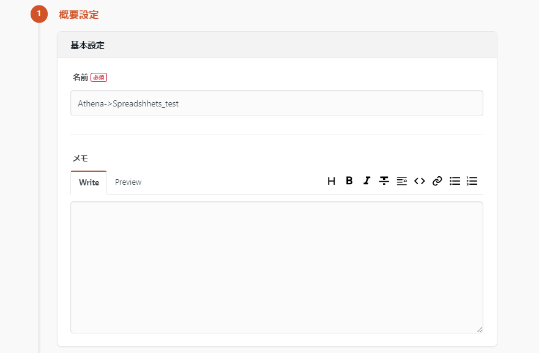

# データ統合サービスTroccoでクラウドをまたいでデータを転送してみた

データ分析基盤構築サービスであるTroccoを用いて、クラウドサービスをまたいだデータの転送を実際に行ったので、それについてまとめます。
今回行った、AWS AthenaからGoogle Spreadsheetsへのデータ転送をもとに、設定方法などを解説していきます。

## Troccoとは

Troccoとは[Embulk](https://www.embulk.org/)[^1]をべースにしたSaaSサービスです。  
Troccoは特にAWSのサービスと連携することが得意です。様々な自動化などをGUIで行うことができ、データの転送や変換を簡単に設定できます。

## この文章の目的

この文章はTroccoを用いてAthenaからSpreadsheetsへのデータ転送を行うため設定方法を説明するものです。Troccoは非常に簡単に転送を設定することが可能ですが、これらの機能を利用するためには、まずは権限設定を行う必要があります。
今回はこの権限設定から始めて、実際にAthenaからSpreadsheetsへのデータ転送を行った際の手順を説明します。

## 概念図


## 前提条件

- AWSアカウントを持っていること
  - 十分な権限を持つIAMユーザーが必要です。
- Troccoのアカウントを持っていること
  - フリーアカウントが利用可能です。
- Athenaのデータベースが設定されていること
  - この辺りに関しては別途ドキュメントを作成します
- Googleアカウントを持っていること
  - Spreadsheetsへのデータ転送を行うために必要です。

## AthenaとSpreadsheetsの接続

1. Athenaからデータベースを参照するための権限設定
2. TroccoがAthenaにアクセスするための権限を付与するユーザーの作成
3. Troccoの設定画面でAthenaの接続情報を入力
4. Spreadsheetsの接続設定をTroccoの設定画面で行う
5. 実際の接続をTrocco上で行う

### Athenaの権限設定

Athenaからデータベースの参照のための権限設定はTroccoからのアクセス許可の付与と同時に行います。

### Trocco用のIAMユーザー作成

TroccoがAthenaにアクセスするためのIAMユーザーを作成します。このユーザーには以下のポリシーを付与します。

```Json
{
    "Version": "2012-10-17",
    "Statement": [
        {
            "Sid": "VisualEditor0",
            "Effect": "Allow",
            "Action": [
                "athena:StartQueryExecution",
                "athena:GetQueryResultsStream",
                "athena:StopQueryExecution",
                "athena:GetQueryExecution",
                "athena:GetQueryResults"
            ],
            "Resource": "*",
            "Condition": {
                "IpAddress": {
                    "aws:SourceIp": [
                        "13.231.52.164",
                        "18.182.232.211",
                        "3.113.216.138"
                    ]
                }
            }
        },
        {
            "Sid": "VisualEditor1",
            "Effect": "Allow",
            "Action": [
                "glue:GetDatabase",
                "glue:GetTable"
            ],
            "Resource": "*",
            "Condition": {
                "IpAddress": {
                    "aws:SourceIp": [
                        "13.231.52.164",
                        "18.182.232.211",
                        "3.113.216.138"
                    ]
                }
            }
        },
        {
            "Sid": "VisualEditor2",
            "Effect": "Allow",
            "Action": [
                "s3:PutObject",
                "s3:GetObject",
                "s3:ListBucketMultipartUploads",
                "s3:AbortMultipartUpload",
                "s3:ListBucket",
                "s3:GetBucketLocation",
                "s3:ListMultipartUploadParts"
            ],
            "Resource": [
                "arn:aws:s3:::Athenaの書き込み先S3バケット",
                "arn:aws:s3:::データレイク",
                "arn:aws:s3:::Athenaの書き込み先S3バケット/*",
                "arn:aws:s3:::データレイク/*"
            ],
            "Condition": {
                "IpAddress": {
                    "aws:SourceIp": [
                        "13.231.52.164",
                        "18.182.232.211",
                        "3.113.216.138"
                    ]
                }
            }
        }
    ]
}
```

ユーザー作成後、「AWSアクセスキーID」と「AWSシークレットアクセスキー」を発行しメモしておきます。

### 書き込み先のS3バケットの設定

以下のバケットポリシーを設定

```json
{
    "Version": "2012-10-17",
    "Statement": [
        {
            "Sid": "Statement1",
            "Effect": "Allow",
            "Principal": {
                "AWS": "作成したトロッコ用ユーザーのARN"
            },
            "Action": "s3:*",
            "Resource": "arn:aws:s3:::保存先のバケットの名前/*"
        }
    ]
}
```

詳しくは[こちらの解説](https://documents.trocco.io/docs/data-source-athena)を参照してください。

### Troccoコンソールでの設定

#### Athenaの接続設定

Troccoの設定画面でAthenaの接続情報を入力します。以下の情報が必要です。

- 接続名
- AthenaエンドポイントURL
  - jdbc:awsathena://athena.ap-northeast-1.amazonaws.com:443
- 一時出力先Amazon S3バケット・パス
  - s3://Athenaの書き込み先S3バケット/
- AWSアクセスキーID
- AWSシークレットアクセスキー

#### Spreadsheetsの接続設定

Googleアカウント連携で接続設定を行えます。

#### 転送の作成


転送元にはAthenaを、転送先にはSpreadsheetsを選択します。

概要設定の欄に名前を設定し、基本設定で先ほど作成したAthenaの接続情報を選択します。
その後、必要なデータをクエリするSQLと、出力されるカラムを設定します。



次に、下にある転送先 Google Spreadsheetsの設定で、スプレッドシートのIDやシート名を指定します。


転送モードは全件洗替の必要がない場合はAPPENDがおすすめです。

最後に接続確認を行いスプレッドシートにデータが転送されることを確認し次のステップに進んでください。

次のステップに進むとスキーマとデータのプレビューが行われるので、適切なスキーマが設定されていることを確認します。
必要な場合はこの画面で入出力や、フィルタリングの設定なども行えます。
プレビュー画面で個人情報が残っている場合、SQLか個々のフィルタリングで適切な処理を行ってください。

最後に確認画面で内容を確定すれば完了です。

### 転送の実行

転送作成後ダッシュボード上から転送を行い、データの転送がうまくいくか確認してください。

[^1]: Embulkはデータの抽出、変換、ロード（ETL）を行うためのオープンソースツールです。様々なデータソースに対応可能なプラグインベースのツールです。
