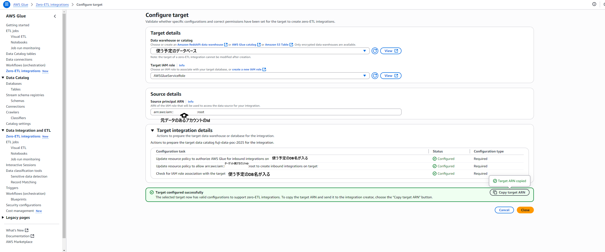
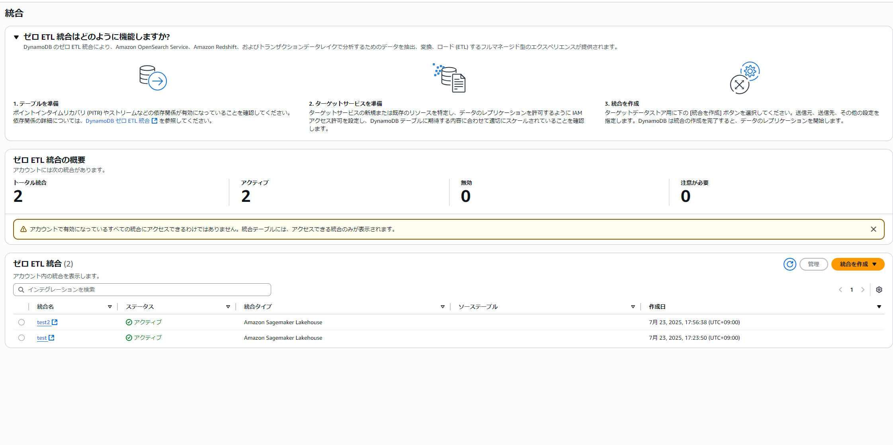
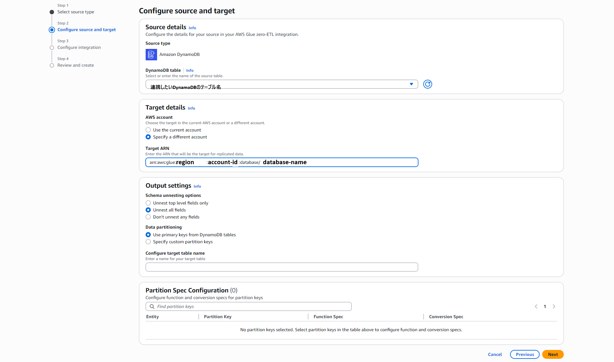

# AWSのZeroETLを用いたDynamoDBとS3上に作成したIcebergテーブルとのクロスアカウント連携

ここでは、AWSのZeroETLを用いてDynamoDBからIcebergテーブルへのデータ転送の設定方法を説明します。
クロスアカウントでの連携を行うため、ターゲット側とソース側のアカウントでそれぞれ設定が必要です。

## この文章の目的

この文章では、ZeroETLを用いたDynamoDBとS3上に作成したIcebergテーブルとのクロスアカウント連携の設定方法を説明します。
ZeroETLは、AWS Glueを使用してデータを簡単に転送できるサービスで、DynamoDBのデータをS3上のIcebergテーブルに転送するために使用します。クロスアカウント連携を行うことができ、様々なサービスのデータを一つのデータレイクに集約が可能なため、データ分析や機械学習のためのデータセットを簡単に構築できます。
そのために必要な権限設定と、統合の作成方法を説明します。

## 前提条件

- 十分な権限があること
  - 両方のアカウントでGlueの権限を持つIAMロールがあること
  - ソース側のアカウントでDynamoDBのリソースベースのポリシーを設定できること
  - ターゲット側のアカウントでGlueのCatalog Settingsを編集できること
  - データ連携のためにGlueと外部アカウントに付与するための適切なロールを作成できること（存在しない場合）
- データソースのDynamoDBのテーブルが存在すること

## 最初

データをもらう側のアカウント(ターゲット側アカウント)でS3バケットと、それを参照するGlueのテーブルを作成します。

## ターゲット側リソースの権限設定

### Configure target

AWS Glue -> Zero-ETL integrationsから上部中央にあるConfigure targetを選択します。



### Target details

ここでデータを連携される側に必要な権限設定を行います。

#### Data warehouse or catalog

データを連携したいレイクを選択してください。

##### Target IAM role

ターゲットのIAMロールを選択します。
この際付与するロールは画像の物ではなく、S3アクセスとGlueの権限があり、それをGlueに付与できるロールにしてください。

### Source details

ここでデータを連携する側の情報を入力します。

#### Source Principal ARN

データソース側のアカウントで連携に利用するIAMロールのARNを入力します。

### Target integration details

設定される権限についてここに出るので確認してから処理を開始してください。
終了後、Copy target ARNからARNをコピーしてどこかに残しておいてください。

### Catalog Settings

Glueの左カラムのData Catalog -> Catalog Settingsを選択し以下のような設定が入っているかを確認してください。
基本的に、先ほどの設定で入るかと思いますが不足があれば手作業で追加してください。

```Json
{
  "Version" : "2012-10-17",
  "Statement" : [ {
    "Effect" : "Allow",
    "Principal" : {
      "Service" : "glue.amazonaws.com"
    },
    "Action" : "glue:CreateInboundIntegration",
    "Resource" : "arn:aws:glue:<your-region>:ターゲット側のアカウントID:database/コピー先のDB名",
    "Condition" : {
      "StringEquals" : {
        "aws:SourceAccount" : "データソース側のアカウントID"
      }
    }
  }, {
    "Effect" : "Allow",
    "Principal" : {
      "AWS" : "arn:aws:iam::データソース側のアカウントID:root"
    },
    "Action" : "glue:CreateInboundIntegration",
    "Resource" : [ "arn:aws:glue:<your-region>:ターゲット側のアカウントID:catalog", "arn:aws:glue:<your-region>:ターゲット側のアカウントID:database/コピー先のDB名" ]
  }, {
    "Effect" : "Allow",
    "Principal" : {
      "Service" : "glue.amazonaws.com"
    },
    "Action" : "glue:AuthorizeInboundIntegration",
    "Resource" : [ "arn:aws:glue:<your-region>:ターゲット側のアカウントID:catalog", "arn:aws:glue:<your-region>:ターゲット側のアカウントID:database/コピー先のDB名" ]
  }, {
    "Effect" : "Allow",
    "Principal" : {
      "Service" : "glue.amazonaws.com"
    },
    "Action" : [ "glue:UpdateTable", "glue:CreateTable", "glue:GetDatabase", "glue:GetTable" ],
    "Resource" : [ "arn:aws:glue:<your-region>:ターゲット側のアカウントID:database/コピー先のDB名", "arn:aws:glue:<your-region>:ターゲット側のアカウントID:table/ターゲットのテーブル名" ]
  }]
}
```

これを設定したのちにソース側の作業に移る

## ソース側の設定

### DynamoDBの設定

#### アクセス許可

データを吸い上げたいDyanmoDBのテーブルを選択し、アクセス許可タブ内にあるテーブルについてのリソースベースのポリシーを設定します。
以下のようなポリシーを設定してください。
ポリシーを管理のプルダウンから編集を選択することで編集できます。

```json

{
  "Version": "2012-10-17",
  "Statement": [
    {
      "Sid": "1111",
      "Effect": "Allow",
      "Principal": {
        "Service": "glue.amazonaws.com"
      },
      "Action": [
        "dynamodb:ExportTableToPointInTime",
        "dynamodb:DescribeTable",
        "dynamodb:DescribeExport"
      ],
      "Resource": "*",
      "Condition": {
        "StringLike": {
          "aws:SourceArn": "arn:aws:glue:<your-region>:ソースアカウントのID:integration:*"
        }
      }
    }
  ]
}
```

この設定により、GlueがDynamoDBのテーブルにアクセスできるようになります。

#### PITR設定

PITR（Point-In-Time Recovery）を有効にするには、DynamoDBのテーブル設定でPITRを有効にしてください。これは指定した時点のデータを復元できるようにするための設定ですが、このためのバックアップからデータを同期することができ、DynamoDBのリードキャパシティを消費せず読み取ることができるようになります。
ZERO-ETLには必須の設定です。

### Glueの設定

DynamoDBのコンソール画面から左カラム内のインテグレーションを選択し、Glueの設定を行います。


画面下のゼロETL統合の欄から結合を作成を選択し、Amazon Sagemaker Lakehouseを選択します。

#### Select source type

DynamoDBを選択

#### Configure source and target



Source detailsでは、接続を作成するDynamoDBのテーブルを選択します。
Target detailsには、Target integration detailsでコピーしたARNを入力します。
わからなくなった場合は、ターゲットアカウントのGlueのコンソールからCatalog Settingsを確認し、そこにある権限定義内のテーブルARNを確認してください。

それ以外の項目はデフォルトで作ります。

ETLの設定が完了したら、統合を作成した後数分待ちます。
状態がActiveになれば設定は統合成功です。

## FAQ

### 統合を作成しようとしたらエラーが出る

基本的に権限不足が原因です。
クロスアカウント統合ではリソースポリシーにおいて明示的に許可する必要がある部分も多いです。設定漏れがないかを確認してください。

### 統合作成時に設定するロールを間違えた

統合を作成した後に、設定したロールを変更することはできません。
その場合は、統合を削除して再度作成してください。

### 統合を作れたのに状態がアクティブにならない

統合を作成した後、数分待っても状態がActiveにならず失敗したりリトライ待機状態になる場合は、DynamoDBのテーブルのリソースベースのポリシーが正しく設定されていない可能性があります。
正しくターゲットアカウントに対して許可を行っているか確認してください。

### データが転送されない

即時データが転送されない場合があります。Active状態になるまで待ってください。

### 連携頻度を変更したい

コンソール上で変更がロックされているように、現在(2025/08/06)のところ連携頻度は15分に1度から変更はできません。

### 作成した統合を編集しようとしたら画面がちかちかして操作できない

私の環境で発生したこの問題はアカウントの権限付与で解決しました。RedShift-Serverlessに関するgetやlist系の権限が不足している可能性があります。
