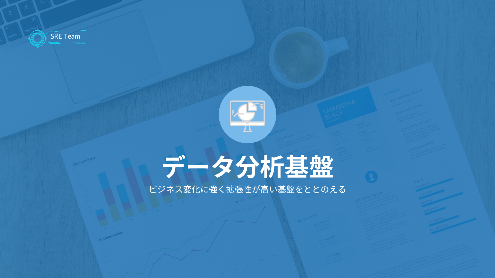
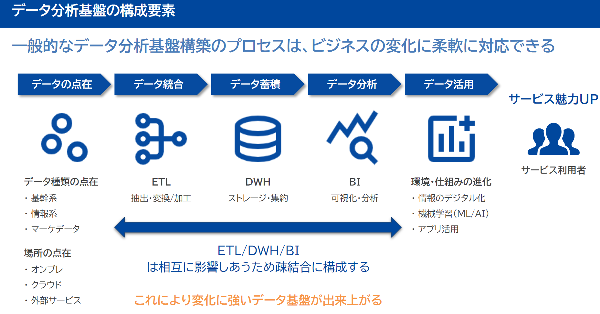

# データ基盤の必要性

ビジネスにおいて「データ」は、まるで羅針盤のようなものです。この羅針盤を使いこなせれば、会社は正しい方向に進み、もっと成長できます。

しかし、羅針盤がバラバラだったり、正しく動かなかったりしたらどうでしょう？それでは、正しい方向はわかりませんよね。

そこで重要になるのが、**データ基盤**です。

## データ基盤って何？なぜそんなに大切なの？

ビジネスの世界は常に変化しています。昨日まで正解だったことが、明日には通用しなくなることも珍しくありません。

そんな中で、会社が生き残り、さらに成長していくためには、変化の兆しをいち早く見つけ、対応していく必要があります。
そのために欠かせないのが、データを活用することです。

データ基盤を整える目的は、まさにこの「**データをスムーズに、そして安全に活用できる仕組み**」を作り上げることなんです。

具体的には、以下の3つの大きな目標があります。

- **ビジネスの変化に素早く対応する**
  - 市場の動きやお客様のニーズが変わった時、すぐに新しいデータを取り込んだり、分析方法を変えたりできる柔軟な仕組みがあれば、会社は無駄なコストをかけずに変化に対応できます。
- **「負債」を抱え込まないようにする**
  - システムは一度作ると、時間とともに古くなり、直したり改善したりするのが大変になることがあります。これを「技術的負債」と呼びます。データ基盤では、なるべく誰でもわかりやすい、一般的なやり方でシステムを構築することで、将来のメンテナンスを楽にし、技術的負債を減らすことを目指します。
- **無駄なコストをなくす**
  - データ基盤を動かすには、エンジニアの人件費や外部サービスの利用料がかかります。これらを最適なバランスで組み合わせ、無駄なコストがかかり続けないように工夫することが大切です。

:::tip[データ基盤を作る前に、まず考えよう！]

データ基盤を作り始める前に、次の2つのポイントをはっきりさせることが成功の鍵です。
- どんなデータを、何のために使うのか？
  - 例えば、「お客様の購入履歴を使って、次のヒット商品を予測したい」のか、「ウェブサイトのアクセス状況を分析して、デザインを改善したい」のか、など、**具体的に何をしたいのか**を明確にしましょう。
- データを使って何をしたいのか？
  - データをただ集めるだけでなく、「グラフで**見える化**したい」「将来を予測するAIを作りたい」「お客様ごとに**おすすめ**を表示したい」など、具体的なゴールを決めましょう。

:::

## データ基盤を支える「土台」の考え方

データ基盤を作る上では、いくつかの基本的な考え方があります。これらを意識することで、より使いやすく、安全な基盤を構築できます。

### 既存のシステムに負担をかけない

今会社で使っている大事なシステム（例えば、会社の売り上げを管理するシステムなど）に、データ基盤が原因で不具合が起きたり、動きが遅くなったりしないように、慎重に接続方法を考える必要があります。

### いろんな場所で使えるようにする

一度作ったデータ基盤が、マーケティング部門だけでなく、営業部門や商品開発部門など、はたまた様々なサービスで再利用できるように設計することが望ましいです。

### データの安全を守る

お客様の情報や会社の秘密など、データには大切なものがたくさん含まれています。これらが外部に漏れたり、不正に利用されたりしないように、厳重なセキュリティ対策は絶対に必要です。

### 部分ごとに分けて柔軟にする

データを取り込んだり、加工したり、分析したりする一連の流れを、細かく部品に分け（これを「マイクロサービス」のような考え方と呼びます）、それぞれの部品が独立して動くようにします。
こうすることで、もしどこかの部品で問題が起きても、全体が止まることなく、問題箇所だけを直すことができます。

データを取り扱う技術は、本当にものすごいスピードで進化しています。
「これが一番！」という方法が、あっという間に古くなることもあります。
だからこそ、データ基盤は一度作ったら終わりではなく、**常に変化に対応し、改善し続けられる**ような仕組みにしておくことが大切です。

## データ基盤の進め方と選ぶポイント

データ分析基盤には以下の考え方が必須となる。

まずは、小さく始めてみるのがおすすめです。最初から完璧なものを作ろうとするのではなく、まずは必要な部分から構築し、少しずつ広げていくイメージです。

その上で、データ基盤で使う技術やサービスを選ぶ際には、いくつかの大切なポイントがあります。

|検討ポイント|どんなことを考えるの？|
|:---|:---|
|拡張性|新しい種類のデータが増えたり、データ量が爆発的に増えたりしても、簡単に対応できるか？|
|保守性|作った後も、メンテナンスが楽で、特別な知識がなくても管理できるか？|
|コスト|最初にかかる費用（初期コスト）と、毎月かかる費用（運用コスト）が、できるだけ安く抑えられるか？|
|将来性|今選んだ技術やサービスが、これからも長く使われ続ける見込みがあるか？ （すぐに使えなくなったりしないか？）|
|継続性|その技術が業界で一般的で、特別なカスタマイズをしなくても使えるか？|
|再利用性|もし将来、別の技術に切り替えることになった時に、スムーズに移行できるか？|
|接続性|他のシステムやサービスと、簡単かつ安全につながるか？|

データ基盤は、まるで会社の「頭脳」を強化するようなものです。この頭脳がしっかりしていれば、未来を予測し、より良い判断を下し、会社を大きく成長させることができます。

もしこのデータ基盤に興味を持たれたら、ぜひ一歩踏み出して、その奥深さに触れてみてください。あなたの会社を、そしてあなたのキャリアを、もっと輝かせる力になるはずです！

### データ分析基盤は4つのしくみをどうするかが重要

データ分析基盤の全体構成は以下。

その中でもとくに以下４つの仕組をどうすべきか検討することが求められる。

- 収集 (Ingestion)
  - データの発生元からデータを集めるプロセス
- 蓄積 (Storage)
  - データをストレージに保存し、データカタログを管理する
- 加工 (Processing)
  - 保存したデータに対して適切な変換処理を行なう
- 分析 (Analytics)
  - 変換済みのデータを活用する

これを実現するための構成技術を比較検討する。

### 構成する要素と技術

以下はあらためて整理する

#### 収集 (Ingestion)

- 具体的な内容
  - 元の業務データから、データ分析基盤へデータをコピー
- 検討すべき技術の観点
  - データベース選定
    - 処理性能：パフォーマンス、データ量
    - 拡張性 : 水平スケール・垂直スケール
    - データ構造 : スキーマ固定 or 非固定
    - データサイズ
    - データコスト
- 検討項目
  - 1.1. データソース
    - 種類: Web API, IoTデバイス, RDBMS, ファイル(CSV, JSON)
    - 対応プロトコル: REST API, WebSocket, FTP
    - サポートされているコネクタ: Kafka Connect, Airbyte
  - 1.2. データの形式
    - 構造化: SQL, CSV, Excel
    - 半構造化: JSON, XML, Avro
    - 非構造化: 画像, テキスト, ログファイル
  - 1.3. データ取得の方法
    - バッチ収集: 定期実行 (Apache NiFi, Airflow)
    - リアルタイム収集: ストリーミング (Apache Kafka, AWS Kinesis)
  - 1.4. エラー処理と再送機構
    - キュー管理: RabbitMQ, AWS SQS
    - 再処理: リトライや死行列 (Dead Letter Queue)

- ツール案
  - Digdag
    - 複雑なデータ処理をワークフローとして定義でき、スケジュール実行やリトライが可能。
  - Embulk
    - 大規模データのバルク転送が可能なOSSツール

#### 蓄積 (Storage)

- 検討すべき項目
  - 2.1. ストレージタイプ
    - データベース:
      - RDBMS (MySQL, PostgreSQL) → トランザクション処理に強い
      - NoSQL (MongoDB, Cassandra) → スキーマレスやビッグデータ向き
    - データレイク:
      - Amazon S3, Azure Data Lake → 生データの柔軟な保存
  - 2.2. パフォーマンスと拡張性
    - スケーリング方法:
      - 水平 (NoSQL, S3) vs 垂直 (RDBMS)
    - キャッシング:
      - Redis, Memcached で頻繁アクセス対応
  - 2.3. コスト最適化
    - ホット/コールドデータの分離:
      - 頻繁アクセス: SSD, In-memory
    - アーカイブ: HDD, Glacier
  - 2.4. セキュリティ
    - 暗号化: AES-256 (保存時), TLS (転送時)
    - アクセス管理: IAM, ACL (アクセス制御リスト)

#### 加工 (Processing)

- 検討すべき項目
  - 3.1. 処理方式
    - バッチ処理:
      - Apache Spark, Hadoop MapReduce → 大量データの一括処理
    - ストリーム処理:
      - Apache Flink, Kafka Streams → リアルタイム分析
  - 3.2. ETL/ELTの選定
    - ETL: データクレンジング後に保存 (Talend, Pentaho, )
    - ELT: データをまず保存し、その後変換 (BigQuery, Snowflake)
  - 3.3. データの変換とクレンジング
    - 重複排除: データ統合時のID管理
    - 標準化: 日付フォーマットや単位の統一
    - フィルタリング: ノイズデータの除去
  - 3.4. 処理の自動化と監視
    - ワークフロー: Apache Airflow, Prefect
    - 監視: Prometheus, Grafana

#### 分析 (Analytics)

- 検討すべき項目
  - 4.1. 分析のタイプ
    - 記述的 (Descriptive):
      - BIツール (Tableau, Power BI) → KPIやダッシュボード
    - 診断的 (Diagnostic):
      - SQL分析, ドリルダウン (Looker, Redash)
    - 予測的 (Predictive):
      - 機械学習 (Databricks, TensorFlow)
    - 処方的 (Prescriptive):
      - 最適化アルゴリズムやシミュレーション
  - 4.2. データウェアハウスの選定
    - 選定基準:
      - Amazon Redshift → SQL対応とコストバランス
      - Google BigQuery → スケーラビリティとサーバーレス
  - 4.3. クエリ性能
    - インデックス: カラムナ型 (ClickHouse, Apache Druid)
    - キャッシュ: メモリ上での中間データ保持 (Redis)
  - 4.4. 可視化とレポート
    - BIツール: Tableau, Power BI, Looker
    - インタラクティブ性: ドリルダウンやフィルター機能

- 比較対象？：オープンソースかサービスに内包しているものを対象にするべきでしょうね
  - Looker 
  - Kibana
  - Redash
  - Apache Superset
  - Metabase
  - Graylog

## 参考

- [TROCCO®× dbt × Amazon S3で始めるコスト安なデータ分析ジャーニーとサンプルのご紹介](https://aws.amazon.com/jp/blogs/startup/analytics-pipeline-samples/)
- [今さら聞けないdbtの基本LT](https://speakerdeck.com/gak_t12/jin-sarawen-kenaidbtnoji-ben-lt)
- [新卒5ヶ月目で任された分析基盤構築 - Digdag/Embulk/dbtによるデータパイプライン開発記](https://zenn.dev/counterworks/articles/d4a1ac252d2ce4)
